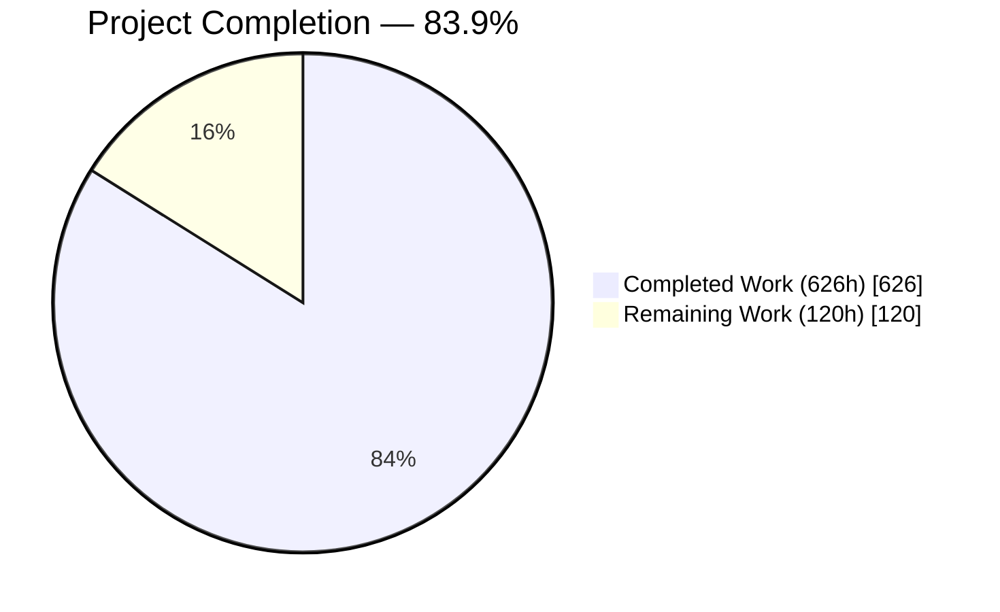
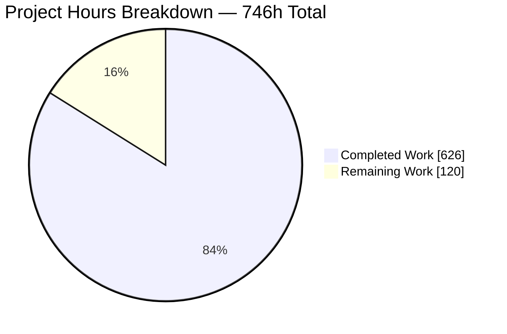
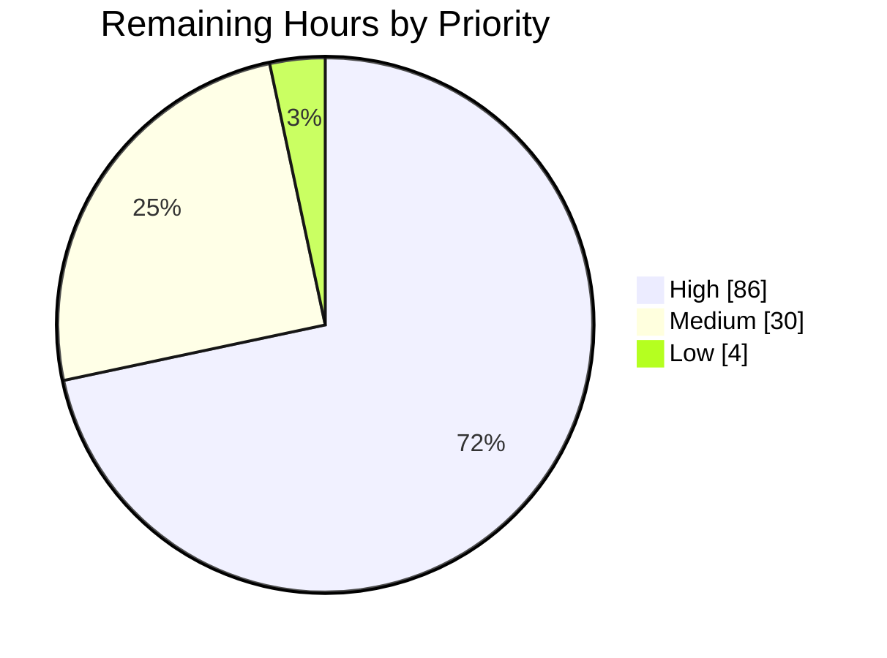
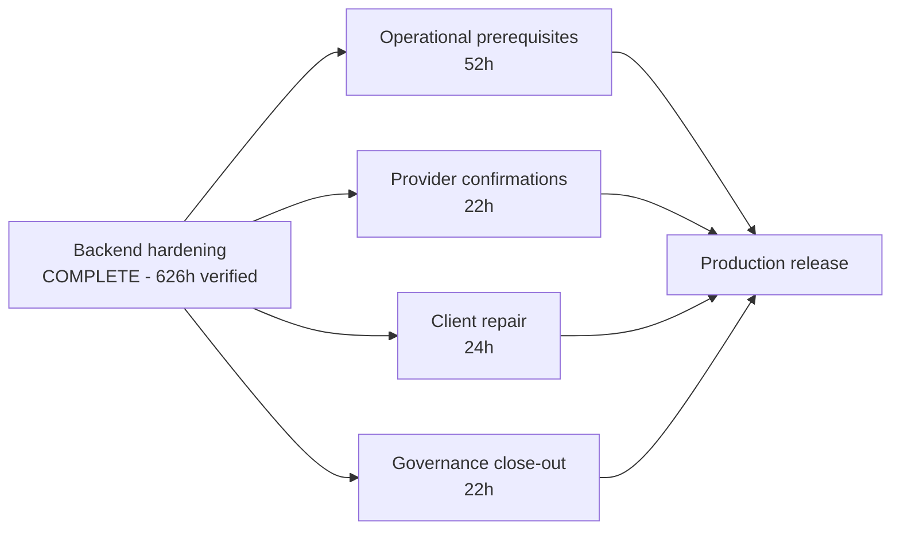

# 1. Executive Summary

## 1.1 Project Overview

`apartment-finder-service` is a public-facing rental-listing platform: a FastAPI backend on PostgreSQL that serves a listings corpus, saved search filters and paid subscriptions, with a React client and a Google Cloud deployment. This engagement hardened the backend against twenty catalogued weaknesses spanning token handling, authorization, payment integrity, dependency supply chain and secrets management, without adding product functionality, without advancing the Python 3.9 runtime, and without breaking any workflow that did not itself depend on a weakness. The beneficiaries are every account holder whose credentials, saved filters and payment records the service holds, and the operators who must deploy it safely.

## 1.2 Completion Status



Chart colours follow the Blitzy palette: Completed = Dark Blue `#5B39F3`, Remaining = White `#FFFFFF`.

| Metric | Value |
|---|---|
| Total Hours | **746** |
| Completed Hours (AI + Manual) | **626** (626 autonomous, 0 manual) |
| Remaining Hours | **120** |
| Percent Complete | **83.9%** — 626 ÷ 746 × 100 |

Scope is the agreed remediation plan plus the path-to-production activities it implies; nothing outside that scope is counted.

## 1.3 Key Accomplishments

- Token verification is confined to an HMAC allowlist with a validated 32-byte signing key; forged and tampered tokens are refused.
- Deny-by-default role authorization across four roles, resolved from the stored row and never from a client claim.
- Subscription price and entitlement dates are server-owned; no client field can influence either.
- Payment notifications are signature-verified with a certificate-host allowlist and protected against replay.
- Secrets left version control behind enforced ignore rules, a credential-free container definition and provisioned managed secrets.
- Security headers, exact-origin CORS, host validation, request-size and pagination caps, throttling and health probes on every response path.
- Five reversible schema revisions and exactly one auditable administrative account.
- 3,771 automated cases pass at 92.47% statement coverage, gated in continuous integration alongside dependency and static-analysis thresholds.

## 1.4 Critical Unresolved Issues

| Issue | Impact | Owner | ETA |
|---|---|---|---|
| The browser client does not compile — an imported payment package is undeclared | No product screen renders, so no user can reach the hardened service | Frontend | 3 days |
| Previously committed credentials remain recoverable from repository history | Every existing clone still yields a live credential until it is revoked and rotated | Platform / Security | 1 day |
| Payment webhook identifier unprovisioned; the provider round trip is unexercised | No subscription can activate in a real environment | Payments | 1.5 days |
| The container image and stack were never observed running | Image identity, filesystem permissions and migration ordering rest on static assertions | Platform | 1 day |
| The cloud configuration has never been applied | Private data plane, secret resolution and invoker restriction are unconfirmed against a provider | Platform | 1.5 days |
| The managed function declares a runtime the provider has withdrawn | That resource cannot be created; it is gated off by default, so the decision is deferred rather than forced | Platform | 1 day |
| The listing-provider contract is unverified, so ingestion is held suspended | The corpus does not refresh; enabling early fails hourly rather than once | Data / Integration | 1.5 days |
| Throttle counters are per process until the shared store is named | Several replicas admit several times the configured limit | Platform | 0.5 day |

## 1.5 Access Issues

| System/Resource | Type of Access | Issue Description | Resolution Status | Owner |
|---|---|---|---|---|
| Container engine | Local build and run | No engine is available in the verification environment, so image and stack behaviour could not be observed | Open — needs a container-capable runner | Platform |
| Google Cloud project | Provisioning and deploy credentials | No project reachable, so no apply, secret resolution or invoker binding could be confirmed | Open — provision a non-production project | Platform |
| Workload-identity federation | Release identity | The provider and deploy service account are referenced by the release workflow but not yet created | Open | Platform / CI |
| PayPal merchant console | Webhook identifier, sandbox credentials | The webhook identifier does not exist yet, so activation cannot complete | Open | Payments |
| Listing-provider API | Specification and credentials | The provider contract is this repository's declaration; verification needs a membership or partnership | Open | Data / Integration |
| Repository administration | Settings | Private vulnerability reporting is not enabled and the renamed deploy inputs are unset | Open | Repository owner |
| Kubernetes cluster | Namespace and workloads | No cluster reachable, so the first workload apply and the release preflight are unexercised | Open | Platform |

## 1.6 Recommended Next Steps

1. **[High]** Repair the browser client so a user can reach the hardened service — declare the payment package, align the login path and response fields, attach a bearer transport, and move to the server's order contract and plan identifiers.
2. **[High]** Provision the payment webhook identifier and drive one sandbox purchase through hosted approval to activation.
3. **[High]** Apply the cloud configuration to a non-production project, bind federated release identity, and bootstrap the cluster workloads once out of band.
4. **[High]** Accept the container image and the local stack on a container-capable runner.
5. **[High]** Execute the credential rotation runbook last, in its documented order: revoke, rotate, eradicate from history, review prior access.

# 2. Project Hours Breakdown

## 2.1 Completed Work Detail

| Component | Hours | Description |
|---|---|---|
| Application importability restoration | 6 | Eight import-time faults cleared across application settings, the ORM session export, four absent request models, the missing subscription contract and the payment client, so `import backend.app.main` succeeds and the suite collects |
| Dependency inventory and pinned manifests | 8 | Runtime (16 pins), development (8) and audit (1) manifests created where none existed; the JOSE implementation, the hashing abstraction, the archived payment SDK and the legacy HTTP client all replaced, with zero residual imports anywhere under `backend/` |
| Authentication and credential hardening | 92 | Validated settings gate with a 32-byte signing-key floor and a placeholder denylist, an HMAC-only algorithm allowlist, seven-claim tokens carrying an integer subject, direct bcrypt hashing with a 72-byte guard, uniform credential refusals, per-account lockout, a redacting structured logger (`backend/app/core/logging.py`) and a bounded throttle store (`backend/app/core/rate_limit.py`) |
| Authorization, schema and migrations | 76 | Centralised deny-by-default role dependency over guest/registered/premium/admin resolved from the stored row (`backend/app/core/authorization.py`), additive role and lockout columns, a notification-event table for replay defence, the Alembic framework and five independently reversible revisions including the audited single-administrator seed |
| Payment integrity and webhook verification | 74 | Payment client rebuilt on direct REST with a cached token exchange and explicit timeouts (`backend/app/services/paypal_service.py`), a server-owned plan catalog as the sole price authority (`backend/app/core/plans.py`), ownership-bound settlement, and a signature-verified, replay-protected notification route under the existing prefix |
| Secrets, application assembly and infrastructure | 148 | Version-control and image boundaries, credential-free Compose with profiles and a cache service, a non-root image running as uid 1001, the provider credential moved into a request header with a timeout, security headers, exact-origin CORS, host validation, a body cap and health probes in `backend/app/main.py`, managed secrets with a private data and control plane in Terraform, twelve Kubernetes manifests with a renderer, and a fully gated integration pipeline with a federated release path |
| Automated security and regression suite | 140 | 47 test modules and 3,774 cases covering the role matrix, token forgery, price and entitlement tampering, notification authenticity, request bounds, migration reversibility, the release path and every governance document |
| Governance documentation and executive deck | 58 | Decision log, bidirectional traceability matrix, residual-risk register, credential-rotation runbook, critical-decision review, disclosure policy, README security section and an eighteen-slide executive presentation |
| Verification, gate execution and release-path validation | 24 | Static, dependency, migration and live-service verification cycles executed end to end, including browser validation of the presentation |
| **Total Completed** | **626** | |

## 2.2 Remaining Work Detail

| Category | Hours | Priority |
|---|---|---|
| Credential revocation, rotation and history eradication | 8 | High |
| Container image build and local stack acceptance | 6 | High |
| Cloud infrastructure apply and the three open provisioning judgements | 12 | High |
| Withdrawn managed-function runtime decision | 6 | High |
| Federated release binding, repository inputs and first release | 8 | High |
| First-cluster workload bootstrap | 4 | High |
| Payment provider end-to-end and webhook identifier provisioning | 10 | High |
| Listing-provider contract verification, then ingestion enablement | 12 | Medium |
| Browser client repair so a user can reach the service | 24 | High |
| Per-environment configuration including the shared throttle store | 6 | High |
| Administrator credential provisioning | 2 | High |
| Owner policy decisions, private reporting channel and licence | 4 | Medium |
| Disposition of the ten findings raised for confirmation | 10 | Medium |
| Presentation accessibility and helper-script lint close-out | 4 | Low |
| Production readiness review and breaking-change sign-off | 4 | Medium |
| **Total Remaining** | **120** | |

## 2.3 Estimation Basis

Every hour above traces to a specific requirement in the agreed remediation plan or to a path-to-production activity that plan implies. Completed hours were sized from the delivered scope of each component — module complexity and volume, the share attributable to its tests, and the verification cycles that proved it — then reconciled against what the repository actually contains: 131 changed paths, 101 of them new, and 98,963 hand-authored lines excluding the client dependency lock file. Remaining hours were sized from the base rates for their category: operational runbook execution at 8 hours, a container acceptance pass at 6, a cloud apply with three open provisioning judgements at 12, a provider integration exercised end to end at 10, and a client repair spanning a dependency declaration plus five contract alignments at 24.

Confidence is **high** for the completed figures, which rest on delivered artefacts and on gates observed passing. It is **high** for the operational items, whose steps are enumerated in the runbook. It is **medium** for the cloud apply and the container acceptance, which may surface provider-side or admission-time rejections that only a first apply reveals. It is **medium-to-low** for the listing-provider verification, which depends on obtaining a specification this engagement could not reach; that item carries the widest range and its estimate is set at the upper end accordingly.

The arithmetic that governs the rest of this document: **626 completed + 120 remaining = 746 total**, and **626 ÷ 746 = 83.9% complete**.

# 3. Test Results

The whole suite was executed against PostgreSQL 13 from the repository root with coverage measurement: **3,774 collected, 3,771 passed, 3 skipped, 0 failed, in 438.82 seconds, at 92.47% statement coverage (4,832 statements, 364 missed)** against a configured floor of 80%. The three skips are environmental — a PostgreSQL client binary was absent from the invoking process's path — and cover no behaviour that another case does not also assert. Every figure in the table below is a count from that run.

| Area / Category | Framework | Tests | Passed | Failed | Coverage | What This Proves |
|---|---|---|---|---|---|---|
| Authentication, settings validation and redaction | pytest | 734 | 734 | 0 | 92% config, 93% security, 86% logging | A short, placeholder or non-allowlisted signing configuration cannot start the service, and no credential reaches a log record |
| Authorization and administrator provisioning | pytest | 328 | 328 | 0 | 95% authorization, 83% provisioning | Every route refuses every principal that should not reach it, roles come from the stored row, and exactly one account can hold administrative privilege |
| Payment integrity and notification authenticity | pytest | 392 | 392 | 0 | 91% payment client, 93% subscription routes | Price and entitlement are server-owned, settlement is bound to its owner, and a tampered, off-allowlist or replayed notification changes no state |
| API surface and request bounds | pytest | 543 | 543 | 0 | 93% assembly, 100% listings | Frozen response shapes and route paths hold, and oversized bodies, unbounded pages and unknown fields are refused |
| Schema, database boundary and migrations | pytest | 188 | 188 | 0 | 100% models, 100% session, 95% contract | All five revisions apply and reverse independently, and the ORM and the migrated schema agree column for column |
| Provider integrations and ingestion | pytest | 169 | 169 | 0 | 98% listing provider, 100% email, 99% ingestion | The provider credential travels in a header under a timeout, and an ingestion pass surfaces a contract mismatch instead of returning silence |
| Infrastructure, release path and residual-risk guards | pytest | 834 | 834 | 0 | contract assertions over configuration | The image, stack, cloud and pipeline definitions carry the controls they claim, and no accepted advisory has become reachable |
| Governance documents and executive presentation | pytest | 586 | 586 | 0 | contract assertions over documents | Each governance document and the presentation match the repository they describe and satisfy their stated structural rules |

Supporting gates were run in the same session and all passed: static analysis returned **zero Medium and zero High findings** over 11,010 lines with five Low informational results; style returned **zero findings** from both supported working directories; the runtime dependency audit returned **no vulnerabilities with seven documented suppressions** and the development audit **one**; both compensating-control guards were clean; the infrastructure configuration formatted, initialised and validated; and the schema advanced to head, reversed two revisions and reapplied cleanly with exactly one administrative account remaining.

**Not covered by any test.**

- **The container image and the local stack.** No case builds the image or starts the stack, because no engine is available. Their properties are asserted from the definitions — the context filter, both profile renderings, the start command's module path and the migration ordering. Before release, build from the `backend/` context, confirm the process runs as uid 1001 with nothing writable beneath `/app`, bring up the local profile, and confirm the migration service exits successfully before the backend becomes healthy.
- **The applied cloud state.** Terraform is validated but never applied, so nothing here proves the private database path, the private control plane, secret resolution or the invoker restriction as the provider enforces them. Apply to a non-production project and confirm all six secrets resolve.
- **The live payment provider.** Order creation, settlement and notification verification are driven against stubs and crafted headers; the provider's own signature-verification endpoint is never called, and its simulator does not support that path. Provision the webhook identifier and drive one sandbox purchase through hosted approval to activation.
- **The live listing provider and outbound email.** Both are exercised against stubs only. Confirm the provider request shape and response fields against a real account before enabling the ingestion schedule, and send one real message through the mail provider.
- **The federated release exchange.** The workflow declares it, but no run has traded an identity token for provider credentials. Exercise it once against a non-production project.
- **The product user interface.** The client does not build, so no case and no browser session reaches a product screen. Once it builds, exercise sign-in, filter creation and a purchase end to end.

# 4. Runtime Validation &amp; UI Verification

The service was started on a live server and driven over HTTP. Each line below is an observed response.

- ✅ **Start-up and health** — the entrypoint imports cleanly and the server binds; `GET /health` returns `200 {"status":"ok"}`, `GET /health/ready` returns `200 {"status":"ready"}`, and the interactive documentation page returns 200.
- ✅ **Published surface** — eleven operations are advertised: the eight pre-existing paths, the new notification listener under the existing `/subscriptions` prefix, and the two health probes. All four router prefixes are intact and the router module is byte-identical to its original.
- ✅ **Registration and sign-in** — registration returns a nested user object alongside a token and never discloses a password hash; sign-in returns exactly `{access_token, token_type}` with `token_type` of `bearer`, so the frozen response shape holds. Issued tokens carry `alg: HS256` and the claims `aud, exp, iat, iss, jti, nbf, role, sub`, with the subject an integer identifier.
- ✅ **Privilege escalation refused** — a registration body carrying a role field is refused with 422, so no self-service path to elevated privilege exists.
- ✅ **Token forgery refused** — a token declaring no algorithm and a token with a mutated signature are both answered 401 with an identical body.
- ✅ **Authorization boundary** — the listings read is publicly reachable and returns 200 without a credential; an oversized page request is refused 422; a protected route with no credential returns 401; and a listing write with a registered token returns **403 `{"detail":"Insufficient permissions"}`**, which is the one intentional behaviour change in this delivery.
- ✅ **Payment tampering refused** — a subscription request carrying an amount, a start date or an end date is refused 422; the plan catalog is the only price authority. A notification whose certificate host is outside the allowlist, and one missing its signature headers, are each answered 400 with no state change.
- ✅ **Response hardening** — every response carries strict transport security, a `default-src 'none'` content-security policy with framing, base-URI and form-action all denied, no-sniff, deny-framing, a no-referrer policy, a thirteen-token permissions policy and no-store caching.
- ✅ **Cross-origin and resource controls** — a permitted origin is echoed exactly with credentials allowed and explicit methods, never a wildcard; an unlisted origin is refused 400 with no allow-origin header. Fourteen rapid failed sign-ins yield two 401s then 429 with `{"detail":"Too many requests","retry_after_seconds":19}` and a matching `Retry-After` header. A three-megabyte body is refused 413.
- ⚠ **Schema lifecycle** — the schema stands at head across five revisions; two reversals and a reapplication all succeed and leave exactly one administrative account, `test@blitzy.com`. That account is seeded holding a value no password produces, so it cannot sign in until an operator provisions a credential.

**Never exercised at runtime.** The container image was never built and the local stack never started, because no container engine is available in this environment; the image's runtime identity, filesystem permissions and migration ordering rest on assertions over the definitions. The cloud configuration validates but has never been applied, so the private database path, the private control plane, secret resolution and the invoker restriction are unconfirmed against a provider, and the federated release exchange has never traded a token. The payment and listing providers and the mail transport were driven against stubs only. The product user interface renders nothing today: its build fails on an imported payment package that its manifest never declares, so no browser session reaches a product screen and no end-to-end user journey exists yet. The executive presentation, by contrast, was driven in a real browser — all eighteen slides render, both diagrams and every icon draw, the console is clean, and an eighteen-page print export is produced.

# 5. Compliance &amp; Quality Review

## 5.1 Compliance Matrix

Status reflects where each deliverable stands now.

| Deliverable | Benchmark | Status | Progress | Evidence |
|---|---|---|---|---|
| Signing-key strength and algorithm confinement (C-1, C-2) | Misconfiguration fails at start-up; verification restricted to an allowlist | ✅ Pass | 100% | `backend/app/core/config.py` (32-byte floor, placeholder denylist, `{HS256, HS384, HS512}`); forged and unlisted-algorithm tokens answered 401 |
| Token identity and claim enforcement (H-7) | Subject type matches the compared column; issuer, audience, lifetime and identifier required | ✅ Pass | 100% | Live token carries eight claims with an integer subject; 47 cases in the token modules |
| Credential handling and enumeration closure (M-1) | Both credential branches equal-cost with one generic refusal; per-account lockout | ✅ Pass | 100% | `backend/app/api/endpoints/auth.py`; 102 cases across the throttling and lockout modules |
| Role-based access control (H-1) | Deny by default across every route and principal; role from the stored row | ✅ Pass | 100% | `backend/app/core/authorization.py`; 207 matrix and authorization cases; live 401 anonymous, 403 non-admin write |
| Payment integrity (C-3, H-2, H-3) | Server-owned price and entitlement; ownership-bound settlement; no hardcoded mode | ✅ Pass | 100% | `backend/app/core/plans.py`, `backend/app/services/paypal_service.py`; live 422 on any client amount or date |
| Notification authenticity and replay defence (H-4) | Signature verified with a certificate-host allowlist applied before use; each event once | ⚠ Partial | 95% | 74 cases plus live 400 on an off-allowlist host and on missing headers; the provider's own verification endpoint is never called |
| Request-resource controls (H-5, H-6, M-2, M-3) | Bounded pages, explicit field allowlists, security headers, exact-origin policy, body cap | ⚠ Partial | 95% | Live 422 / 403 / 413 / 429 refusals and the full header set; per-environment origin and host lists remain operational inputs |
| Secrets boundary (C-4, M-4) | No secret in version control; reintroduction structurally prevented; none in URLs or logs | ⚠ Partial | 85% | Enforced ignore rules, a credential-free stack definition, a header-borne provider credential, zero bare prints, and a policy gate that passes; the previously committed values persist in history until rotated |
| Cloud posture (INFRA-1) | Managed secrets, private data and control planes, least-privilege nodes, restricted invoker | ⚠ Partial | 80% | Six managed secrets, private database with encrypted-only connections and backups, private control plane with authorised networks, dedicated node identity, invoker binding; formats, initialises and validates but has never been applied |
| Delivery pipeline (INFRA-2, INFRA-3, INFRA-4) | Least-privilege tokens, security gates, federated identity, non-root image, safe release script | ⚠ Partial | 88% | Ten integration gates plus four jobs with live probes, a federated release path with no long-lived key, an image running as uid 1001, a strict release script; never executed against a cluster or a container engine |
| Dependency inventory (INFRA-5) | A pinned manifest exists; advisories only where documented and unreachable | ✅ Pass | 100% | Three manifests; audits clean with seven runtime and one development suppression, each with a named compensating control and a guard |
| Explainability, presentation and review artefacts (Rules 1–3) | Decision log with a complete bidirectional matrix; self-contained deck; critical-decision review | ⚠ Partial | 95% | All artefacts delivered and contract-tested by 586 cases; residual accessibility items are listed in Section 2.2 |

## 5.2 AAP &amp; Rule Divergences and Gaps

| What the AAP/Rule Required | What Was Delivered Instead | Why It Diverged | Impact | Remediation |
|---|---|---|---|---|
| A file map of 68 entries: 30 new, 29 changed, 9 read-only | 131 changed paths, 72 of them outside that map | Root causes and mandated controls sat outside the mapped files | Larger review surface; every control is present and tested | Accept the expanded map, or reconcile the plan to it |
| Two schema revisions and eight security test modules | Five revisions and 44 security modules | Later controls needed their own reversible steps and coverage | More to review; all revisions reverse independently | None; note the counts in the record |
| Subscription creation captures payment in the request | Creation returns a pending row plus an approval target; settlement moves to the verified notification | The hosted redirect the plan freezes is inherently two-step | Breaking for a client that assumed the create response was active | Confirm consumers follow the approval target; state it in release notes |
| The administrator revision must not create the account when absent | It seeds the account with an unusable credential, then promotes it | Refusing would roll back the schema and wedge a fresh database | The account exists holding a credential nobody knows | Provision a real credential through the supported input and job |
| The client image is read-only reference material | Two build arguments and a matching environment block were added to it | Build-time inlining left no other route for the values | Four additive lines in an excluded file | Confirm the exception, or revert and accept unset values |
| A single ignore file at the repository root | Three, at the root and in each build context | The engine reads the file from the build context, not the root | Three pattern sets must stay in step | None; equality is asserted by a test |
| Uniqueness on the listing provider address | No uniqueness; the conflict status was withdrawn | The authorised revision scope excludes that table and no backfill was in scope | Two rows may share one provider address | Decide whether uniqueness is wanted; it needs a revision and a backfill |
| Premium entitlement stored on the account | Derived from a live, unexpired subscription | Storing it would need an expiry scheduler, which is new functionality | Anything reading the column directly will not see premium | Confirm derivation is the intended model |

**Scope expansion beyond the file map.** The plan mapped 68 entries; the delivery changed 131 paths, 72 of them unmapped. The additions are load-bearing: `backend/app/core/rate_limit.py` gives the throttle a bounded store, `admin_provisioning.py` and `db_contract.py` make the administrator grant and the ORM-to-schema agreement assertable, twelve manifests under `infrastructure/kubernetes/` plus `scripts/render_kubernetes_manifests.sh` make the service deployable at all, and `.github/scripts/` holds the gates the pipeline runs. The runtime manifest carries sixteen pins rather than fourteen, and settings grew to 54 fields with 7 required. Nothing was removed and no plan pin was altered. Decide whether to reconcile the plan to the delivery or accept the expansion as recorded.

**Revision and test counts.** Two revisions became five and eight security modules became 44. `0003_add_workload_indexes`, `0004_add_open_intent_uniqueness` and `0005_add_login_attempt_slots` each back a control the plan called for but gave no schema step — index support for the deployed workload, one open payment intent per account, and durable lockout slots. Each carries server defaults and reverses independently, which the reversal cycle confirms. The extra test modules follow the same pattern: the plan named the eight modules its own controls needed, and the delivered controls needed more. All 3,774 cases pass. No action is required beyond noting the counts wherever the plan's figures are quoted.

**Settlement moved to the notification path.** The plan describes `POST /subscriptions/` as capturing payment within the request. It cannot: the plan also freezes the hosted redirect, and a payer cannot approve inside the same call. Creation therefore persists a pending row and returns an approval target, and entitlement opens only when the signature-verified notification confirms approval (`backend/app/api/endpoints/subscriptions.py`). No field was removed, the route path and all four prefixes are unchanged, and no client ever sent an amount. It is nonetheless breaking for any consumer that treated the create response as an active subscription. Confirm every non-browser consumer follows the approval target, and record the change in the release notes.

**The administrator revision seeds rather than only promotes.** The plan's per-file direction said not to create the account when absent; the delivered revision seeds it with a value no password produces and then promotes it. The two revisions run in one transaction, so refusing would have rolled back the schema itself and left a fresh database unmigratable — while the plan states unconditionally that exactly one account holds administrative privilege after migration. Every audit property survives: one revision, one hardcoded address, one conditional grant, an explicit record and an asserted post-condition. The consequence is operational — `test@blitzy.com` exists and cannot sign in until an operator supplies a credential through the `admin_seed_password` input and the credential job.

**The client image was modified despite being read-only.** The plan lists `infrastructure/docker/Dockerfile.frontend` as reference material never to be modified. Two build arguments and a matching environment block were added. The build inlines those values at compile time, so a value supplied only by the stack definition reaches the bundle as `undefined`; without the declaration the intended addresses cannot arrive at all. Four additive lines were changed — no source, no dependency, no runtime pin — and the decision log records the exception explicitly. Confirm it, or revert it and accept that the bundle carries no configured API address.

**Three ignore files rather than one.** The plan specified a single `.dockerignore` at the repository root and explicitly forbade a second copy. The delivery keeps three: the root file, `backend/.dockerignore` and `frontend/.dockerignore`. The engine reads the ignore file from the build context root, and the documented context is `backend/`, so the root file was never consulted for the backend image and could not have closed the exposure it was meant to close. The three pattern bodies are identical and a test asserts set equality between them, so drift fails loudly rather than silently. No action is needed unless you consolidate the build contexts, at which point the extra files become redundant.

**Listing provider addresses are not unique.** The plan describes a uniquely-constrained provider address on the listings table, and an interim conflict status was advertised for duplicates. Neither shipped. The authorised additive revision's table list excludes `listings`; the constraint would fail outright on any database already holding repeated addresses, and no de-duplication step was in scope. Rather than leave a guarantee the database does not make, the claim and the conflict status were both withdrawn and deterministic reconciliation now bounds the corpus, with a test asserting the ORM, the migration and the fixtures agree. If one row per provider address is the product intent, that is a new requirement needing a revision, a backfill and a restored conflict status.

**Premium entitlement is derived, not stored.** The role column stays `registered` for a paying account, and premium is computed at request time from an unexpired active subscription (`backend/app/core/authorization.py`). Storing the elevated role would require demoting it when the subscription lapses, which needs a scheduler the change scope forbids; derivation expires by itself and keeps the stored row authoritative. No route requires the premium minimum today, so no caller is affected. Confirm derivation is the intended model, and note that any future consumer reading the role column directly — rather than the effective role — will not see premium.

**User-rule literal readings.** Three, all recorded. The presentation rule cites a canonical theme stylesheet under `blitzy-deck/references/` that does not exist in this repository, so the theme was authored inline from the rule's own literal specification, which supplies every value needed; the deck ships eighteen slides against a stated target of sixteen, inside the mandated twelve-to-eighteen band. The explainability rule's ban on rationale in comments was read as applying to code, so `.env.example` retains operator-facing prose and two modules keep a one-line pointer to the decision log — a pointer being the opposite of embedded rationale. Confirm each reading, or move the template prose into the log and trim the deck.

**Sanctioned deferrals, not divergences.** Four items the plan itself directs: credential rotation is sequenced last because it cannot be rolled back; ten findings discovered outside the stated scope are flagged rather than fixed; seven runtime and one development advisory are accepted as residual risk under the runtime pin, each with a named compensating control and an automated guard; and the Python 3.9 pin holds at all five sites.

# 6. Risk Assessment

These are forward-looking exposures that survive into production.

| Risk | Category | Severity | Probability | Mitigation | Status |
|---|---|---|---|---|---|
| The browser client does not compile, so no user can reach the hardened service | Technical | High | Certain — observed | Authorise a client change declaring the imported payment package, refreshing its lock file, and aligning the sign-in path, response fields, bearer transport and plan identifiers to the server contract | Open — 24h, Section 2.2 |
| Previously committed credentials remain recoverable from repository history | Security | High | High | Execute the rotation runbook in order — revoke, rotate, eradicate from history, review prior access — then require every clone to be re-taken; revocation must precede the rewrite | Open — 8h, Section 2.2 |
| The payment round trip is unexercised and the notification identifier is unprovisioned, so no subscription can activate | Integration | High | High | Provision the identifier, subscribe it to the approval event, and drive one sandbox purchase through hosted approval to activation | Open — 10h, Section 2.2 |
| Container image and stack behaviour is unproven at runtime | Technical | Medium | Medium | One build-and-bring-up acceptance pass on a container-capable runner; the context filter, both profile renderings, the start command and the migration ordering are already asserted from the definitions | Open — 6h, Section 2.2 |
| The cloud configuration has never been applied, so provider-enforced isolation and secret resolution are unconfirmed | Operational | Medium | Medium | Apply to a non-production project first; the service refuses to start when a secret does not resolve, which is the intended failure mode | Open — 12h, Section 2.2 |
| Throttle counters are per process by default, so several replicas admit several times the configured limit | Operational | Medium | High at scale | Point the storage setting at the cache service already provisioned; a start-up warning names the setting whenever an in-process store is used outside a local run, and memory is bounded either way | Open — within the 6h configuration item |
| The listing-provider contract is a repository declaration, so ingestion must stay suspended | Integration | Medium | High | Obtain the specification and credentials, align the declared contract and the fixtures, then enable the schedule; the adapter now fails loudly naming the mismatched element rather than returning an empty corpus | Open — 12h, Section 2.2 |
| End-of-life platform versions are pinned — the interpreter at five sites, a withdrawn managed-function runtime, and a database major past support — with no stateless token revocation | Security / Technical | Medium | Medium | The function's four resources are gated behind an authorisation input defaulting to false, so a default apply does not attempt it; each accepted advisory carries a named compensating control and an automated guard; a unique token identifier is already minted, so a revocation list is additive when wanted | Open — within the 6h runtime decision and the 10h disposition item |

# 7. Visual Project Status

**Overall progress — 83.9% complete.** Completed = Dark Blue `#5B39F3`, Remaining = White `#FFFFFF`.



**Remaining work by priority — 120 hours.**



**Remaining hours by category.**

| Category | Hours | Share of remaining |
|---|---|---|
| Browser client repair | 24 | 20.0% |
| Cloud infrastructure apply and open provisioning judgements | 12 | 10.0% |
| Listing-provider contract verification and ingestion enablement | 12 | 10.0% |
| Payment provider end-to-end and identifier provisioning | 10 | 8.3% |
| Disposition of the ten findings raised for confirmation | 10 | 8.3% |
| Credential revocation, rotation and history eradication | 8 | 6.7% |
| Federated release binding, inputs and first release | 8 | 6.7% |
| Container image and local stack acceptance | 6 | 5.0% |
| Withdrawn managed-function runtime decision | 6 | 5.0% |
| Per-environment configuration including the shared throttle store | 6 | 5.0% |
| First-cluster workload bootstrap | 4 | 3.3% |
| Owner policy decisions, reporting channel and licence | 4 | 3.3% |
| Presentation accessibility and helper-script lint | 4 | 3.3% |
| Production readiness review and breaking-change sign-off | 4 | 3.3% |
| Administrator credential provisioning | 2 | 1.7% |
| **Total** | **120** | **100%** |

**Where the remaining work sits.** Nothing outstanding is application code. Every item is an operational act, a provider-side confirmation, a client-side repair in a tree this engagement was not authorised to change, or a governance decision reserved to the owner.



| Group | Hours | Items |
|---|---|---|
| Operational prerequisites | 52 | Rotation 8 · cloud apply 12 · federated binding 8 · container acceptance 6 · withdrawn runtime decision 6 · per-environment configuration 6 · cluster bootstrap 4 · administrator credential 2 |
| Provider confirmations | 22 | Listing-provider contract 12 · payment end-to-end 10 |
| Client repair | 24 | Dependency declaration and five contract alignments |
| Governance close-out | 22 | Flagged-finding disposition 10 · owner decisions and licence 4 · readiness review and sign-off 4 · accessibility and lint 4 |
| **Total** | **120** | |

# 8. Summary &amp; Recommendations

**What was delivered and verified.** The backend of `apartment-finder-service` now enforces the controls the engagement set out to establish, and each one has been driven rather than inspected. Token verification is confined to an HMAC allowlist over a signing key the service refuses to start without; tokens carry an issuer, an audience, a lifetime, a unique identifier and an integer subject that matches the column it is compared against; a forged or mutated token is answered with an indistinguishable refusal. A single deny-by-default dependency governs authorization across four roles, resolving each principal's role from the stored row rather than from anything a client asserts. Subscription price and entitlement dates are computed from a server-owned catalog, so a request carrying an amount or a date is refused outright rather than validated. Payment notifications are signature-verified with the certificate host checked against an allowlist before that value is used, and each delivery is processed exactly once. Secrets have left version control behind enforced ignore rules, a credential-free stack definition, a header-borne provider credential and a redacting logger, with managed secrets, a private data plane and a private control plane declared in infrastructure. Five schema revisions apply and reverse independently, and exactly one auditable administrative account exists. The evidence is 3,771 passing cases at 92.47% statement coverage, zero Medium or High static findings across 11,010 lines, clean dependency audits with only the documented suppressions, and thirty-odd live HTTP observations confirming every refusal path behaves as specified.

**What remains.** The project stands at **83.9% complete — 626 of 746 hours** — and the shape of the remaining 120 hours matters more than its size: **none of it is application code**. Fifty-two hours are operational acts no automated process may perform — revoking and rotating credentials that are still recoverable from repository history, applying the cloud configuration to a real project, binding federated release identity, accepting the container image on a runner with an engine, bootstrapping the cluster workloads, populating per-environment configuration, and provisioning the seeded administrator's credential. Twenty-two hours are provider-side confirmations: one sandbox purchase driven through hosted approval to activation once the notification identifier exists, and verification of the listing provider's contract before the ingestion schedule is enabled. Twenty-four hours are a client-side repair in a tree this engagement was explicitly not authorised to change. The last twenty-two hours are governance close-out — dispositioning the ten findings raised for confirmation, settling the four policy decisions reserved to the owner, and running the readiness review.

**The critical path to production.** Two items gate everything else and neither is a backend defect. First, the browser client does not compile: it imports a payment package its manifest never declares, so no product screen renders and no user can reach the service the rest of this work hardened. Second, the payment notification identifier does not exist yet, so even a working client could not complete a purchase — creation persists a pending row and entitlement opens only when the verified notification confirms approval. Repair the client, provision the identifier and prove one purchase end to end, and the service becomes usable. Then apply the cloud configuration to a non-production project, accept the image, bootstrap the workloads, and only then execute the rotation runbook — last, in its documented order of revoke, rotate, eradicate from history, review prior access, because rewriting history before revoking leaves a live credential inside every outstanding clone.

**Success metrics for the release.** The gates to hold at merge and in the pipeline: the entrypoint imports; the suite passes with coverage at or above the 80% floor; static analysis returns no Medium or High finding; both dependency audits return only their documented suppressions; both compensating-control guards stay clean; the schema advances to head and reverses two revisions cleanly; exactly one account holds administrative privilege in every environment; the sign-in body remains exactly two members and all four route prefixes stay intact. Add three that only a real environment can prove: all six managed secrets resolve, one sandbox purchase reaches activation, and one authenticated browser journey completes.

**Production readiness.** The backend is production-quality and, on the evidence gathered here, production-ready in itself. The system is **not deployable as-is**, and the reasons are documented rather than latent: an uncompilable client, an unprovisioned payment identifier, an unapplied cloud configuration, an unbuilt image, and a credential rotation the plan deliberately sequences last because it cannot be undone. One intentional behaviour change needs explicit sign-off before release — `POST /listings/` now requires the administrative role, which will break any non-browser consumer calling it as an ordinary account. The withdrawn managed-function runtime is contained rather than live: all four of its resources are gated behind an authorisation input that defaults to false, so a default apply does not attempt to create them and the runtime decision can be taken deliberately. Treat the five items in Section 1.6 as the release checklist, keep the rotation last, and this service is ready to ship.

# 9. Development Guide

Every command below was executed in this repository and produced the output shown. Run all of them from the repository root unless a step says otherwise.

## 9.1 System Prerequisites

| Component | Required version | Notes |
|---|---|---|
| CPython | **3.9.2 or later in the 3.9 series** — 3.9.25 verified | The 3.9 pin is a hard constraint at five sites. `cryptography==50.0.0` declares `Requires-Python >=3.9,!=3.9.0,!=3.9.1`, so 3.9.0 and 3.9.1 will not install. The last official Windows 3.9 installer is 3.9.13, so use a version manager (`uv python install 3.9.25`) or a source build for anything later. |
| PostgreSQL | **13** — 13.23 verified | Server plus the client binaries; three cases skip when the client is off the path. |
| Node.js / npm | 22.x — 22.23.1 / 10.9.8 verified | Client tooling only. Continuous integration pins Node 22; the client image still pins 14. |
| Terraform | **1.15.8** | Matches the pipeline pin. |
| Container engine | Any current release | Optional for the local Python workflow; required for the image and stack path. |
| Operating system | Linux, macOS or Windows | Verified on Windows Server with PowerShell; the shell scripts need a POSIX shell. |

## 9.2 Environment Setup

```bash
# 1. Create and activate the virtual environment (Python 3.9)
python3.9 -m venv .venv
. .venv/bin/activate              # Windows: .\.venv\Scripts\Activate.ps1
python -m pip install --upgrade pip

# 2. Install the runtime, development and audit manifests
pip install -r backend/requirements.txt \
            -r backend/requirements-dev.txt \
            -r backend/requirements-audit.txt

# 3. Confirm the dependency set resolves
python -m pip check
# Expected: No broken requirements found.
```

Provision the database and its owning role:

```bash
createuser  --createdb --pwprompt apartment_finder
createdb    --owner=apartment_finder apartment_finder
```

The role needs `CREATEDB`: several cases build and drop their own scratch databases.

Create `.env` at the repository root. **Do not copy `.env.example` verbatim** — it ships nine `CHANGE_ME_` placeholders and the signing-key validator refuses that prefix in every environment, including a local run. Generate a real key:

```bash
cp .env.example .env
python -c "import secrets; print('SECRET_KEY=' + secrets.token_hex(32))"   # paste over the placeholder
```

The template declares 69 keys; the settings class exposes 54 fields of which **seven are required**: `DATABASE_URL`, `SECRET_KEY`, `ZILLOW_API_KEY`, `PAYPAL_CLIENT_ID`, `PAYPAL_CLIENT_SECRET`, `PAYPAL_WEBHOOK_ID` and `SENDGRID_API_KEY`. A working local set:

```bash
ENVIRONMENT=local
SECRET_KEY=<64 hex characters from the command above>
DATABASE_URL=postgresql://apartment_finder:<password>@127.0.0.1:5432/apartment_finder
JWT_ALGORITHMS=["HS256"]
RATE_LIMIT_STORAGE_URI=bounded-memory://
SECRET_BACKEND=env
```

`scripts/setup_dev_environment.sh` performs all of the above in order — virtual environment, dependencies, environment file, migrations, administrator seed — generating a random signing key rather than writing a placeholder. Set `SETUP_DB_ADMIN_USER`, `SETUP_DB_ADMIN_DB`, `SETUP_DB_ADMIN_HOST` and `SETUP_DB_ADMIN_PORT` to name the account that creates the role and database.

## 9.3 Apply the Schema

```bash
python -m alembic -c backend/alembic.ini upgrade head
python -m alembic -c backend/alembic.ini current
# Expected: 0005 (head)
```

Run Alembic **from the repository root**. Invoked from `backend/`, the environment file does not resolve and settings validation fails with missing-value errors unless every setting is exported into the process.

Confirm the schema is reversible and that exactly one administrator exists:

```bash
python -m alembic -c backend/alembic.ini downgrade -1
python -m alembic -c backend/alembic.ini downgrade -1
python -m alembic -c backend/alembic.ini upgrade head       # back to 0005 (head)

psql -h 127.0.0.1 -U apartment_finder -d apartment_finder \
     -tAc "SELECT role, count(*) FROM users GROUP BY role ORDER BY role;"
# Expected: admin|1  and one row per other role
```

## 9.4 Start the Application

```bash
python -m uvicorn backend.app.main:app --host 127.0.0.1 --port 8000 --no-proxy-headers
```

`--no-proxy-headers` is deliberate: forwarded-header trust is decided by configuration, not by the server flag. Verify:

```bash
curl -s http://127.0.0.1:8000/health         # {"status":"ok"}
curl -s http://127.0.0.1:8000/health/ready   # {"status":"ready"}
curl -s -o /dev/null -w '%{http_code}\n' http://127.0.0.1:8000/docs   # 200
```

Start-up failures are deliberate and name their cause: a short or placeholder signing key, an algorithm outside the allowlist, a production environment paired with sandbox payment credentials, or a secret that does not resolve all refuse to start rather than degrade.

## 9.5 Verification Suite

```bash
# Entrypoint
python -c "import backend.app.main"                                  # exit 0

# Full suite with coverage (about 7 minutes)
python -m pytest backend/tests -q --cov=backend/app --cov-report=term-missing
# Observed: 3771 passed, 3 skipped in 438.82s — Total coverage: 92.47%

# Production-dialect cases, which skip unless a server is named
POSTGRES_TEST_URL=postgresql://apartment_finder:<password>@127.0.0.1:5432/apartment_finder \
POSTGRES_TEST_DATABASE_URL=$POSTGRES_TEST_URL \
REQUIRE_POSTGRES_TESTS=1 \
  python -m pytest backend/tests -m postgres -q

# Static analysis — no Medium or High finding
python -m bandit -r backend/app -ll                                  # exit 0

# Style, from either supported directory
python -m flake8 backend --jobs=1                                    # exit 0
( cd backend && python -m flake8 . --jobs=1 )                        # exit 0

# Dependency advisories
python -m pip_audit --strict -r backend/requirements.txt \
  --ignore-vuln PYSEC-2026-161  --ignore-vuln PYSEC-2026-248 \
  --ignore-vuln PYSEC-2026-249  --ignore-vuln PYSEC-2026-2280 \
  --ignore-vuln PYSEC-2026-2281 --ignore-vuln PYSEC-2026-2270 \
  --ignore-vuln PYSEC-2026-2132
# Expected: No known vulnerabilities found, 7 ignored
python -m pip_audit --strict -r backend/requirements-dev.txt --ignore-vuln PYSEC-2026-1845
# Expected: No known vulnerabilities found, 1 ignored

# Compensating-control guards — both must succeed
! python -m pip show python-multipart
! grep -rEn "request\.form|request\.url|StaticFiles|HTTPEndpoint|Route\(|set_key|unset_key|\bclick\b" \
      --include=*.py backend/app/

# Policy and contract gates
bash .github/scripts/check_secret_policy.sh          # The secret and ignore policy is satisfied.
python .github/scripts/check_manifest_settings_contract.py   # 12 manifests match the settings contract

# Infrastructure
( cd infrastructure/terraform && terraform fmt -check -recursive \
    && terraform init -backend=false && terraform validate )
# Expected: Success! The configuration is valid.
rm -rf infrastructure/terraform/.terraform infrastructure/terraform/.terraform.lock.hcl
```

The final removal is required, not tidiness: two cases assert the provider lock is absent from the tree, so leaving it behind after `terraform init` fails the suite.

## 9.6 Example Usage

```bash
# Register, then sign in
curl -s -X POST http://127.0.0.1:8000/auth/register \
  -H 'Content-Type: application/json' \
  -d '{"email":"you@example.com","password":"Str0ng!Passw0rd#2026"}'
# 200 {"user":{"id":6,"email":"you@example.com"},"access_token":"eyJ..."}

TOKEN=$(curl -s -X POST http://127.0.0.1:8000/auth/login \
  -H 'Content-Type: application/json' \
  -d '{"email":"you@example.com","password":"Str0ng!Passw0rd#2026"}' \
  | python -c 'import json,sys; print(json.load(sys.stdin)["access_token"])')
# The sign-in body is exactly {"access_token": ..., "token_type": "bearer"}

# Public read; a page beyond the cap is refused
curl -s http://127.0.0.1:8000/listings/                       # 200 [...]
curl -s http://127.0.0.1:8000/listings/?limit=100000          # 422 {"detail":"Invalid request"}

# Writing a listing needs the administrative role
curl -s -X POST http://127.0.0.1:8000/listings/ -H "Authorization: Bearer $TOKEN" \
  -H 'Content-Type: application/json' -d '{"address":"1 Test St", "...":"..."}'
# 403 {"detail":"Insufficient permissions"}

# Price and entitlement are server-owned
curl -s -X POST http://127.0.0.1:8000/subscriptions/ -H "Authorization: Bearer $TOKEN" \
  -H 'Content-Type: application/json' -d '{"plan_id":"premium_monthly"}'
# 200 — a pending row plus the hosted approval target to redirect the payer to
curl -s -X POST http://127.0.0.1:8000/subscriptions/ -H "Authorization: Bearer $TOKEN" \
  -H 'Content-Type: application/json' -d '{"plan_id":"premium_monthly","amount":"0.01"}'
# 422 — amount, start_date and end_date are absent from the contract

# Saved filters are owner-scoped
curl -s http://127.0.0.1:8000/filters/                        # 401 {"detail":"Not authenticated"}
curl -s http://127.0.0.1:8000/filters/ -H "Authorization: Bearer $TOKEN"   # 200 []
```

## 9.7 Container and Cloud Paths

Neither path was executed here — no engine and no cloud project were reachable — so treat both as documented rather than proven.

```bash
# Image
docker build -f infrastructure/docker/Dockerfile.backend \
             -t apartment-finder-backend:verify backend/

# Local stack. Copy .env.example to infrastructure/docker/.env first, and pass a profile:
# every service is profiled, so an invocation with no profile selects nothing.
docker compose -f infrastructure/docker/docker-compose.yml --profile local up -d
# The migration service applies the revisions; the backend starts only once it has completed.

# Cluster objects, in dependency order
scripts/render_kubernetes_manifests.sh prerequisites
scripts/render_kubernetes_manifests.sh migration
scripts/render_kubernetes_manifests.sh workloads
# Both release paths assert the two Deployments already exist, so a brand-new
# cluster needs this one out-of-band apply before the first release.

# Cloud provisioning — thirteen variables declare no default
( cd infrastructure/terraform && terraform init && terraform plan )
```

The managed function's four resources are gated behind `var.cloud_function_deployment_authorized`, which defaults to false, so a default apply does not attempt to create a resource whose declared runtime the provider has withdrawn.

## 9.8 Troubleshooting

| Symptom | Cause | Resolution |
|---|---|---|
| `flake8` aborts with `ValueError: need at most 63 handles` | Its worker pool exceeds the platform handle limit on a many-core machine | Pass `--jobs=1`; the findings are identical |
| The suite fails on two infrastructure cases after a `terraform init` | Those cases assert the provider lock is absent from the tree | Delete `infrastructure/terraform/.terraform/` and `.terraform.lock.hcl` |
| Start-up refuses with a signing-key error after copying the template | The validator rejects the `CHANGE_ME_` prefix in every environment | Generate a real key and paste it over the placeholder |
| `alembic` fails with missing-setting errors | It was invoked from `backend/`, where the environment file does not resolve | Run `alembic -c backend/alembic.ini …` from the repository root, or export every setting |
| `docker compose up` starts nothing | Every service is profiled | Pass `--profile local` or `--profile gcp`, or set `COMPOSE_PROFILES` |
| Three cases skip | A PostgreSQL client binary is not on the invoking path | Put the client binaries on the path |
| Twenty-four cases skip | No server is named for the production-dialect cases | Export `POSTGRES_TEST_URL` and `POSTGRES_TEST_DATABASE_URL` |
| An exported variable seems to have no effect | Machine-scoped variables are invisible to an already-running process tree | Set it inline on the command |
| Sign-in returns 429 during testing | Credential throttling engaged after two failures | Wait out the `retry_after_seconds` value in the body, or use a fresh address |
| `npm run build` fails with `Can't resolve '@paypal/react-paypal-js'` | The client imports a package its manifest never declares | Known open item; the backend and its suite are unaffected |

# 10. Appendices

## A. Command Reference

| Purpose | Command | Observed result |
|---|---|---|
| Dependency health | `python -m pip check` | No broken requirements found |
| Entrypoint imports | `python -c "import backend.app.main"` | exit 0 |
| Full suite with coverage | `python -m pytest backend/tests -q --cov=backend/app --cov-report=term-missing` | 3771 passed, 3 skipped, 438.82s, 92.47% |
| Security cases only | `python -m pytest backend/tests/security -q` | all pass |
| Production-dialect cases | `python -m pytest backend/tests -m postgres -q` | pass when a server is named |
| Static analysis | `python -m bandit -r backend/app -ll` | exit 0 — Medium 0, High 0 over 11,010 lines |
| Style, root | `python -m flake8 backend --jobs=1` | exit 0, 0 findings |
| Style, pipeline scope | `cd backend && python -m flake8 . --jobs=1` | exit 0, 0 findings |
| Runtime advisories | `python -m pip_audit --strict -r backend/requirements.txt` plus the seven suppressions | No known vulnerabilities found, 7 ignored |
| Development advisories | `python -m pip_audit --strict -r backend/requirements-dev.txt --ignore-vuln PYSEC-2026-1845` | No known vulnerabilities found, 1 ignored |
| Omission guard | `! python -m pip show python-multipart` | package absent — the pass condition |
| Reachability guard | the documented grep over `backend/app/` | 0 matches |
| Secret and ignore policy | `bash .github/scripts/check_secret_policy.sh` | The secret and ignore policy is satisfied |
| Manifest settings contract | `python .github/scripts/check_manifest_settings_contract.py` | 12 manifests match the settings contract |
| Schema state | `python -m alembic -c backend/alembic.ini current` | 0005 (head) |
| Schema reversal | `downgrade -1` twice, then `upgrade head` | exit 0 each; state restored |
| Administrator count | `psql -tAc "SELECT role, count(*) FROM users GROUP BY role"` | admin\|1 |
| Infrastructure | `terraform fmt -check -recursive && terraform init -backend=false && terraform validate` | Success! The configuration is valid |
| Manifest renderer | `bash scripts/render_kubernetes_manifests.sh` | prints its selector usage |
| Serve | `python -m uvicorn backend.app.main:app --host 127.0.0.1 --port 8000 --no-proxy-headers` | binds; health probes 200 |
| Client build | `cd frontend && npm run build` | fails — undeclared payment package |

## B. Port Reference

| Port | Service | Notes |
|---|---|---|
| 8000 | Backend API | The image exposes it and the stack publishes it one-to-one; the start command binds it |
| 5432 | PostgreSQL | Verified on `127.0.0.1`, scram-sha-256 host authentication |
| 6379 | Cache service | Provisioned in the stack for the shared throttle store; unused while the setting names the bounded in-process store |
| 3000 | Client development server | Also the first permitted cross-origin entry in the local configuration |
| 80 | Client container | Served by the client image |

## C. Key File Locations

| Concern | Path |
|---|---|
| Validated settings and start-up refusals | `backend/app/core/config.py` |
| Token minting, verification and password hashing | `backend/app/core/security.py`, `backend/app/core/hashing.py` |
| Role model and deny-by-default dependency | `backend/app/core/authorization.py` |
| Administrator grant and its assertions | `backend/app/core/admin_provisioning.py` |
| Server-owned plan and price catalog | `backend/app/core/plans.py` |
| Redacting structured logger | `backend/app/core/logging.py` |
| Bounded throttle store | `backend/app/core/rate_limit.py` |
| ORM-to-schema agreement | `backend/app/core/db_contract.py` |
| Application assembly, headers, CORS, caps, health | `backend/app/main.py` |
| Route modules and the frozen prefix inventory | `backend/app/api/endpoints/`, `backend/app/api/router.py` |
| Payment client and notification verification | `backend/app/services/paypal_service.py` |
| Listing provider adapter | `backend/app/services/zillow_service.py` |
| Schema revisions | `backend/migrations/versions/0001…0005` |
| Test suite | `backend/tests/` (47 modules, `conftest.py`, `support.py`) |
| Container definitions | `infrastructure/docker/` |
| Cloud provisioning | `infrastructure/terraform/` |
| Cluster objects | `infrastructure/kubernetes/` (12 manifests) |
| Pipelines and their gates | `.github/workflows/`, `.github/scripts/` |
| Bootstrap, release and manifest renderer | `scripts/` |
| Governance record | `docs/security/DECISION_LOG.md`, `TRACEABILITY_MATRIX.md`, `RESIDUAL_RISK.md`, `CREDENTIAL_ROTATION.md` |
| Critical-decision review | `docs/review/CRITICAL_DECISIONS.md` |
| Executive presentation | `blitzy-deck/executive-summary.html` |
| Disclosure policy | `SECURITY.md` |

## D. Technology Versions

| Component | Version | Note |
|---|---|---|
| CPython | 3.9.25 | Pinned at five sites; 3.9.2 is the effective floor |
| FastAPI / Starlette | 0.125.0 / 0.49.3 | The ceiling that retaining Pydantic v1 imposes, and the matching server release |
| Pydantic | 1.10.26 | Deliberately frozen; this is what caps the framework |
| SQLAlchemy / Alembic | 1.4.54 / 1.16.5 | Frozen ORM; migrations introduced by this work |
| PyJWT (with crypto) | 2.13.0 | Replaced the JOSE implementation |
| bcrypt | 5.0.0 | Called directly; existing stored hashes still verify |
| httpx | 0.28.1 | Replaced both the payment SDK and the legacy HTTP client |
| cryptography | 50.0.0 | Sets the 3.9.2 floor |
| slowapi / limits / redis | 0.1.10 / 4.2 / 5.3.1 | Throttling, its bounded store, and the shared-store driver |
| psycopg2-binary / uvicorn / sendgrid / python-dotenv | 2.9.12 / 0.39.0 / 6.12.5 / 1.2.1 | Remaining runtime pins |
| pytest / pytest-asyncio / pytest-cov | 8.4.2 / 1.2.0 / 7.1.0 | Development manifest |
| bandit / flake8 / pip-audit | 1.8.6 / 7.3.0 / 2.9.0 | The audit tool is isolated in its own manifest |
| PostgreSQL | 13.23 | Past end of support; raised for confirmation |
| Node.js | 22.23.1 locally and in the pipeline; 14 in the client image | The image pin is raised for confirmation |
| Terraform | 1.15.8 | Matches the pipeline |
| Presentation dependencies | reveal.js 5.1.0, Mermaid 11.4.0, Lucide 0.460.0 | Exactly as the presentation rule pins them |

## E. Environment Variable Reference

`.env.example` declares 69 keys and documents every default. The settings class exposes 54 fields, seven of which are required. The table covers the ones that decide behaviour.

| Variable | Required | Purpose |
|---|---|---|
| `ENVIRONMENT` | No — defaults to a local run | Governs which defaults are accepted; outside a local run several safe defaults are refused |
| `SECRET_KEY` | **Yes** | Signing key; at least 32 bytes and not a known placeholder, or the service refuses to start |
| `JWT_ALGORITHMS` | No — defaults to `["HS256"]` | Validated against `{HS256, HS384, HS512}`; the value `none` is refused in any letter case |
| `JWT_ISSUER`, `JWT_AUDIENCE` | No | Minted into every token and required on decode |
| `DATABASE_URL` | **Yes** | PostgreSQL connection string; never committed |
| `PAYPAL_MODE`, `PAYPAL_API_BASE` | No | Validated together; a production environment paired with sandbox credentials refuses to start |
| `PAYPAL_CLIENT_ID`, `PAYPAL_CLIENT_SECRET` | **Yes** | Payment client credentials |
| `PAYPAL_WEBHOOK_ID` | **Yes** | Notification identifier; without it no subscription activates |
| `PAYPAL_CERT_HOST_ALLOWLIST` | No | Hosts whose certificates may be used, checked before the value is used |
| `PAYPAL_RETURN_BASE_URL` | No | Base for the hosted approval return |
| `ZILLOW_API_KEY`, `ZILLOW_API_URL` | **Yes** / No | Provider credential, sent in a request header and never in a query string |
| `SENDGRID_API_KEY`, `FROM_EMAIL` | **Yes** / No | Mail transport |
| `ALLOWED_ORIGINS`, `ALLOWED_HOSTS` | No | Explicit cross-origin and host lists; a request from outside either is refused |
| `RATE_LIMIT_STORAGE_URI` | No — defaults to a bounded in-process store | Name the cache service so throttle counters are shared across replicas |
| `SECRET_BACKEND` | No | Where values come from; the deployment injects them as environment variables |
| `HTTP_TIMEOUT_SECONDS` | No | Applied to every outbound provider call |
| `TRUSTED_PROXY_HOPS` | No | Decides forwarded-header trust; the server flag never does |

Both a comma-separated list and a JSON array parse for every list-valued setting.

## F. Developer Tools Guide

| Tool | Invocation | What it protects |
|---|---|---|
| pytest | `python -m pytest backend/tests -q` | The whole regression surface; an 80% coverage floor is configured and fails the run below it |
| Marks | `-m postgres`, `-m "not timing"` | Production-dialect cases, and wall-clock measurements that host contention can move; every property a timed case measures is also asserted deterministically elsewhere |
| bandit | `python -m bandit -r backend/app -ll` | The zero Medium-or-High threshold. The scope is the application package deliberately: including tests floods the report with assertion-related low findings |
| flake8 | `python -m flake8 backend --jobs=1` | Style, at the tool's own defaults. One module is exempted from two codes because it is frozen byte-for-byte |
| pip-audit | `python -m pip_audit --strict -r <manifest>` | Dependency advisories. **Always pass a manifest** — a bare invocation audits the whole environment and mixes the audit tool's own tree into the report |
| Guards | the two documented commands | That the omitted package stays omitted and that no accepted advisory has become reachable |
| Policy gates | `check_secret_policy.sh`, `check_manifest_settings_contract.py` | That no tracked file carries a credential, that every reintroduction path is ignored, and that the twelve cluster manifests still match the settings contract |
| Alembic | `python -m alembic -c backend/alembic.ini <command>` | Schema state and reversibility. Offline SQL generation is refused by design: the revisions inspect the live schema, which no offline run can do |
| Terraform | `fmt -check -recursive`, `init -backend=false`, `validate` | Formatting and semantic validity. Delete the provider directory and lock afterwards |
| Renderer | `scripts/render_kubernetes_manifests.sh <selector>` | Ordered application of the cluster objects: prerequisites, then migration, then workloads |

## G. Glossary

| Term | Meaning in this project |
|---|---|
| Algorithm allowlist | The fixed set `{HS256, HS384, HS512}` that verification is confined to; the token header never chooses the algorithm |
| Deny by default | An absent, unrecognised or malformed role resolves to the lowest privilege and the request is refused, so no route is reachable because a check was forgotten |
| Effective role | The role an authorization decision uses — the stored role, raised to premium only while an unexpired active subscription confirms it |
| Plan catalog | The immutable server-owned mapping of plan identifier to amount, currency, period and role; the only price authority |
| Certificate-host allowlist | The permitted hosts for a notification's certificate, checked before that inbound value is used or forwarded |
| Replay defence | A uniqueness constraint on the notification transmission identifier, so each delivery is processed exactly once |
| Frozen interface | A contract this work could not change: the two-member sign-in body, all eight original route paths, the four router prefixes, public listings read, filter ownership scoping and existing password hashes |
| Residual risk | An advisory with no fix installable under the runtime pin, accepted with a named compensating control and an automated guard that fails the build if the control lapses |
| Compensating-control guard | A pipeline check proving an accepted advisory is still unreachable — the omitted package is still absent, and none of the seven reachability patterns appears in the application package |
| Bounded throttle store | The in-process default that caps how many throttle keys are tracked, so memory stays bounded even without the shared cache |
| Open item | A numbered entry in the residual-risk register naming something no code change can close — rotation, a platform end-of-life, an unverified provider contract or a client-side repair |
