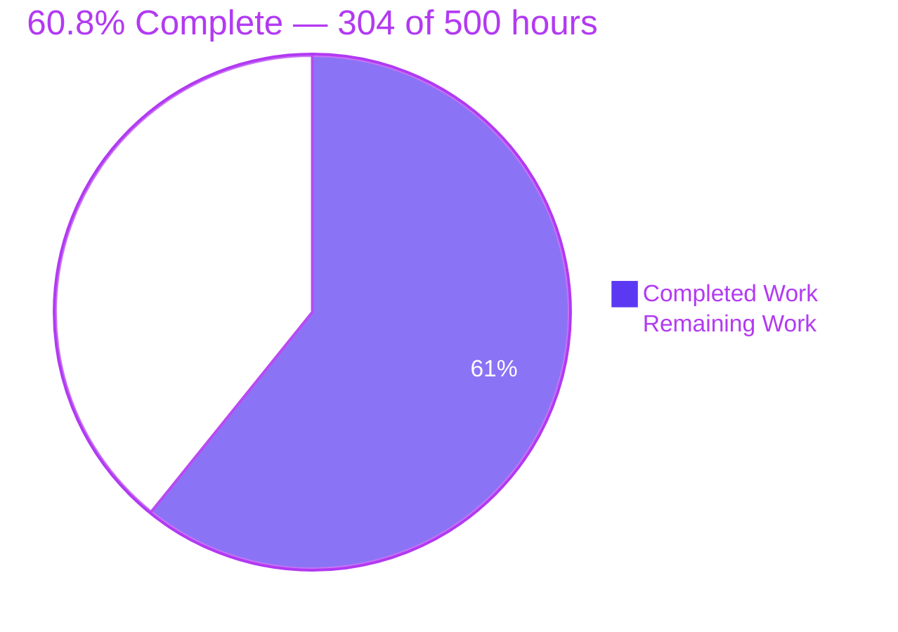
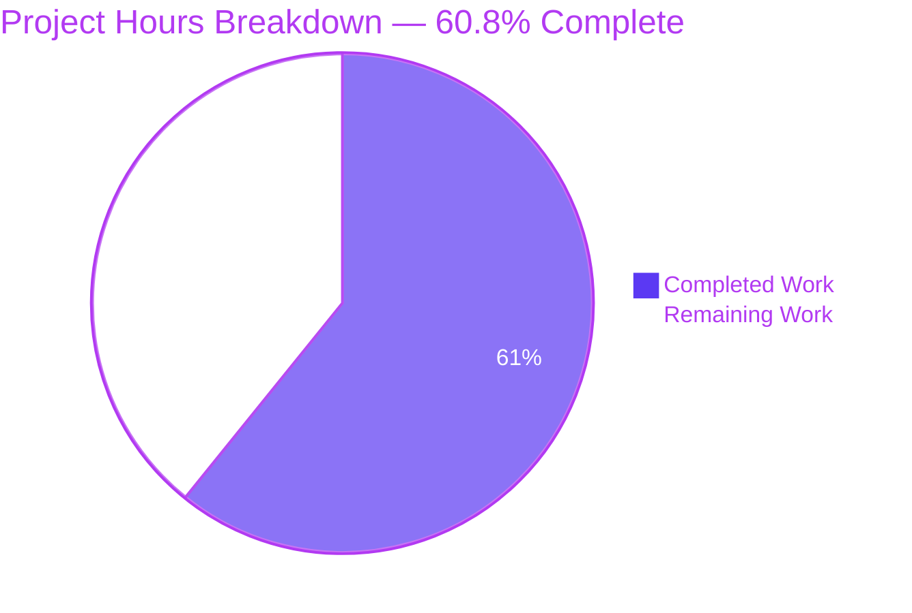
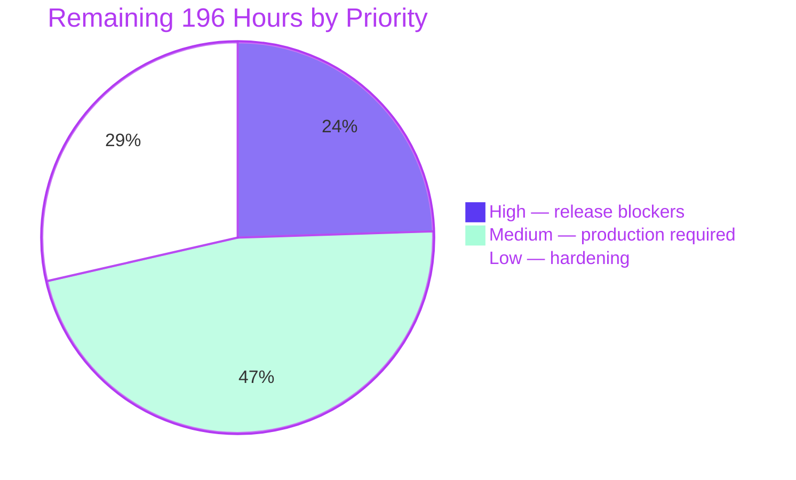

# Blitzy Project Guide — apartment-finder-service Security Remediation

**Branch** `blitzy-6a978493-6c9d-44eb-a495-f7df2c6b1da7` · **HEAD** `06f0c88` · **Repository** `apartment-finder-service`

---

## 1. Executive Summary

### 1.1 Project Overview

This project closes twelve enumerated first-party security defects in `apartment-finder-service`, a FastAPI and React apartment-listing platform with PayPal subscriptions and Zillow ingestion. None is a published CVE; each is a defect in code, configuration or infrastructure the repository owns — spanning credential exposure, broken authentication, permissive CORS, absent input validation, browser token storage, unthrottled login, information disclosure, hardcoded payment environment, cleartext database transport, excessive database privilege and undisciplined secret custody. The audience is the platform's own engineering and security reviewers. Business impact is direct: the application could not previously start, so no security property was testable. Technical scope covers the backend, the frontend service layer, Terraform, Compose, provisioning scripts and CI.

### 1.2 Completion Status



<sub>■ Completed = Dark Blue `#5B39F3` · □ Remaining = White `#FFFFFF`</sub>

| Metric | Hours |
|---|---|
| **Total Hours** | **500** |
| **Completed Hours (AI + Manual)** | **304** (AI 304 · Manual 0) |
| **Remaining Hours** | **196** |
| **Percent Complete** | **60.8%** |

Calculation, shown explicitly: `304 / (304 + 196) = 304 / 500 = 60.8%`. All 41 commits on this branch are authored `Blitzy Agent <agent@blitzy.com>`, so the manual figure is zero by measurement rather than by assumption.

### 1.3 Key Accomplishments

- [x] **All twelve findings closed.** Every AAP-specified control for `SEC-01` through `SEC-12` is delivered, compiles, and carries passing regression coverage.
- [x] **The application boots.** All five layers of the import-failure chain were cleared and verified by execution; 18 of 18 modules import cleanly.
- [x] **959 of 959 security tests pass, exit 0**, across 13 suites at **96.32% line coverage** (6,879 of 7,142 lines).
- [x] **Three security gates measurably closed**: credential scan 4 → **0** hits, browser token storage 3 → **0** hits, frontend client-secret held at **0**.
- [x] **The dependency surface exists for the first time.** `backend/requirements.txt` pins 19 packages, including `bcrypt==4.3.0` — the pin that prevents a total authentication outage.
- [x] **The audit gate detects as well as passes**: 15 suppressions → exit 0; without them → 15 vulnerabilities in 9 packages, exit 1.
- [x] **Static-analysis debt reduced honestly**: flake8 129 → 96 findings, zero new categories, undefined names 4 → 1 with the survivor in an out-of-scope file.
- [x] **Runtime proven end to end** against a live TLS PostgreSQL instance: register → cookie → cookie-only auth → logout, throttle firing at the limit, CORS echo versus withhold, and a uniform error envelope across six status codes.
- [x] **Rule 1 artefacts delivered**: a 452-entry decision log and a traceability matrix whose bidirectional coverage is *measured* (116 edges each way, empty difference) rather than asserted.

### 1.4 Critical Unresolved Issues

| Issue | Impact | Owner | ETA |
|---|---|---|---|
| Credentials that were ever real remain un-rotated — the tracked tree is clean but history was not rewritten | A previously disclosed database password, signing key or payment secret still authenticates | Security / Platform | Before release · 3h |
| Frontend production build fails — 18 syntax errors in `src/services/paypal.ts` plus unmapped absolute imports and 2 undeclared packages | The SPA cannot be built or deployed, so `SEC-06` is unverifiable through the app's own UI | Frontend | Sprint 1 · 17h |
| Seven backend and two frontend build-time variables must exist before the new build starts; three were read but never declared | Mail and Zillow ingestion fail on first use; a missing origin allow-list stops the process entirely | DevOps | Before release · 7h |
| `POST /listings/` and `POST /subscriptions/` cannot persist records — `Listing` has no `owner_id` column and `models.py` is frozen | Two documented write paths return an error; needs columns plus migration tooling | Backend | Sprint 1 · 16h |
| `terraform validate` fails on 7 undeclared resource references in `outputs.tf`; the Cloud SQL SSL and role changes have never been applied | The `SEC-10` server half and the `SEC-11` cloud role are unproven in a real project | Infrastructure | Sprint 1 · 8h |
| 15 dependency advisories have no installable fix on Python 3.9; `ecdsa` PYSEC-2026-1325 will never receive one | 8 assessed unreachable, 2 partial with a compensating control; suppressions dated with a shared review trigger | Platform | Sprint 2 · 24h |
| Every previously issued token becomes invalid on release, and rollback repeats the invalidation | All active sessions re-authenticate once; the one non-revertible consequence | Release Manager | Release day · 6h |
| Three legacy test modules fail collection, and `ci.yml` invokes an `npm run lint` script that does not exist | The pipeline cannot reach green; masking the modules is forbidden by DL-191 | Backend / Frontend | Sprint 1 · 9h |

### 1.5 Access Issues

| System/Resource | Type of Access | Issue Description | Resolution Status | Owner |
|---|---|---|---|---|
| Google Cloud project | Deploy / plan credentials | No `gcloud` SDK and no application-default credentials in the validation environment. `ssl_mode = "ENCRYPTED_ONLY"` and `google_sql_user` were schema-validated in isolation against the real `google ~> 7.42` provider but never planned or applied | **Open** — blocks `SEC-10` server-half and `SEC-11` cloud verification | Infrastructure |
| PayPal REST API | `PAYPAL_CLIENT_ID` / `PAYPAL_CLIENT_SECRET` | Placeholder values only. `PAYPAL_MODE` is validated and the charge and replay seams are tested, but no live-mode transaction has been exercised | **Open** — staging exercise required | Payments |
| SendGrid API | `SENDGRID_API_KEY`, `FROM_EMAIL` | Placeholder values. Both settings were only just declared, so the mail path has never executed successfully | **Open** | Backend |
| Zillow API | `ZILLOW_API_KEY` | Placeholder value. `ZILLOW_API_URL` newly declared; no live ingestion run performed | **Open** | Backend |
| Cloud SQL instance | Managed database | No instance reachable. Validation used a local `postgres:13` container with TLS confirmed on, which exercises the client half of `SEC-10` only | **Open** | Infrastructure |
| npm registry (transitive audit) | Reproducible install | No frontend lock file exists, so a clean install cannot be performed and no stable frontend advisory report is obtainable | **Open** — named as a follow-on | Frontend |
| GitHub repository | Read / write | Remote reachable; branch pushed and confirmed at `06f0c88` | **Resolved** — no action | — |

### 1.6 Recommended Next Steps

1. **[High]** Rotate the database password, signing key and PayPal client secret, then generate a fresh signing key of at least 32 bytes — the application refuses to start below the per-algorithm floor. *(3h + 4h)*
2. **[High]** Provision the seven backend variables and the two frontend **build-time** variables in every environment, validating `ALLOWED_ORIGINS` and `ALLOWED_HOSTS` against the real deployed origins and ingress hostnames first. Startup is fail-closed by design. *(4h + 2h)*
3. **[High]** Restore the frontend build — repair `src/services/paypal.ts`, resolve the pre-existing semantic errors, configure path mapping, add the missing lint script — so the cookie session can be exercised through the SPA. *(17h)*
4. **[High]** Repair `infrastructure/terraform/outputs.tf`, then run a targeted plan and apply for `ssl_mode` and `google_sql_user` to prove the server half of `SEC-10` and the cloud role of `SEC-11`. *(8h)*
5. **[Medium]** Hold the human security review against the decision log and traceability matrix, then release on a coordinated window with forced re-authentication and a rehearsed rollback. *(8h + 6h)*

---

## 2. Project Hours Breakdown

### 2.1 Completed Work Detail

Every row traces to a specific AAP requirement. Hours reflect the delivered artefact measured on the committed tree.

| Component | Hours | Description |
|---|---|---|
| Dependency manifest + version-compatibility research | 14 | `backend/requirements.txt` with 19 pins. Includes the Python 3.9 remediation-ceiling analysis, direct probing of every advisory fix release, the `bcrypt` 5.0.0 failure proof, the Pydantic 1.x constraint across seven call sites, the `fastapi` 0.125.0-versus-0.115.14 advisory comparison, the end-to-end PyJWT contingency validation, and the `python-multipart` removal that closed six advisories at zero cost |
| Boot-blocker chain repairs + registration repair | 4 | All five import-failure layers cleared: missing schema names, `User` and `Dict` imports, the async `process_payment` wrapper, the `Base` import source, and `ALLOWED_ORIGINS`. Plus `created_at` on the registration insert |
| SEC-01 credential externalisation | 10 | Fail-closed `${VAR:?message}` indirection replacing the literal connection string; `JWT_SECRET` → `SECRET_KEY` correction; 32-line `.gitignore`; 212-line `.env.example`; setup-script credential generation |
| SEC-02 identity-claim correction | 9 | Subject minted as `str(user.id)`; canonical-decimal coercion guard bounded to the INTEGER primary key range; bare 404 normalised to a uniform 401 with `WWW-Authenticate: Bearer`; `iat` claim; outbound model retyped and its password-hash field dropped |
| SEC-03 origin allow-list + fail-closed validator | 10 | `ALLOWED_ORIGINS` as a required list with five origin-syntax helpers rejecting empty, `*`, `null`, non-ASCII and bare hosts; exact string equality with no reflection; explicit method and header lists replacing both wildcards |
| SEC-04 + SEC-05 request-validation boundary | 17 | Password policy mirroring the client character set plus the mandatory 72-byte bcrypt ceiling; `UserCreate`, `UserLogin`, `FilterCreate`, `ListingCreate` and a new `subscription.py`; `extra = "forbid"` on every create model; float finiteness checks |
| SEC-06 session-cookie migration | 12 | `HttpOnly; Secure; SameSite=Strict` cookie on both auth routes with the JSON body untouched; cookie-first guard with bearer fallback; new `POST /auth/logout`; browser storage removed from `auth.ts`; `api.ts` export and credentialed mode; axios pinned to exactly 1.19.0 |
| SEC-07 login throttling | 11 | slowapi limiter with in-memory storage, middleware and exceeded handler; 5 attempts per 15 minutes; identity-keyed second layer; fixed-cost password verification against a per-process stand-in hash; `Retry-After`; throttled attempts logged; `--no-proxy-headers` in the image command |
| SEC-08 error boundary + diagnostics channel | 14 | Four handlers sharing one `{detail, error_id, fields}` envelope; sanitising middleware inside the CORS layer; correlation identifier echoed to client and log; single-line log record factory with control-character translation; `hide_parameters` on the engine |
| SEC-09 payment environment + charge seam | 9 | `PAYPAL_MODE` restricted to `sandbox` or `live` and read from settings at two sites; CI gate asserting no client-secret pattern under `frontend/`; charge authorisation bound to a provider-confirmed reference with a worker-local replay ledger |
| SEC-10 transport encryption, both ends | 6 | `ip_configuration { ssl_mode = "ENCRYPTED_ONLY" }` on the Cloud SQL instance; `DB_SSLMODE` setting with a validated domain; `connect_args` applied conditionally for PostgreSQL URLs only, because SQLite rejects the argument |
| SEC-11 least-privilege role separation | 8 | `app_owner` and `app_user` split replacing one all-privileges account; `CONNECT`, `USAGE` and table-data grants plus `ALTER DEFAULT PRIVILEGES`; `PUBLIC` grants revoked; `google_sql_user` with a write-only password that reaches neither state nor a log |
| SEC-12 secret-custody discipline | 7 | Per-algorithm `SECRET_KEY` floor grounded in RFC 7518 (32/48/64 UTF-8 bytes); the three settings that raised `AttributeError` declared; CI secret scan; `.gitignore` and `.env.example` shared with SEC-01 |
| Test harness | 8 | `backend/tests/conftest.py`, 477 lines resolving four simultaneous constraints: dual import paths, environment injection before application import, a real SQLite session override rather than a mock, and an HTTPS base URL so `Secure` cookies persist |
| Security regression suite | 70 | 13 files, 13,815 lines, **959 tests**, 96.32% line coverage. Every one of the twelve findings carries coverage, from 14 cases on token storage to 295 on configuration guards |
| CI security gates | 7 | Dependency audit with 15 justified suppressions verified in both directions; three repository scans; a dedicated security-test step; an audit-result enforcement step |
| Rule 1 + operational documentation | 42 | `SECURITY.md` 1,004 lines (secret handling, verification commands, residual-risk register, 11 prioritised follow-ons); `decision-log.md` 2,815 lines with 452 entries in the mandated four-column form; `traceability-matrix.md` 509 lines with measured bidirectional coverage |
| Autonomous validation, QA remediation, extra hardening | 46 | Twelve documented review rounds across 41 commits, plus hardening beyond the map: TrustedHost and security-headers middleware, custom documentation pages, five additional regression suites, a 29-case configuration matrix, live runtime verification and three Chrome browser validation runs |
| **Total Completed** | **304** | Matches Completed Hours in Section 1.2 |

### 2.2 Remaining Work Detail

| Category | Hours | Priority |
|---|---|---|
| Secrets rotation, signing-key generation and environment provisioning | 7 | High |
| Release coordination, origin and host validation, rollback rehearsal | 8 | High |
| Frontend build restoration and lint tooling | 17 | High |
| Terraform `outputs.tf` repair and infrastructure apply | 8 | High |
| Human security review and sign-off | 8 | High |
| SEC-12 gap: managed secret store and federated pipeline identity | 14 | Medium |
| SEC-07 gap: durable, multi-replica-safe account lockout | 12 | Medium |
| SEC-10 gap: `verify-full` transport with root-certificate custody | 10 | Medium |
| Write-path repair for `POST /listings/` and `POST /subscriptions/` | 16 | Medium |
| Frontend lock file and undeclared dependency declaration | 6 | Medium |
| Legacy test collection-error retirement | 6 | Medium |
| Anti-forgery token scheme and durable payment replay ledger | 18 | Medium |
| Production smoke test, monitoring and integration exercise | 10 | Medium |
| Python 3.10+ runtime migration, clearing 15 advisories | 24 | Low |
| SEC-11 gap: per-service roles and row-level security | 16 | Low |
| Container, pipeline and residual hardening | 16 | Low |
| **Total Remaining** | **196** | — |

Band totals: High **48h** · Medium **92h** · Low **56h**. Section 2.1 (304) + Section 2.2 (196) = **500** Total Project Hours.

### 2.3 Human Task List

**High priority — 48 hours.** Blocks release or core functionality.

| # | Task | Hours |
|---|---|---|
| H1 | Rotate every credential that was ever real: database password, `SECRET_KEY`, PayPal client secret. The tracked tree is clean (scan 4 → 0) but history was never rewritten, and no commit performs this | 3.0 |
| H2 | Generate a signing key of at least 32 UTF-8 bytes (48 for HS384, 64 for HS512) and provision seven backend variables plus the two frontend **build-time** variables. Three of the seven were read but never declared, so mail and Zillow ingestion fail on first use today | 4.0 |
| H3 | Validate `ALLOWED_ORIGINS` (JSON-array form) and `ALLOWED_HOSTS` against the deployed frontend origins and ingress hostnames. Startup is fail-closed and `TrustedHostMiddleware` answers 400 on an unexpected `Host` — both verified live | 2.0 |
| H4 | Restore the frontend production build: 18 measured syntax errors in `src/services/paypal.ts`, the 29 pre-existing semantic errors, and path mapping for absolute `frontend/src/...` specifiers | 14.0 |
| H5 | Add the missing `lint` script and eslint dependency — `ci.yml` invokes `npm run lint` and `package.json` defines only start, build, test and eject | 3.0 |
| H6 | Repair `outputs.tf` (7 measured undeclared resource references) and `var.gke_num_nodes`, then run a targeted plan and apply for `ssl_mode` and `google_sql_user` | 8.0 |
| H7 | Human security review and sign-off of the twelve findings against the decision log and traceability matrix; confirm the 15 suppressions and their shared review trigger | 8.0 |
| H8 | Coordinated release: announce that all previously issued tokens become invalid, rehearse rollback including the second forced re-authentication, confirm no dual-token acceptance window is introduced | 6.0 |

**Medium priority — 92 hours.** Required for production, not blocking.

| # | Task | Hours |
|---|---|---|
| M1 | Provision a managed secret store with key management and migrate the pipeline off its long-lived service-account key to federated identity *(SEC-12 gap)* | 14.0 |
| M2 | Move database transport to `verify-full`: distribute and rotate a root certificate, add `sslrootcert` to `connect_args` or export `PGSSLROOTCERT`. `DB_SSLMODE` already admits the value *(SEC-10 gap)* | 10.0 |
| M3 | Add durable, multi-replica-safe account lockout via an external store or migration tooling, replacing per-worker throttle state *(SEC-07 gap)* | 12.0 |
| M4 | Add `Listing.owner_id`, `Subscription.plan` and the non-null timestamp and status defaults, and adopt migration tooling, so both write paths can persist records | 16.0 |
| M5 | Audit the frontend transitive tree, commit a lock file, and declare `@paypal/react-paypal-js` and `dayjs` — both measured as imported but undeclared | 6.0 |
| M6 | Retire the three legacy collection errors. Masking them is forbidden by DL-191 and would break two passing assertions | 6.0 |
| M7 | Add a full anti-forgery token scheme for the CSRF surface the cookie migration created, replacing sole reliance on `SameSite=Strict` | 10.0 |
| M8 | Add durable, shared replay protection for payment references, replacing the 4,096-digest per-worker ledger | 8.0 |
| M9 | Production smoke test plus monitoring and alerting verification: select health-probe paths (there is no `/` and no `/health`), exercise `SENTRY_DSN`, confirm throttle and CORS behaviour in the deployed topology | 6.0 |
| M10 | Exercise PayPal live mode, SendGrid and Zillow end to end in staging — none has ever run successfully | 4.0 |

**Low priority — 56 hours.** Hardening and optimisation.

| # | Task | Hours |
|---|---|---|
| L1 | Migrate to Python 3.10 or newer: update the four declaration sites, re-resolve the 19 pins, re-run the 959-test suite, then empty the suppression list. The only real remedy for the 15 advisories | 24.0 |
| L2 | Add per-service database roles and row-level security with a session-variable convention *(SEC-11 gap)* | 16.0 |
| L3 | Harden containers and pipeline: narrow both `COPY . .` instructions to allow-lists, refresh both end-of-life base images, run as non-root, pin actions to immutable digests, refresh the proxy image | 9.0 |
| L4 | Authorise then apply a bounded page size on `GET /listings/`. The parameters are a frozen contract, so the amendment comes first (DL-187) | 3.0 |
| L5 | Close the remaining noted-but-unfixed observations: Zillow key out of the query string, drop the password-hash field from the user response schema, require authenticated function invocation, add private networking and authorized networks | 4.0 |

---

## 3. Test Results

All tests below originate from Blitzy's autonomous validation logs for this project and were re-executed and reproduced independently on the committed tree at `06f0c88`.

| Test Category | Framework | Total Tests | Passed | Failed | Coverage % | Notes |
|---|---|---|---|---|---|---|
| Configuration guards (SEC-01/09/10/11/12) | pytest 8.4.2 | 295 | 295 | 0 | 79.7 (`config.py`) | Includes the 29-case validator matrix and both credential-scan gate stages |
| Input validation & mass assignment (SEC-05) | pytest 8.4.2 | 193 | 193 | 0 | 93.9–98.4 (schema) | Unknown key rejected 422; malformed, missing and mistyped fields never 500 |
| Password policy (SEC-04) | pytest 8.4.2 | 98 | 98 | 0 | 98.4 (`schema/user.py`) | Includes the mandatory 73-byte ceiling case |
| Documentation accessibility | pytest 8.4.2 | 57 | 57 | 0 | 97.6 (`main.py`) | Custom `/docs` and `/redoc` pages and their affordances |
| Response headers | pytest 8.4.2 | 56 | 56 | 0 | 97.6 (`main.py`) | CSP, X-Frame-Options, Referrer-Policy, Permissions-Policy |
| Auth identity (SEC-02) | pytest 8.4.2 | 42 | 42 | 0 | 100 (`security.py`) | Subject round-trip; email-subject and unresolvable-subject both 401, never 500 or 404 |
| Host validation | pytest 8.4.2 | 41 | 41 | 0 | 97.6 (`main.py`) | Suffix-attack refusal on the host allow-list |
| Error handling (SEC-08) | pytest 8.4.2 | 40 | 40 | 0 | 97.6 (`main.py`) | Envelope uniformity, correlation id, zero leakage |
| CORS policy (SEC-03) | pytest 8.4.2 | 38 | 38 | 0 | 97.6 (`main.py`) | Allow-listed echo, foreign withhold, fail-closed startup |
| OpenAPI contract | pytest 8.4.2 | 30 | 30 | 0 | 100 (`router.py`) | Declared client paths compared against the real route table |
| Login throttle (SEC-07) | pytest 8.4.2 | 29 | 29 | 0 | 99.3 (`auth.py`) | Sixth attempt 429, uniform envelope, attempts logged |
| Zillow ingestion | pytest 8.4.2 | 26 | 26 | 0 | 95.5 (`zillow_service.py`) | Transform and scheduling behaviour preserved |
| Token storage (SEC-06) | pytest 8.4.2 | 14 | 14 | 0 | 99.3 (`auth.py`) | Three cookie attributes, frozen body, cookie-only auth, bearer fallback, logout |
| **Security regression total** | **pytest 8.4.2** | **959** | **959** | **0** | **96.32 overall** | **exit 0** in 117.64 s; deterministic across 5 runs in 3 configurations |
| Legacy unit tests (pre-existing) | pytest 8.4.2 | 0 collected | 0 | 0 (3 collection errors) | n/a | `test_api.py`, `test_services.py`, `test_tasks.py` target a module, package and function that exist nowhere. Pre-existing; masking forbidden by DL-191 |
| Dependency audit | pip-audit 2.9.0 | 75 packages | pass | 0 | n/a | 15 suppressions → exit 0; unsuppressed → 15 vulns in 9 packages, exit 1 |
| Repository scan gates | grep -rIn | 3 gates | 3 | 0 | n/a | Credential 4 → **0**; frontend client-secret 0 → **0**; browser storage 3 → **0** |
| Static analysis | flake8 7.3.0 | 96 findings | n/a | n/a | n/a | 129 → 96, zero new categories, undefined names 4 → 1 (survivor out of scope) |
| Frontend type check | tsc (strict) | 18 errors | n/a | n/a | n/a | All 18 in `src/services/paypal.ts`, an untouched original-author file. Both in-scope service files clean |
| Browser validation | Chrome (headless) | 3 runs | 3 | 0 | n/a | HttpOnly proven from Chrome's own cookie DB (`is_httponly=1, is_secure=1, samesite=STRICT`); all 6 storage surfaces empty |

**Aggregate: 959 automated tests executed, 959 passed, 0 failed, 0 skipped — a 100% pass rate at 96.32% line coverage.** Per-suite counts were re-collected independently and their sum is exactly 959, so nothing is deselected or lost.

---

## 4. Runtime Validation & UI Verification

Every item was exercised against a live `uvicorn` process talking to a TLS-enabled PostgreSQL 13 instance, on the committed tree.

**Application health**

- ✅ **Operational** — Application startup completes; 18 of 18 modules import; importing `main` opens a live TLS database connection through the `SEC-10` `connect_args`
- ✅ **Operational** — `GET /listings/` 200 with `skip`/`limit` pagination intact (the frozen public read path)
- ✅ **Operational** — `GET /openapi.json` 200 · `GET /docs` 200 · `GET /redoc` 200
- ⚠ **Partial** — No `/` route and no `/health` route exist. Load-balancer and orchestrator probes must target `/listings/`, `/openapi.json`, `/docs` or `/redoc`
- ✅ **Operational** — `docker compose config` renders three services (backend :8000, db :5432, frontend :80), each with a healthcheck

**Authentication and session (SEC-02, SEC-06)**

- ✅ **Operational** — Register 200; token subject minted as a canonical decimal `User.id`; both `exp` and `iat` present
- ✅ **Operational** — `Set-Cookie: access_token=…; HttpOnly; Max-Age=1800; Path=/; SameSite=strict; Secure`
- ✅ **Operational** — Login response body carries exactly `access_token` and `token_type`; the frozen contract is byte-for-byte intact
- ✅ **Operational** — Cookie-only request to `/filters/` 200 · no-credential request 401 · `POST /auth/logout` 200
- ✅ **Operational** — Chrome stores the Secure cookie and authenticates with it while `document.cookie`, localStorage, sessionStorage, cookieStore, IndexedDB and Cache Storage are all empty; a control experiment isolated `HttpOnly` as the cause
- ⚠ **Partial** — No end-to-end flow through the SPA's own UI, because the frontend cannot build. Verified through `/docs` and direct HTTP instead

**Request boundary and error handling (SEC-04, SEC-05, SEC-08)**

- ✅ **Operational** — Unknown field `is_admin` rejected 422 with `fields: ["is_admin"]` — mass assignment closed, proven live
- ✅ **Operational** — Short password rejected 422 with `fields: ["password"]` and no other detail
- ✅ **Operational** — Uniform `{detail, error_id, fields}` envelope confirmed on 404 (both route-miss and resource-miss), 405 and 422; zero leakage hits
- ✅ **Operational** — A forced internal error returns the generic body while the full traceback shares one correlation identifier in the log

**Network policy (SEC-03, SEC-07, plus additional hardening)**

- ✅ **Operational** — Allow-listed origin echoed with `access-control-allow-credentials: true` and `vary: Origin`; foreign origin receives no allow-origin header
- ✅ **Operational** — Consecutive failed logins produce 401 responses then **429**, with `Retry-After` exposed through CORS
- ✅ **Operational** — Foreign `Host` refused with 400 by `TrustedHostMiddleware`
- ✅ **Operational** — Fail-closed startup proven for six unsafe configuration values
- ✅ **Operational** — Additional headers present: `x-content-type-options: nosniff`, `x-frame-options: DENY`, `referrer-policy: no-referrer`, a 16-feature `permissions-policy`, and `content-security-policy: default-src 'none'`

**Integrations**

- ⚠ **Partial** — PayPal: `PAYPAL_MODE` validated and the charge and replay seams tested, but only against the sandbox path
- ⚠ **Partial** — Zillow: transform and scheduling covered by 26 tests; no live ingestion run (placeholder key)
- ❌ **Failing** — SendGrid: settings newly declared, mail path never executed successfully (placeholder key)
- ⚠ **Partial** — Cloud SQL: `ssl_mode = "ENCRYPTED_ONLY"` and `google_sql_user` schema-valid in isolation against the real provider, never applied
- ❌ **Failing** — `POST /listings/` and `POST /subscriptions/` cannot persist records; `Listing` has no `owner_id` column and `models.py` is frozen

---

## 5. Compliance & Quality Review

| AAP deliverable | Benchmark | Status | Evidence and fixes applied during autonomous validation |
|---|---|---|---|
| SEC-01 Hardcoded credentials | CWE-798/540 · A07:2021 | ✅ **Pass** | Credential scan 4 → **0** hits. Fail-closed `${VAR:?}` contract, `.gitignore`, `.env.example`. The setup script was pulled into scope because 3 of the 4 baseline hits were in it |
| SEC-02 Broken authentication | CWE-287/863 · A01:2021 | ✅ **Pass** | Subject `"83"` minted and coerced; 42 tests; four negatives all 401, never 500 or 404. Hardened during validation from a plain `int()` cast to a canonical-decimal regex bounded to the INTEGER range |
| SEC-03 Permissive CORS | CWE-942/346 · A05:2021 | ✅ **Pass** | 38 tests; echo versus withhold verified live; fail-closed for six unsafe values. Extended during validation to reject non-ASCII, whitespace and control characters |
| SEC-04 Weak password policy | CWE-521 · A07:2021 | ✅ **Pass** | 98 tests. The 72-byte ceiling is mandatory, not defensive: at pinned `bcrypt==4.3.0` a 100-character password is accepted silently — re-proven live during validation |
| SEC-05 Input validation / mass assignment | CWE-20/915 · A03:2021 | ✅ **Pass** | 193 tests; `extra = "forbid"` on every create model; unknown key 422 live. Extended with float finiteness checks so `NaN` and `Infinity` are refused |
| SEC-06 Token in browser storage | CWE-522/1004 · A07:2021 | ✅ **Pass** | Browser-storage scan 3 → **0**. Chrome cookie DB shows `is_httponly=1, is_secure=1, samesite=STRICT`. `POST /auth/logout` added because script cannot delete an HttpOnly cookie. axios pinned exactly and the cross-site-token option deliberately left unset |
| SEC-07 Excessive auth attempts | CWE-307 · A07:2021 | ⚠ **Pass (partial)** | 429 at the limit, proven live. Two layers: address-keyed plus identity-keyed, with fixed-cost verification. **Gap**: per-worker state, not durable or multi-replica-safe. Corrected during validation from a folded counter key to the exact stored identity |
| SEC-08 Error information exposure | CWE-209/497 · A05:2021 | ✅ **Pass** | Uniform envelope across 400/401/404/405/422/429/500 with **0 leakage hits**; one correlation id spans the generic body and the full traceback. Single-line log folding added at record creation |
| SEC-09 Insecure default init | CWE-1188/798 · A05:2021 | ✅ **Pass** | Frontend client-secret scan held at **0**, now an enforced CI invariant rather than an accident. `PAYPAL_MODE` domain-restricted. **Gap**: the replay ledger is worker-local and bounded |
| SEC-10 Cleartext DB transport | CWE-319 · A02:2021 | ⚠ **Pass (partial)** | Client half proven by a live TLS connection; server half schema-valid in isolation. `connect_args` applied conditionally, since SQLite raises `TypeError` on `sslmode`. **Gap**: `require` encrypts but does not verify server identity |
| SEC-11 Excessive privilege | CWE-250/269 · A01:2021 | ⚠ **Pass (partial)** | `GRANT ALL` removed; `app_owner`/`app_user` split with least-privilege grants, default privileges and `PUBLIC` revocation; `google_sql_user` with a write-only password. **Gap**: no per-service roles, no row-level security |
| SEC-12 Secret custody | CWE-522 · A05:2021 | ⚠ **Pass (partial)** | Per-algorithm key floor per RFC 7518; three previously-undeclared settings added; CI secret scan. **Gap**: no managed secret store; pipeline still on a long-lived key |
| Dependency integrity | CWE-1104 · A06:2021 | ✅ **Pass** | Manifest created; 19 pins; fresh-venv install exit 0 with `pip check` clean; audit gate verified in both directions. 15 advisories unpatchable on this runtime, 8 assessed unreachable, each suppression dated with a shared review trigger |
| Rule 1 — Explainability | Four-column decision log | ✅ **Pass** | `decision-log.md`, 2,815 lines, **452 entries** covering every version choice, design trade-off, advisory suppression, partial remediation and boundary decision |
| Rule 1 — Traceability | Bidirectional, 100% coverage | ✅ **Pass** | `traceability-matrix.md`, 509 lines. Coverage **measured, not asserted**: 116 edges in each direction with an empty difference, 58 unique paths in 58 rows |
| Rule 2 — Prose | Technical-documentation agent | ✅ **Pass** | Applied to the five prose artefacts; code, configuration and manifests excluded per the special-handling clause. The blog-scoped rule subset was correctly identified as non-binding |
| Minimal Change Clause | Smallest change per finding | ✅ **Pass** | 0 deletions; no schema migration; no new infrastructure; one-line enabling repairs rather than refactors; one package removed rather than upgraded, closing six advisories at zero cost; 8 further weaknesses recorded and deliberately not fixed |
| Frozen contract preservation | No path, verb or body change | ✅ **Pass** | Login body keys verified byte-for-byte against the original; route table matches the frozen set plus the one additive `POST /auth/logout`; all eight frozen variable names retained |
| Delivered file map | 39 planned paths | ✅ **Pass** | All 39 present. 37 in the planned mode (16/16 CREATE, 18/18 UPDATE, 3/5 REFERENCE unchanged); 2 documented deviations, each with a superseding decision chain and an explicit matrix row |
| Pipeline green | All CI steps pass | ❌ **Fail (expected)** | Explicitly not on offer. 3 pre-existing collection errors, 96 flake8 findings in files the AAP forbids reformatting, a `npm run lint` script that does not exist. The commitment was "no **new** failures", and it is met |

---

## 6. Risk Assessment

| Risk | Category | Severity | Probability | Mitigation | Status |
|---|---|---|---|---|---|
| Credentials that were ever real remain un-rotated; history was not rewritten | Security | High | Medium | Rotate all three secrets before release (H1, 3h). No commit can do this | Open |
| 15 dependency advisories with no installable fix on Python 3.9; `ecdsa` will never receive one | Security | High | Medium | 8 assessed unreachable, 2 partial with a compensating control; algorithm allow-list turns the unfixable one into an enforced invariant; runtime migration (L1, 24h) | Mitigated / accepted |
| Secrets held in environment variables with no managed store; pipeline on a long-lived service-account key | Security | High | Medium | Provision a store and adopt federated identity (M1, 14h). Labelled a partial remediation, not claimed complete | Open |
| Frontend production build fails, so no SPA flow can be exercised | Technical | High | Certain | Repair `paypal.ts`, semantic errors and path mapping (H4, 14h). Both in-scope service files already type-check clean | Open |
| `POST /listings/` and `POST /subscriptions/` cannot persist records | Technical | High | Certain | Add columns and migration tooling (M4, 16h). Restated honestly in the AAP rather than promised | Open / documented |
| Cloud SQL SSL and role changes never applied; a wrong `DB_SSLMODE` silently changes the transport guarantee | Integration | High | Medium | Repair `outputs.tf`, then targeted plan and apply (H6, 8h). Validated in isolation against the real provider | Open |
| Seven backend and two frontend build variables absent; three were read but never declared | Operational | High | High | Provision from `.env.example` before the new build starts (H2, 4h) | Open |
| CSRF surface created by the cookie migration; `SameSite=Strict` is the only control | Security | Medium | Low | Anti-forgery token scheme (M7, 10h). Ripple identified and priced rather than discovered later | Mitigated / partial |
| Transport encrypted but server identity unverified (`require`, not `verify-full`) | Security | Medium | Low | Distribute and rotate a root certificate (M2, 10h). `DB_SSLMODE` already admits the value | Open / accepted |
| No row-level security; one application role reaches every row | Security | Medium | Medium | Per-service roles and RLS (L2, 16h). SEC-11 explicitly labelled partial | Open / accepted |
| Throttle and payment-replay state per-worker and lost on restart; behind a proxy all callers share one key | Operational | Medium | High at >1 worker | Durable lockout (M3, 12h) and shared replay ledger (M8, 8h). `--no-proxy-headers` keeps the key on the TCP peer today | Mitigated / partial |
| All previously issued tokens invalidated; rollback repeats it | Operational | Medium | Certain | Coordinated release with forced re-authentication (H8, 6h). Inherent to correcting the identity claim and accepted in the brief | Accepted |
| Fail-closed startup: a bad origin allow-list stops the process | Operational | Medium | Medium | Validate against real deployed origins first (H3, 2h). This is the requested behaviour, not a defect | Mitigated |
| `TrustedHostMiddleware` answers 400 for an unexpected `Host` | Operational | Medium | Medium | Include deployed hostnames in `ALLOWED_HOSTS`; confirm during smoke test (M9, 6h) | Mitigated |
| No health or root route for orchestrator probes | Operational | Medium | High | Point probes at `/listings/` or `/openapi.json` (M9, 6h). Verified live | Documented |
| `terraform validate` fails on 7 undeclared resources in `outputs.tf` | Technical | Medium | Certain | Repair as unrelated cleanup (H6, 8h). No CI job invokes Terraform | Open / documented |
| Three legacy modules fail collection; `npm run lint` script absent — pipeline cannot go green | Technical | Medium | Certain | Retire the modules (M6, 6h) and add the script (H5, 3h). Masking forbidden by DL-191 | Open / documented |
| Transitive resolution non-deterministic without a frontend lock file | Technical | Medium | Medium | Audit the tree and commit a lock file (M5, 6h). Direct dependencies pinned exactly today | Open / accepted |
| Session tokens cannot be revoked; a copied token authenticates until expiry | Security | Medium | Low | 30-minute expiry bounds the window; revocation needs persistent storage, which is a feature build | Accepted |
| `GET /listings/` has no bounded page size | Security | Medium | Medium | Amend the frozen contract, then apply the bound (L4, 3h) per DL-187 | Open / accepted |
| Containers run as root; both base images past end of life; actions on mutable tags | Security | Medium | Medium | Container and pipeline hardening (L3, 9h) | Open / accepted |
| PayPal live mode, SendGrid and Zillow never exercised against real credentials | Integration | Medium | Medium | Staged exercise in staging (M10, 4h) | Open |
| Zillow API key travels as a URL query parameter, landing in logs and proxy records | Integration | Medium | Medium | Recorded as noted-but-unfixed; move to a header (L5, 4h) | Open / documented |
| Cloud Functions permit unauthenticated invocation; cluster lacks private networking | Integration | Medium | Medium | Recorded as noted-but-unfixed; infrastructure authorization work (L5, 4h) | Open / documented |
| `access_token` remains script-readable in the frozen response body | Security | Low | Medium | `HttpOnly` bounds cookie reads only. The body is a user-frozen contract | Accepted |
| 96 flake8 findings remain in files the AAP forbids reformatting | Technical | Low | Certain | 129 → 96 with zero new categories. Cleanup is a separate pass | Accepted |
| Least-covered modules: `subscriptions.py` 73.1%, `listings.py` 79.0%, `config.py` 79.7% | Technical | Low | Low | Overall coverage is 96.32%; the gaps sit in the two write paths that cannot execute | Accepted |

---

## 7. Visual Project Status



<sub>■ Completed Work = Dark Blue `#5B39F3` (304h) · □ Remaining Work = White `#FFFFFF` (196h) · Total 500h</sub>

**Remaining work by priority**



**Remaining hours per category (Section 2.2)**

| Category | Hours | Bar |
|---|---|---|
| Python 3.10+ runtime migration | 24 | ████████████ |
| Anti-forgery scheme + durable replay ledger | 18 | █████████ |
| Frontend build restoration + lint tooling | 17 | ████████▌ |
| Write-path repair (listings, subscriptions) | 16 | ████████ |
| SEC-11 gap: per-service roles + RLS | 16 | ████████ |
| Container, pipeline, residual hardening | 16 | ████████ |
| SEC-12 gap: managed secret store | 14 | ███████ |
| SEC-07 gap: durable lockout | 12 | ██████ |
| SEC-10 gap: verify-full transport | 10 | █████ |
| Smoke test, monitoring, integrations | 10 | █████ |
| Release coordination + rollback rehearsal | 8 | ████ |
| Terraform repair + apply | 8 | ████ |
| Human security review + sign-off | 8 | ████ |
| Secrets rotation + env provisioning | 7 | ███▌ |
| Frontend lock file + undeclared packages | 6 | ███ |
| Legacy collection-error retirement | 6 | ███ |
| **Total** | **196** | |

**Findings status**

| Status | Count | Findings |
|---|---|---|
| ✅ Closed | 8 | SEC-01, SEC-02, SEC-03, SEC-04, SEC-05, SEC-06, SEC-08, SEC-09 |
| ⚠ Closed with a named gap (AAP-declared partial) | 4 | SEC-07, SEC-10, SEC-11, SEC-12 |
| ❌ Not started | 0 | — |

---

## 8. Summary & Recommendations

### Achievements

The project is **60.8% complete — 304 of 500 hours**. All twelve findings have their AAP-specified control delivered, and the evidence is measured rather than asserted: **959 of 959 security tests pass at 96.32% line coverage**, the credential scan fell from 4 hits to 0, browser token storage from 3 to 0, and the dependency audit gate was verified in both directions so it demonstrably detects as well as passes. The application now boots — all five layers of the import-failure chain were cleared and confirmed by execution — which means a security property can be tested here for the first time.

Three things distinguish this delivery. First, scope discipline held: zero deletions, no schema migration, no new infrastructure, one package removed rather than upgraded (closing six advisories at no functional cost), and eight further weaknesses found and deliberately recorded rather than quietly fixed. Second, the frozen contracts survived intact, verified byte-for-byte against the original sources. Third, the ripples the fixes themselves created were identified and priced rather than discovered later — the CSRF surface the cookie migration opens, the axios advisory that `withCredentials` switches on, and the logout route a browser cannot do without.

### Remaining gaps

The 196 remaining hours divide into two kinds of work, and the distinction matters for planning.

**52 hours are the four AAP-declared partial remediations.** In each case the minimal control is delivered and proven; the stronger control was deliberately deferred and the gap named: durable multi-replica lockout for SEC-07, certificate verification for SEC-10, row-level security for SEC-11, a managed secret store for SEC-12.

**144 hours are path to production.** The largest items are the Python 3.10+ migration that is the only real remedy for the 15 unpatchable advisories (24h), the anti-forgery scheme and durable replay ledger (18h), the frontend build restoration without which the SPA cannot ship (17h), the write-path repair for two documented routes (16h), and container and pipeline hardening (16h).

### Critical path to production

1. Rotate credentials and generate a new signing key — no commit performs this, and removing a value from a file does not un-disclose it *(7h)*
2. Provision the nine environment variables, validating the origin and host allow-lists against reality first, because startup is fail-closed by design *(6h)*
3. Restore the frontend build so the cookie session can be exercised through the SPA *(17h)*
4. Repair `outputs.tf` and apply the Cloud SQL SSL and role changes to prove the server half of SEC-10 and SEC-11 *(8h)*
5. Hold the human security review, then release on a coordinated window with forced re-authentication and a rehearsed rollback *(14h)*

That is **52 hours to a defensible production release**, with the remaining 144 hours sequenced across the following two sprints.

### Success metrics

| Metric | Baseline | Now | Target |
|---|---|---|---|
| Security tests passing | 0 collected, 3 errors | **959 / 959** | Maintained |
| Line coverage | none measurable | **96.32%** | ≥ 90% |
| Credential-scan hits | 4 | **0** | 0 |
| Browser token-storage hits | 3 | **0** | 0 |
| Frontend client-secret hits | 0 | **0** (now enforced) | 0 |
| flake8 findings | 129 | **96** | Falling, no new categories |
| Undefined names | 4 | **1** (out of scope) | 0 after cleanup |
| Unpatchable advisories | never enumerated | **15**, all justified | 0 after runtime migration |
| Findings closed | 0 / 12 | **12 / 12** control delivered | 12 with all gaps closed |

### Production readiness assessment

**Conditionally ready for a coordinated release, and not ready for an unattended one.** The backend security posture is materially and verifiably improved, and every claim in this guide was re-measured on the committed tree rather than inherited. Three conditions gate the release: credentials must be rotated, the nine environment variables must be provisioned, and the origin and host allow-lists must be validated against real deployed values — because a mistake there surfaces as a failed deployment rather than as a silent weakening, which is the correct trade but requires the operator to know it.

Two honest limits deserve emphasis. **A green pipeline is not on offer**, and claiming one would be false: three legacy test modules fail collection, 96 style findings sit in files the Minimal Change Clause forbids reformatting, and a CI step invokes a script that does not exist. And the **frontend cannot be built**, so `SEC-06` is verified by backend cookie tests and browser inspection rather than by an end-to-end journey through the application's own interface. Both were pre-existing, both were declared out of scope, and both are priced in the remaining work.

---

## 9. Development Guide

Every command below was executed against this repository during validation. Expected results are measured values, not predictions.

### 9.1 System prerequisites

| Requirement | Version | Why this version |
|---|---|---|
| Python | **3.9** (validated on 3.9.25) | Declared in four places: `Dockerfile.backend` (`python:3.9-slim`), `ci.yml`, `main.tf` (`runtime = "python39"`), `deploy.sh`. A compatibility claim verified on a runtime the project does not use is worthless |
| Node.js | **14** for the image build (validated with npm on the host) | `Dockerfile.frontend` (`node:14 as build`) and `ci.yml` |
| PostgreSQL | **13** with TLS | `main.tf` (`database_version = "POSTGRES_13"`) |
| Docker | Engine 20.10+ with the `compose` plugin | Use `docker compose`, not the legacy script |
| Terraform | 1.x with `google ~> 7.42` | Only for the infrastructure changes |
| OS / hardware | Linux, 4 GB RAM, 2 GB disk | The full suite runs in about two minutes |

### 9.2 Environment setup

Run **every** command from the **repository root**. Pydantic resolves `env_file` against the current working directory, so running from `backend/` makes settings construction fail on the required `DATABASE_URL`.

```bash
# 1. Create the environment file from the template. It is gitignored.
cp .env.example .env
chmod 600 .env
```

Then replace every angle-bracket placeholder. Nine values need attention:

```bash
# Database — sslmode is environment-driven, never hardcoded
DATABASE_URL=postgresql://app_user:<password>@localhost:5432/apartment_finder
DB_SSLMODE=require                 # use "disable" ONLY behind the Cloud SQL Auth Proxy

# Signing key — at least 32 UTF-8 bytes for HS256 (48 for HS384, 64 for HS512)
SECRET_KEY=$(python3 -c "import secrets;print(secrets.token_urlsafe(48))")
ALGORITHM=HS256
ACCESS_TOKEN_EXPIRE_MINUTES=30

# CORS and host allow-lists — JSON arrays. A bare comma-separated string fails.
ALLOWED_ORIGINS=["http://localhost:3000"]
ALLOWED_HOSTS=["localhost","127.0.0.1"]

# Cookie security — false only for plain-HTTP local development
COOKIE_SECURE=true
```

`.env.example` is authoritative for all 20 variable names, their shapes and their purposes, and it distinguishes placeholders from documented defaults from required choices.

Start the database:

```bash
docker run -d --name apartment-pg -p 5432:5432 \
  -e POSTGRES_PASSWORD=<password> -e POSTGRES_DB=apartment_finder \
  postgres:13

# Confirm TLS is on — the SEC-10 client fix connects through it
docker exec apartment-pg psql -U postgres -tAc "SHOW ssl;"     # expect: on
```

### 9.3 Dependency installation

```bash
python3.9 -m venv .venv
. .venv/bin/activate
pip install -r backend/requirements.txt
pip check
```

**Measured result:** exit 0. All 19 pins resolve into 74 packages with no conflict. `pip check` prints `No broken requirements found.` Verified from a completely clean virtual environment.

```bash
cd frontend && CI=true npm install --no-audit --no-fund && cd ..
node -e "console.log(require('./frontend/node_modules/axios/package.json').version)"
```

**Measured result:** `1.19.0` — the exact pin the `SEC-06` credentialed mode requires.

### 9.4 Application startup

```bash
# From the REPOSITORY ROOT, with .venv active
python -m uvicorn backend.app.main:app --host 127.0.0.1 --port 8000 --no-proxy-headers
```

**Expected output** ends with `INFO: Application startup complete.` One warning appears first and is harmless — see troubleshooting item 6.

`--no-proxy-headers` is not optional cosmetics: it keeps the rate-limit key on the TCP peer rather than letting `X-Forwarded-For` write it. Change it only alongside a real reverse proxy.

Full stack via Compose:

```bash
set -a; . ./.env; set +a
export REACT_APP_API_BASE_URL="http://localhost:8000"
export REACT_APP_PAYPAL_CLIENT_ID="<sandbox-client-id>"
docker compose -f infrastructure/docker/docker-compose.yml config     # exit 0
docker compose -f infrastructure/docker/docker-compose.yml up -d
```

The two `REACT_APP_*` variables are **build-time**, substituted into the bundle while it compiles. A value handed to a running container arrives too late. Neither may hold a secret — the PayPal client **secret** stays a backend setting.

### 9.5 Verification

```bash
# Security regression suite — the primary gate
cd backend && python -m pytest tests/security -q
```
**Measured: `959 passed, 1 warning in 117.64s`, exit 0.**

```bash
# Full suite with coverage, matching the pipeline invocation
python -m pytest --cov=./ --cov-report=xml --continue-on-collection-errors
```
**Measured: `959 passed, 1 warning, 3 errors`, exit 1, line-rate 0.9632.** Exit 1 is expected; the three errors are pre-existing legacy modules.

```bash
flake8 .        # measured: 96 findings, exit 1 — documented baseline, down from 129
cd ..
```

```bash
# Dependency audit gate — 15 suppressions exactly as in ci.yml
pip freeze > /tmp/frozen.txt
pip-audit --strict --no-deps -r /tmp/frozen.txt \
  --ignore-vuln PYSEC-2026-1325 --ignore-vuln PYSEC-2026-2132 \
  --ignore-vuln PYSEC-2026-161  --ignore-vuln PYSEC-2026-248 \
  --ignore-vuln PYSEC-2026-249  --ignore-vuln PYSEC-2026-2280 \
  --ignore-vuln PYSEC-2026-2281 --ignore-vuln PYSEC-2026-2275 \
  --ignore-vuln PYSEC-2026-141  --ignore-vuln PYSEC-2026-142 \
  --ignore-vuln PYSEC-2026-1374 --ignore-vuln PYSEC-2026-1375 \
  --ignore-vuln PYSEC-2026-1845 --ignore-vuln PYSEC-2026-2270 \
  --ignore-vuln GHSA-6v7p-g79w-8964
```
**Measured: `No known vulnerabilities found, 15 ignored`, exit 0.** Without the list: `Found 15 known vulnerabilities in 9 packages`, exit 1 — the gate detects as well as passes. Note that `pip-audit` matches PyPI-namespace identifiers; suppressing by a GitHub alias silently fails to match and the gate then looks broken.

```bash
# The three repository scan gates
grep -rIn -E "postgres:postgres|PASSWORD '[^']+'|SECRET_KEY=[A-Za-z0-9_]|password@" \
  --exclude-dir=.git --exclude-dir=.venv --exclude-dir=node_modules .   # expect 0 (was 4)
grep -rIn -E "CLIENT_SECRET|client_secret" frontend/                     # expect 0 (held)
grep -rIn -E "localStorage|sessionStorage" frontend/src/                 # expect 0 (was 3)
```

```bash
# Scripts and YAML
bash -n scripts/setup_dev_environment.sh && bash -n scripts/deploy.sh
python -c "import yaml;[yaml.safe_load(open(f)) for f in \
 ['.github/workflows/ci.yml','.github/workflows/cd.yml','infrastructure/docker/docker-compose.yml']]"
```

### 9.6 Example usage

Every request needs a `Host` the allow-list admits, or `TrustedHostMiddleware` answers 400.

```bash
# Public read path — no credential required (a frozen contract)
curl -s -H "Host: localhost" "http://127.0.0.1:8000/listings/?skip=0&limit=10"    # 200

# Register. Password must be 12-72 bytes with upper, lower, digit and special.
curl -s -D - -H "Host: localhost" -H "Content-Type: application/json" \
  -X POST http://127.0.0.1:8000/auth/register \
  -d '{"email":"dev@example.com","password":"SetupAgent1!Verify"}'
```
**Measured response:** 200, body keys `access_token`, `token_type`, `user`, and
`set-cookie: access_token=…; HttpOnly; Max-Age=1800; Path=/; SameSite=strict; Secure`

```bash
# Login and keep the cookie. Body keys are exactly access_token and token_type.
curl -s -c /tmp/cj.txt -H "Host: localhost" -H "Content-Type: application/json" \
  -X POST http://127.0.0.1:8000/auth/login \
  -d '{"email":"dev@example.com","password":"SetupAgent1!Verify"}'

curl -s -b /tmp/cj.txt -H "Host: localhost" http://127.0.0.1:8000/filters/   # 200 cookie-only auth
curl -s              -H "Host: localhost" http://127.0.0.1:8000/filters/     # 401 no credential
curl -s -b /tmp/cj.txt -H "Host: localhost" -X POST http://127.0.0.1:8000/auth/logout   # 200

# Mass assignment is refused, not absorbed
curl -s -H "Host: localhost" -H "Content-Type: application/json" \
  -X POST http://127.0.0.1:8000/auth/register \
  -d '{"email":"x@y.com","password":"SetupAgent1!Verify","is_admin":true}'
```
**Measured:** `422 {"detail":"Request validation failed","error_id":"…","fields":["is_admin"]}`

```bash
# CORS: allow-listed origin is echoed, a foreign one is not
curl -s -D - -o /dev/null -H "Host: localhost" -H "Origin: http://localhost:3000" \
  http://127.0.0.1:8000/listings/ | grep -i access-control
```
**Measured:** `access-control-allow-origin: http://localhost:3000`, `access-control-allow-credentials: true`, `vary: Origin`. With `Origin: https://evil.example.com`, no allow-origin header is emitted at all.

### 9.7 Troubleshooting

| # | Symptom | Cause and resolution |
|---|---|---|
| 1 | `ValidationError: DATABASE_URL field required` although `.env` exists | Pydantic resolves `env_file` against the current working directory. Run every command from the **repository root** |
| 2 | `404 {"detail":"Not Found"}` on `/` or `/health` | Neither route exists. Use `/listings/`, `/openapi.json`, `/docs` or `/redoc`, including for orchestrator probes |
| 3 | Every request returns `400 Invalid host header` | `TrustedHostMiddleware`. Add the hostname to `ALLOWED_HOSTS` as a JSON array |
| 4 | Process exits during startup with a validation error on `ALLOWED_ORIGINS` | Intended fail-closed behaviour. Empty, `*`, `"null"` and bare hosts are all rejected. Use a JSON array of full origins: `["http://localhost:3000"]` — a bare comma-separated string fails with no obvious cause |
| 5 | `SECRET_KEY` rejected at startup | The floor is per algorithm: 32 UTF-8 bytes for HS256, 48 for HS384, 64 for HS512, per RFC 7518 §3.2. Generate with `python3 -c "import secrets;print(secrets.token_urlsafe(48))"` |
| 6 | `(trapped) error reading bcrypt version` / `module 'bcrypt' has no attribute '__about__'` | **Non-fatal** passlib probe warning at the pinned `bcrypt==4.3.0`. Hashing works. Do **not** upgrade to bcrypt 5.0.0 — it raises inside the same probe and breaks all password hashing |
| 7 | Compose fails with `required variable REACT_APP_API_BASE_URL is missing a value` | Intended. Export both `REACT_APP_*` build variables; there are no inline defaults anywhere |
| 8 | Connection refused, or TLS errors, against the Cloud SQL Auth Proxy | The proxy terminates TLS itself and listens on plain local TCP. Set `DB_SSLMODE=disable` — the documented local-development exception. Forcing `require` on that hop breaks the stack |
| 9 | `TypeError: 'sslmode' is an invalid keyword argument` | `connect_args` is applied only for URLs beginning `postgres`. SQLite rejects it, which is exactly why the test harness can use SQLite |
| 10 | Cookie-based test assertions fail although the code is correct | A `Secure` cookie is not persisted over plain HTTP. The harness uses an HTTPS base URL, and `COOKIE_SECURE` is settings-driven so the same code works in both contexts |
| 11 | `429 Too Many Requests` while testing login | The throttle is working: 5 attempts per 15 minutes per address, plus an identity-keyed layer. Restart the process to clear in-process state, or wait out the window |
| 12 | `pytest` exits 1 with three collection errors | Pre-existing. `test_api.py`, `test_services.py` and `test_tasks.py` target a module, a package and a function that exist nowhere. Add `--continue-on-collection-errors`; masking them is forbidden by DL-191 |
| 13 | `flake8` exits 1 with 96 findings | The documented baseline, down from 129. These sit in files the Minimal Change Clause forbids reformatting |
| 14 | `terraform validate` fails | Pre-existing: `outputs.tf` references 7 resources `main.tf` never declares, plus `var.gke_num_nodes`. Validate the changed resources in isolation. No CI job invokes Terraform |
| 15 | `npm run build` or `tsc` fails | Pre-existing: 18 syntax errors in `src/services/paypal.ts` (an untouched original-author file), unmapped absolute imports, and two undeclared packages. Both in-scope service files are clean |
| 16 | `npm run lint` reports a missing script | `package.json` defines only start, build, test and eject. `ci.yml` invokes `lint`; adding the script is task H5 |

---

## 10. Appendices

### Appendix A — Command Reference

| Purpose | Command | Expected |
|---|---|---|
| Create environment | `python3.9 -m venv .venv && . .venv/bin/activate` | Python 3.9.25 |
| Install backend deps | `pip install -r backend/requirements.txt` | exit 0, 19 pins, 74 packages |
| Verify resolution | `pip check` | `No broken requirements found.` |
| Install frontend deps | `cd frontend && CI=true npm install --no-audit --no-fund` | exit 0, axios 1.19.0 |
| Security suite | `cd backend && python -m pytest tests/security -q` | **959 passed**, exit 0 |
| Full suite + coverage | `python -m pytest --cov=./ --cov-report=xml --continue-on-collection-errors` | 959 passed, 3 errors, exit 1 |
| Single suite | `python -m pytest tests/security/test_token_storage.py -q` | 14 passed |
| Style check | `cd backend && flake8 .` | 96 findings, exit 1 |
| Syntax check | `python -m compileall -q backend/app backend/tests` | exit 0 |
| Dependency audit | `pip-audit --strict --no-deps -r /tmp/frozen.txt --ignore-vuln …` | 15 ignored, exit 0 |
| Audit detection proof | same command without `--ignore-vuln` | 15 vulns / 9 packages, exit 1 |
| Credential gate | `grep -rIn -E "postgres:postgres\|PASSWORD '[^']+'\|password@" --exclude-dir=.git .` | 0 matches |
| Client-secret gate | `grep -rIn -E "CLIENT_SECRET\|client_secret" frontend/` | 0 matches |
| Token-storage gate | `grep -rIn -E "localStorage\|sessionStorage" frontend/src/` | 0 matches |
| Run application | `python -m uvicorn backend.app.main:app --host 127.0.0.1 --port 8000 --no-proxy-headers` | `Application startup complete.` |
| Compose render | `docker compose -f infrastructure/docker/docker-compose.yml config` | exit 0 once all variables are set |
| Script syntax | `bash -n scripts/setup_dev_environment.sh` | silent |
| Infrastructure format | `cd infrastructure/terraform && terraform fmt -check` | see troubleshooting 14 |

### Appendix B — Port Reference

| Port | Service | Source | Notes |
|---|---|---|---|
| 8000 | FastAPI backend | `docker-compose.yml`, uvicorn | Healthchecked in Compose |
| 3000 | React dev server | `ALLOWED_ORIGINS` default | Must appear in the origin allow-list |
| 80 | Frontend (built bundle) | `docker-compose.yml` | Healthchecked in Compose |
| 5432 | PostgreSQL / Cloud SQL Auth Proxy | `docker-compose.yml` | Behind the proxy, use `DB_SSLMODE=disable` |

### Appendix C — Key File Locations

| Path | Role |
|---|---|
| `backend/requirements.txt` | 19 pins. `bcrypt==4.3.0` is availability-critical |
| `backend/app/core/config.py` | 305 lines. All security settings, 6 validators + a root validator |
| `backend/app/core/security.py` | 117 lines. Token minting, cookie-first guard, canonical subject coercion |
| `backend/app/main.py` | 1,338 lines. CORS, TrustedHost, security headers, sanitising middleware, 4 handlers, docs pages |
| `backend/app/api/endpoints/auth.py` | 359 lines. Register, login, logout, throttle, cookie issuance |
| `backend/app/schema/*.py` | 4 modules. Strict create models with `extra = "forbid"` |
| `backend/app/db/database.py` | Conditional `connect_args` sslmode, `hide_parameters` |
| `backend/app/db/models.py` | **Frozen reference.** Column types and constraints; unchanged, since there is no migration tooling |
| `backend/tests/conftest.py` | 477-line harness: dual import paths, pre-import env injection, SQLite override, HTTPS base URL |
| `backend/tests/security/` | 13 suites, 13,815 lines, 959 tests |
| `frontend/src/services/api.ts` | `API_BASE_URL` export, `withCredentials`, the `ApiError` envelope |
| `frontend/src/services/auth.ts` | No browser storage; corrected path; server-side logout |
| `frontend/src/utils/validators.ts` | **Frozen reference.** Authoritative password character set |
| `infrastructure/terraform/main.tf` | `ssl_mode = "ENCRYPTED_ONLY"`, `google_sql_user` with `password_wo` |
| `scripts/setup_dev_environment.sh` | 409 lines. `app_owner`/`app_user` split, generated passwords via stdin |
| `.github/workflows/ci.yml` | 212 lines. Audit gate + 3 scan gates + security-test step |
| `.env.example` | 212 lines. All 20 variable names, values placeholder-only |
| `SECURITY.md` | 1,004 lines. Secret handling, verification, residual risks, 11 prioritised follow-ons |
| `documentation/security/decision-log.md` | 2,815 lines, **452 entries**. Single source of truth for *why* |
| `documentation/security/traceability-matrix.md` | 509 lines. Measured bidirectional coverage |

### Appendix D — Technology Versions

| Package | Pinned | Why not the newest |
|---|---|---|
| `fastapi` | 0.125.0 | Highest installable on Python 3.9; later releases need 3.10+. Also closes two `starlette` advisories the conservative candidate leaves open |
| `starlette` | 0.49.3 (transitive) | Every release from 0.51.0 needs Python 3.10+ |
| `uvicorn` | 0.39.0 | Latest taken |
| `pydantic` | 1.10.26 | v2 moves `BaseSettings` out and renames `from_orm()`, used at six call sites |
| `email-validator` | 2.3.0 | Required by the SEC-04 email validation |
| `SQLAlchemy` | 2.0.51 | Latest taken |
| `psycopg2-binary` | 2.9.12 | Carries the SEC-10 `sslmode` connection argument |
| `python-jose[cryptography]` | 3.5.0 | Latest; addresses CVE-2024-33663 and CVE-2024-33664; verified to reject `alg=none` |
| `passlib[bcrypt]` | 1.7.4 | Latest taken |
| `bcrypt` | **4.3.0** | **5.0.0 raises inside passlib's own probe and breaks all password hashing** |
| `slowapi` | 0.1.10 | Latest; constructs with in-memory storage, no external service |
| `python-dotenv` | 1.2.1 | Highest installable on Python 3.9 |
| `requests` | 2.32.5 | 2.33.0+ needs Python 3.10+ |
| `paypalrestsdk` | 1.13.3 | Latest taken |
| `sendgrid` | 6.12.5 | Latest taken |
| `python-multipart` | **removed** | Not used anywhere; removal closed six advisories at zero functional cost |
| `pytest` | 8.4.2 | 9.x needs Python 3.10+ |
| `pytest-cov` | 7.1.0 | Required — `ci.yml` invokes coverage reporting |
| `flake8` | 7.3.0 | Required — `ci.yml` runs style checking |
| `pip-audit` | 2.9.0 | The dependency audit gate |
| `httpx` | 0.28.1 | Required by FastAPI's `TestClient`, and not a FastAPI dependency |
| `axios` (npm) | **1.19.0 exact** | A caret floor sat inside the CVE-2023-45857 range, which `withCredentials` activates |

Runtimes: Python **3.9.25** · Node **14** for the image build · PostgreSQL **13** with TLS · Terraform `google ~> 7.42`.

### Appendix E — Environment Variable Reference

| Variable | Required | Default | Validation |
|---|---|---|---|
| `DATABASE_URL` | Yes | none | Not format-checked; a malformed value fails at first use |
| `DB_SSLMODE` | No | `require` | Restricted domain; `disable` is the documented Auth Proxy exception |
| `SECRET_KEY` | Yes | none | ≥ 32 UTF-8 bytes for HS256, 48 for HS384, 64 for HS512 |
| `ALGORITHM` | Yes | none | HMAC family only — this is what makes the `ecdsa` advisory unreachable |
| `ACCESS_TOKEN_EXPIRE_MINUTES` | Yes | none | Integer > 0 |
| `COOKIE_SECURE` | No | `true` | Boolean; `false` only for plain-HTTP local development |
| `ALLOWED_ORIGINS` | **Yes** | none | JSON array of full origins. Rejects empty, `*`, `"null"`, bare hosts, non-ASCII. **A bad value stops startup** |
| `ALLOWED_HOSTS` | Yes | none | JSON array; an unmatched `Host` yields 400 |
| `LOGIN_RATE_LIMIT_ATTEMPTS` | No | `5` | Integer ≥ 1 |
| `LOGIN_RATE_LIMIT_WINDOW_MINUTES` | No | `15` | Integer ≥ 1 |
| `ZILLOW_API_URL` | Yes | none | Newly declared; raised `AttributeError` before |
| `ZILLOW_API_KEY` | Yes | none | Frozen name |
| `PAYPAL_MODE` | No | `sandbox` | `sandbox` or `live` only |
| `PAYPAL_CLIENT_ID` | Yes | none | Frozen name |
| `PAYPAL_CLIENT_SECRET` | Yes | none | Frozen name. **Never a build argument** |
| `SENDGRID_API_KEY` | Yes | none | Newly declared; raised `AttributeError` before |
| `FROM_EMAIL` | Yes | none | Newly declared |
| `SENTRY_DSN` | No | `None` | Deliberately empty in the template |
| `REACT_APP_API_BASE_URL` | Yes | none | **Build-time**, compiled into the bundle |
| `REACT_APP_PAYPAL_CLIENT_ID` | Yes | none | **Build-time**, public identifier only |

The eight frozen names are `DATABASE_URL`, `SECRET_KEY`, `ALGORITHM`, `ACCESS_TOKEN_EXPIRE_MINUTES`, `ZILLOW_API_KEY`, `PAYPAL_CLIENT_ID`, `PAYPAL_CLIENT_SECRET` and `SENTRY_DSN`. Every other setting is additive.

### Appendix F — Developer Tools Guide

| Tool | Use | Invocation |
|---|---|---|
| pytest 8.4.2 | Security regression suite | `python -m pytest tests/security -q` |
| pytest-cov 7.1.0 | Coverage reporting | `--cov=./ --cov-report=xml` |
| flake8 7.3.0 | Style and undefined names | `flake8 .` — the undefined-name count is the meaningful signal |
| pip-audit 2.9.0 | Dependency advisories | Always with the 15 `--ignore-vuln` ids; use **PyPI** identifiers, not GitHub aliases |
| grep gates | Credential, secret and storage scans | Three one-liners from Appendix A; also CI steps |
| tsc | Frontend type check | `node_modules/typescript/bin/tsc --noEmit -p tsconfig.json` |
| docker compose | Full stack | `config` first to prove variables are present, then `up -d` |
| terraform | Infrastructure | `fmt -check` and `validate`; validate the changed resources in isolation |
| Chrome DevTools | Cookie inspection | Application → Cookies. `HttpOnly` and `Secure` must both be ticked, and `document.cookie` must be empty |

Reading the documentation: **`SECURITY.md`** for operational secret handling, verification commands and the residual-risk register. **`decision-log.md`** for *why* any choice was made — 452 entries, and the single source of truth. **`traceability-matrix.md`** for what closes what, and where. Code comments carry a terse threat marker plus a stable `SEC-NN` identifier that keys the log; they deliberately carry no rationale.

### Appendix G — Glossary

| Term | Meaning |
|---|---|
| **SEC-01 … SEC-12** | The twelve finding identifiers, aligned one-to-one with the reporter's numbering, used in code markers, the decision log and the matrix |
| **DL-NNN** | A decision-log entry. 452 exist. Code comments point at these rather than restating rationale |
| **AAP** | Agent Action Plan — the specification governing this work |
| **Boot-blocker chain** | Five layers of import-time failure, each concealing the next, that made the application impossible to start. All cleared and verified by execution |
| **Minimal Change Clause** | The governing constraint: when two fixes both close a finding, the one touching fewer lines and fewer files wins |
| **Fail-closed** | A misconfiguration stops startup rather than silently weakening a control. Applied to the origin allow-list, key length and payment mode |
| **Partial remediation** | A finding whose minimal control is delivered while a stronger one is deliberately deferred, with the gap named. Four exist: SEC-07, SEC-10, SEC-11, SEC-12 |
| **Uniform envelope** | `{detail, error_id, fields}` returned by every handler. Uniformity prevents an attacker fingerprinting which component handled a request |
| **Account-state oracle** | A differential response revealing whether an account exists. Removed by normalising the bare 404 to a 401 |
| **Mass assignment** | Expanding a client-supplied body into a model constructor. Closed by `extra = "forbid"` on every create model |
| **Remediation ceiling** | The Python 3.9 constraint under which every advisory fix release is uninstallable, making the runtime migration the highest-priority follow-on |
| **Reachability** | Whether a vulnerable code path is actually invoked. What makes accepting 15 advisories defensible rather than negligent — 8 are unreachable by construction |
| **Cloud SQL Auth Proxy** | Terminates TLS itself and listens on plain local TCP, which is why `DB_SSLMODE=disable` is correct there and nowhere else |
| **Write-only password** | Terraform `password_wo`, whose value reaches neither state nor a log |
| **REFERENCE file** | A file read as an authority — a contract or column definition — and deliberately left unchanged |

---

**Cross-section integrity verified before submission.** Rule 1: remaining hours are **196** in Section 1.2, in the Section 2.2 sum, and in the Section 7 pie chart. Rule 2: Section 2.1 (**304**) + Section 2.2 (**196**) = **500**, the Total Project Hours in Section 1.2. Rule 3: every test in Section 3 originates from Blitzy's autonomous validation logs and was re-executed on the committed tree. Rule 4: every access issue in Section 1.5 was probed against current permissions. Rule 5: Completed = Dark Blue `#5B39F3`, Remaining = White `#FFFFFF` throughout. Completion is stated as **60.8%** everywhere, from `304 / 500` exactly.