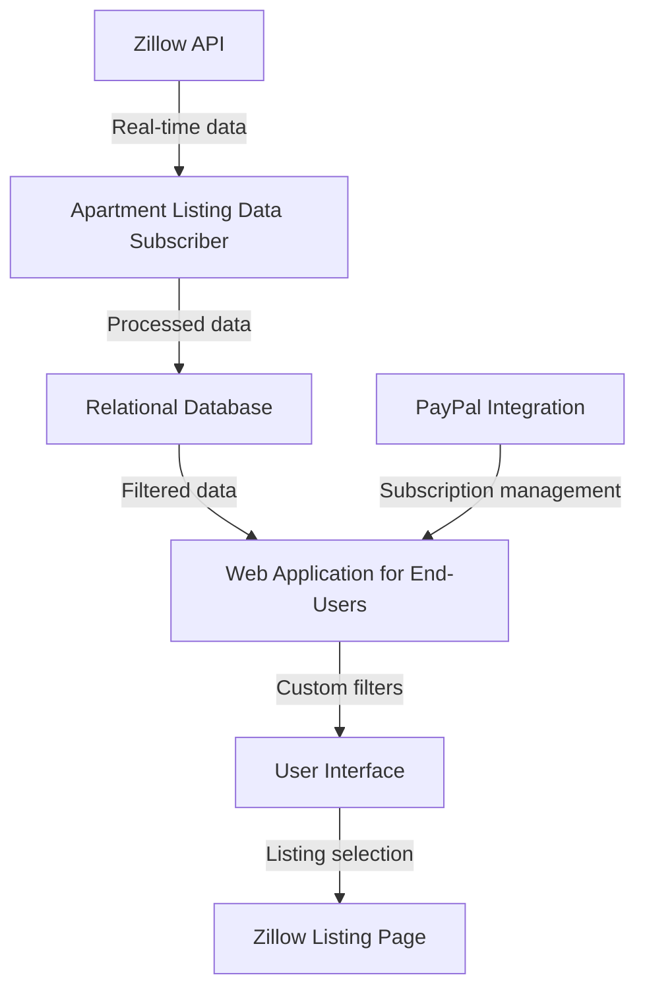
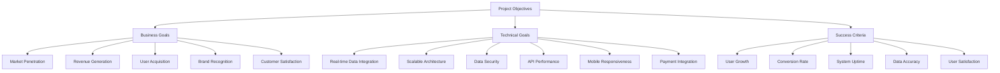
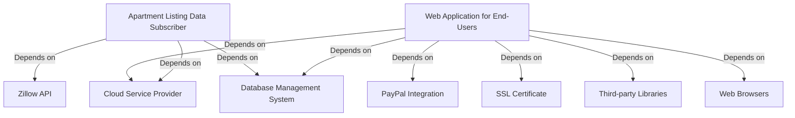
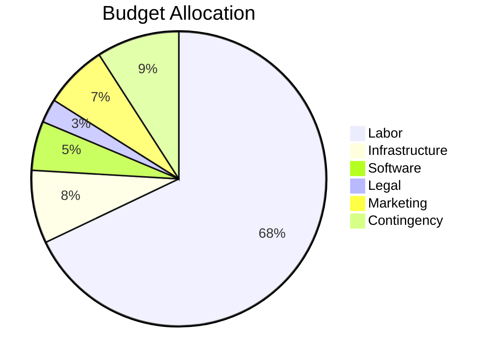
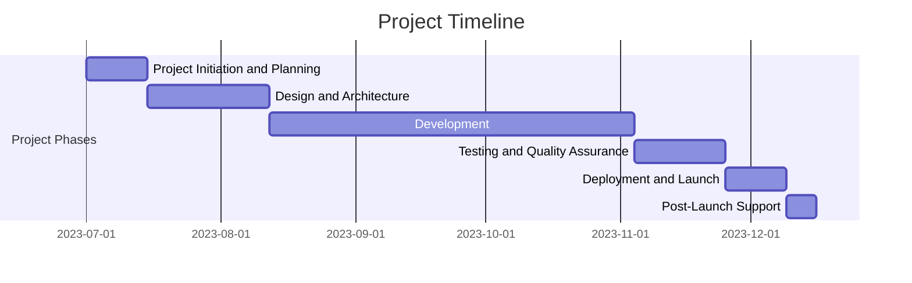
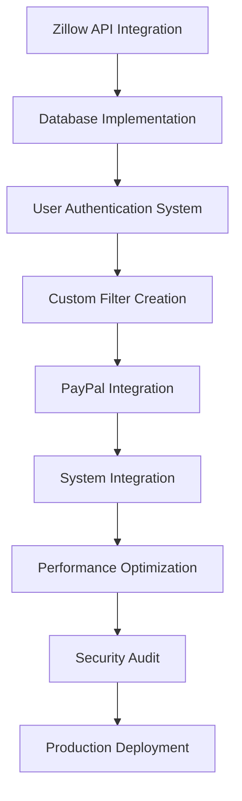

## EXECUTIVE SUMMARY

### PROJECT OVERVIEW

This project aims to develop a web service tailored for new college graduates seeking rental apartments. The solution addresses the challenges faced by recent graduates in finding suitable housing by providing a streamlined, user-friendly platform that aggregates real-time apartment listings from Zillow.com. The system consists of two primary components:

1. An Apartment Listing Data Subscriber that collects and processes real-time apartment listing data from Zillow's API.
2. A Web Application for End-Users that allows filtered searching, custom alerts, and seamless integration with Zillow's listings.

### OBJECTIVES

| Objective | Description |
|-----------|-------------|
| Real-time Data Aggregation | Implement a robust system to collect and process apartment listings from Zillow's API in real-time. |
| User-Centric Interface | Develop an intuitive web application that allows users to create custom filters and view tailored apartment listings. |
| Subscription Model | Integrate a PayPal-based subscription system to monetize the service and provide premium features to users. |
| Scalability and Availability | Ensure the system is built to handle growth and maintain high availability for users across selected markets. |
| Data Accuracy | Maintain up-to-date and accurate listing information by efficiently processing and storing data from Zillow. |

### VALUE PROPOSITION

Our agency offers a unique combination of technical expertise and user-focused design to deliver a superior apartment hunting experience for new college graduates:

1. **Specialized Target Audience**: By focusing on recent graduates, we provide a tailored solution that addresses the specific needs and constraints of this demographic.

2. **Real-Time Data Integration**: Our system's ability to process and display real-time data from Zillow gives users a competitive edge in fast-moving rental markets.

3. **Customizable Alerts**: Users can create personalized filters, ensuring they never miss out on apartments that match their specific criteria.

4. **Seamless Third-Party Integration**: By linking directly to Zillow listings, we provide a comprehensive service without duplicating existing resources.

5. **Scalable Architecture**: Our solution is designed to grow with the client's needs, capable of expanding to new markets and handling increased user loads.

6. **Monetization Strategy**: The integrated subscription model provides a clear path to revenue generation while offering premium features to users.

This value proposition positions our solution as a comprehensive, efficient, and user-friendly tool that bridges the gap between new graduates and their ideal rental apartments, while also providing a sustainable business model for long-term success.

## PROJECT OBJECTIVES

### BUSINESS GOALS

1. **Market Penetration**: Capture a significant share of the apartment rental market for new college graduates in selected areas, starting with the greater Boston area.

2. **Revenue Generation**: Establish a sustainable revenue stream through subscription-based services, targeting a 10% conversion rate of free users to paid subscribers within the first year.

3. **User Acquisition**: Achieve a user base of 10,000 active users within the first six months of launch, with a 20% month-over-month growth rate.

4. **Brand Recognition**: Position the service as the go-to platform for new graduates seeking rental apartments, aiming for 50% brand awareness among the target demographic in selected markets within the first year.

5. **Customer Satisfaction**: Maintain a high level of user satisfaction, targeting a Net Promoter Score (NPS) of 8 or higher.

### TECHNICAL GOALS

1. **Real-time Data Integration**: Develop a robust system capable of processing and storing real-time apartment listing data from Zillow's API with 99.9% accuracy and minimal latency.

2. **Scalable Architecture**: Design and implement a cloud-based infrastructure that can handle up to 100,000 concurrent users without performance degradation.

3. **Data Security and Privacy**: Implement industry-standard security measures to protect user data and ensure compliance with relevant data protection regulations.

4. **API Performance**: Achieve and maintain an API response time of less than 200ms for 95% of requests under normal load conditions.

5. **Mobile Responsiveness**: Ensure the web application is fully responsive and provides an optimal user experience across all device types, with a particular focus on mobile devices.

6. **Payment Integration**: Seamlessly integrate PayPal's payment system for subscription management with a transaction success rate of 99.5% or higher.

### SUCCESS CRITERIA

| Criteria | Target | Measurement Method |
|----------|--------|---------------------|
| User Growth | 10,000 active users within 6 months | Monthly Active Users (MAU) tracked through analytics |
| Subscription Conversion Rate | 10% of free users convert to paid within 1 year | Conversion funnel analysis |
| System Uptime | 99.9% availability | Monitoring tools and incident reports |
| Data Accuracy | 99.9% accuracy in listing information | Regular data audits and user feedback |
| API Performance | 95% of requests < 200ms response time | API performance monitoring tools |
| User Satisfaction | Net Promoter Score (NPS) of 8 or higher | Quarterly user surveys |
| Revenue Growth | 20% quarter-over-quarter increase in subscription revenue | Financial reports |
| Feature Adoption | 80% of paid users utilize custom filters | Feature usage analytics |
| Mobile Usage | 50% of total traffic from mobile devices | Web analytics platform |
| Brand Awareness | 50% awareness among target demographic in key markets | Market research surveys |

This diagram illustrates the hierarchical structure of the project objectives, highlighting the relationship between business goals, technical goals, and success criteria.

## SCOPE OF WORK

### IN-SCOPE

1. Apartment Listing Data Subscriber
   - Development of a service to subscribe to Zillow's data API
   - Real-time data collection for apartment listings in selected markets (e.g., greater Boston area)
   - Extraction and processing of specified data fields from each listing
   - Implementation of a relational database to store processed listing data
   - Indexing of individual data fields for efficient querying

2. Web Application for End-Users
   - User authentication system (sign-up and sign-in functionality)
   - Custom filter creation interface for users
   - Display of matching listings in a sortable table
   - Integration with Zillow's listing pages (opening in new tab on click)
   - PayPal integration for subscription-based access to custom filters

3. System Architecture
   - Design and implementation of a scalable, cloud-based infrastructure
   - Development of RESTful APIs for communication between components
   - Implementation of security measures to protect user data and ensure compliance

4. Testing and Quality Assurance
   - Unit testing for all components
   - Integration testing of the entire system
   - Performance testing to ensure scalability and responsiveness
   - Security testing and vulnerability assessments

5. Deployment and Maintenance
   - Initial deployment to production environment
   - Setup of monitoring and alerting systems
   - Development of maintenance and update procedures

6. Documentation
   - Technical documentation for system architecture and APIs
   - User manuals for end-users and system administrators

### OUT-OF-SCOPE

1. Mobile application development (native iOS or Android apps)
2. Integration with rental platforms other than Zillow
3. Direct communication features between users and property owners/managers
4. Virtual tour or 3D modeling of apartments
5. Background checks or rental history verification for users
6. Automated lease generation or signing
7. Property management tools for landlords or real estate agents
8. Integration with moving or furniture rental services
9. Expansion to markets beyond the initially selected areas (e.g., greater Boston area)
10. Development of a recommendation system based on user preferences

### ASSUMPTIONS

1. Zillow's API will remain stable and accessible throughout the project development and after launch
2. PayPal's payment system will be suitable for handling subscription-based payments
3. The target user base (new college graduates) has reliable internet access and basic digital literacy
4. Legal compliance with data protection regulations (e.g., GDPR, CCPA) can be achieved within the project timeline
5. Cloud infrastructure providers can meet the scalability and availability requirements
6. The client will provide timely feedback and approvals during the development process
7. Adequate testing data will be available to simulate real-world usage scenarios
8. The project team will have access to necessary development tools and environments

### DEPENDENCIES

| Dependency | Description | Potential Impact |
|------------|-------------|-------------------|
| Zillow API | Access and stability of Zillow's data API | Critical for data collection; API changes could require system updates |
| PayPal Integration | Availability and compatibility of PayPal's payment system | Essential for monetization; changes in PayPal's policies could affect subscription management |
| Cloud Service Provider | Reliability and scalability of chosen cloud infrastructure | System performance and availability depend on the provider's services |
| Database Management System | Performance and compatibility of selected DBMS | Data storage and retrieval efficiency could impact overall system performance |
| SSL Certificate | Timely acquisition and renewal of SSL certificates | Crucial for securing user data and maintaining trust |
| Third-party Libraries | Availability and compatibility of required software libraries | Updates or deprecations could necessitate code changes |
| Web Browsers | Compatibility with major web browsers and their updates | User experience could be affected by browser-specific issues |

This diagram illustrates the key dependencies of the main system components, highlighting the interconnected nature of the project and potential points of vulnerability that require careful management throughout the development process.

## BUDGET AND COST ESTIMATES

### COST BREAKDOWN

| Category | Item | Description | Cost (USD) |
|----------|------|-------------|------------|
| Labor | Backend Development | API integration, database design, server-side logic | 60,000 |
| Labor | Frontend Development | User interface, responsive design, client-side functionality | 45,000 |
| Labor | DevOps | Cloud infrastructure setup, CI/CD pipeline, monitoring | 30,000 |
| Labor | Project Management | Planning, coordination, client communication | 35,000 |
| Labor | Quality Assurance | Testing, bug fixing, performance optimization | 25,000 |
| Infrastructure | Cloud Services | AWS or similar, including compute, storage, and networking | 15,000 |
| Infrastructure | Database | Managed database service (e.g., Amazon RDS) | 8,000 |
| Software | Development Tools | IDEs, version control, project management software | 5,000 |
| Software | Third-party APIs | Zillow API access fees | 10,000 |
| Software | SSL Certificates | Secure communication for web application | 500 |
| Legal | Compliance Consulting | Data protection and privacy compliance | 7,500 |
| Marketing | Initial Campaign | Digital advertising, content creation | 20,000 |
| Contingency | Reserve Fund | 10% of total budget for unforeseen expenses | 26,100 |
| **Total** | | | **287,100** |

### PAYMENT SCHEDULE

| Milestone | Deliverable | Payment Percentage | Amount (USD) |
|-----------|-------------|---------------------|--------------|
| Project Kickoff | Signed contract, initial project plan | 20% | 57,420 |
| Design Approval | Approved system architecture and UI/UX designs | 15% | 43,065 |
| Alpha Release | Functional prototype with core features | 25% | 71,775 |
| Beta Release | Feature-complete system ready for testing | 20% | 57,420 |
| Final Delivery | Fully tested and deployed system | 15% | 43,065 |
| Post-Launch Support | 30 days of post-launch support and bug fixes | 5% | 14,355 |

### BUDGET CONSIDERATIONS

1. **API Integration Complexity**: The cost and effort required for Zillow API integration may vary based on API complexity and potential changes. We've allocated additional hours in the backend development budget to account for this uncertainty.

2. **Scalability Requirements**: As user base grows, infrastructure costs may increase. We've included a scalable cloud solution in the budget, but actual costs may vary based on usage.

3. **Data Volume**: The amount of data processed from Zillow may affect storage and processing costs. We've estimated based on initial projections, but this should be monitored closely.

4. **Regulatory Compliance**: Changes in data protection laws may require additional legal consultation or system modifications. The contingency fund can partially cover this if needed.

5. **Third-party Service Costs**: Zillow API or PayPal integration costs may change. We've budgeted based on current pricing, but this should be reviewed regularly.

6. **Market Expansion**: Costs for expanding to additional markets beyond the greater Boston area are not included in this budget and would require separate estimation.

7. **User Acquisition Costs**: Marketing costs may vary based on the effectiveness of initial campaigns. The budget includes an initial marketing push, but additional funds may be needed for sustained growth.

8. **Exchange Rate Fluctuations**: If any services or tools are priced in non-USD currencies, exchange rate changes could impact the budget.

To manage these budget considerations:

1. Implement a robust monitoring system for resource usage and costs.
2. Conduct regular budget reviews and adjust allocations as needed.
3. Maintain open communication with the client about potential budget impacts.
4. Use agile development methodologies to adapt quickly to changing requirements or constraints.
5. Prioritize features to ensure core functionality is delivered within budget.

This budget provides a comprehensive overview of expected costs and potential variables. Regular review and adjustment will be crucial to ensure project success within financial constraints.

## TIMELINE AND MILESTONES

### PROJECT TIMELINE

The project is estimated to take 24 weeks (approximately 6 months) from initiation to completion. The timeline is divided into six major phases:

1. Project Initiation and Planning: Weeks 1-2
2. Design and Architecture: Weeks 3-6
3. Development: Weeks 7-18
4. Testing and Quality Assurance: Weeks 19-21
5. Deployment and Launch: Weeks 22-23
6. Post-Launch Support and Optimization: Week 24

### KEY MILESTONES

| Milestone | Description | Estimated Completion |
|-----------|-------------|----------------------|
| M1 | Project Kickoff and Requirements Finalization | Week 2 |
| M2 | System Architecture and UI/UX Design Approval | Week 6 |
| M3 | Apartment Listing Data Subscriber Alpha Release | Week 10 |
| M4 | Web Application for End-Users Alpha Release | Week 14 |
| M5 | Integration of Both Subsystems Complete | Week 18 |
| M6 | User Acceptance Testing (UAT) Complete | Week 21 |
| M7 | Production Deployment and Go-Live | Week 23 |
| M8 | Post-Launch Review and Optimization Complete | Week 24 |

### CRITICAL PATH

The following tasks and activities are critical to keeping the project on schedule:

1. Zillow API Integration and Data Processing
   - This is crucial for the Apartment Listing Data Subscriber and forms the foundation of the entire system.
   - Estimated Duration: Weeks 7-10

2. Database Design and Implementation
   - Essential for storing and retrieving listing data efficiently.
   - Estimated Duration: Weeks 8-11

3. User Authentication and Authorization System
   - Critical for the Web Application for End-Users.
   - Estimated Duration: Weeks 11-13

4. Custom Filter Creation and Listing Display
   - Core functionality of the Web Application.
   - Estimated Duration: Weeks 13-16

5. PayPal Integration for Subscription Management
   - Essential for monetization and access control.
   - Estimated Duration: Weeks 15-17

6. System Integration and End-to-End Testing
   - Ensures all components work together seamlessly.
   - Estimated Duration: Weeks 18-21

7. Performance Optimization and Scalability Testing
   - Critical for handling expected user load and growth.
   - Estimated Duration: Weeks 20-22

8. Security Audit and Compliance Verification
   - Ensures the system meets all legal and security requirements.
   - Estimated Duration: Weeks 21-22

To maintain the project schedule, it's crucial to:

1. Start API integration and data processing as early as possible.
2. Conduct regular progress reviews on critical path items.
3. Allocate additional resources to critical path tasks if delays occur.
4. Maintain clear communication channels with Zillow and PayPal for third-party integrations.
5. Conduct parallel development of non-critical path items where possible.
6. Implement a robust testing strategy throughout the development process to catch issues early.

By focusing on these critical path elements and maintaining flexibility in resource allocation, we can ensure the project stays on track for its 24-week completion target.

## DELIVERABLES

### LIST OF DELIVERABLES

1. Software Components
   - Apartment Listing Data Subscriber
   - Web Application for End-Users
   - Database System
   - API Integration Layer
   - User Authentication and Authorization System
   - Payment Integration Module

2. Documentation
   - System Architecture Document
   - API Documentation
   - Database Schema Documentation
   - User Manual
   - Administrator Guide
   - Deployment Guide

3. Testing and Quality Assurance
   - Test Plans
   - Test Cases
   - Test Results Reports
   - Performance Test Results

4. Training Materials
   - User Training Guide
   - Administrator Training Guide
   - Video Tutorials

5. Deployment Package
   - Deployment Scripts
   - Configuration Files
   - Environment Setup Guide

6. Project Management Artifacts
   - Project Plan
   - Risk Register
   - Status Reports

### DELIVERY SCHEDULE

| Deliverable | Expected Delivery Date |
|-------------|------------------------|
| Project Plan | Week 2 |
| System Architecture Document | Week 6 |
| Apartment Listing Data Subscriber (Alpha) | Week 10 |
| Web Application for End-Users (Alpha) | Week 14 |
| API Documentation | Week 15 |
| Database Schema Documentation | Week 16 |
| Test Plans and Cases | Week 18 |
| Integrated System (Beta) | Week 18 |
| User Manual | Week 20 |
| Administrator Guide | Week 20 |
| Training Materials | Week 21 |
| Test Results Reports | Week 21 |
| Performance Test Results | Week 22 |
| Deployment Guide | Week 22 |
| Final System (Production-Ready) | Week 23 |
| Project Closure Report | Week 24 |

### ACCEPTANCE CRITERIA

1. Apartment Listing Data Subscriber
   - Successfully connects to Zillow's API and retrieves real-time apartment listing data
   - Accurately extracts and processes all required data fields
   - Stores data in the relational database with proper indexing
   - Handles at least 1000 new listings per hour without performance degradation

2. Web Application for End-Users
   - Provides secure user authentication and authorization
   - Allows users to create and save custom filters with specified criteria
   - Displays matching listings in a sortable table
   - Successfully integrates with Zillow's listing pages
   - Integrates PayPal for subscription payments
   - Supports concurrent access by at least 1000 users without performance issues

3. Database System
   - Efficiently stores and retrieves listing data
   - Supports all required queries with response times under 200ms for 95% of requests
   - Maintains data integrity and consistency

4. API Integration Layer
   - Provides documented RESTful APIs for all required functionalities
   - Handles authentication and authorization for API access
   - Meets specified performance criteria (e.g., response times, throughput)

5. User Authentication and Authorization System
   - Securely manages user credentials
   - Implements role-based access control
   - Supports password reset and account recovery features

6. Payment Integration Module
   - Successfully processes PayPal payments for subscriptions
   - Accurately tracks user subscription status
   - Provides appropriate error handling and transaction logging

7. Documentation
   - Comprehensive and accurate representation of the system
   - Follows agreed-upon documentation standards
   - Provides clear instructions for users, administrators, and developers

8. Testing and Quality Assurance
   - Test coverage of at least 90% for all critical components
   - All critical and high-priority bugs resolved
   - Performance tests demonstrate system meets scalability requirements

9. Training Materials
   - Cover all essential features and operations of the system
   - Provide clear, step-by-step instructions
   - Include practical examples and troubleshooting guides

10. Deployment Package
    - Successfully deploys the system in the specified production environment
    - Includes all necessary scripts and configuration files
    - Provides clear instructions for future updates and maintenance

```mermaid
graph TD
    A[Project Deliverables] --> B[Software Components]
    A --> C[Documentation]
    A --> D[Testing and QA]
    A --> E[Training Materials]
    A --> F[Deployment Package]
    A --> G[Project Management Artifacts]
    
    B --> H[Apartment Listing Data Subscriber]
    B --> I[Web Application for End-Users]
    B --> J[Database System]
    B --> K[API Integration Layer]
    B --> L[User Authentication System]
    B --> M[Payment Integration Module]
    
    C --> N[System Architecture Doc]
    C --> O[API Documentation]
    C --> P[User Manual]
    C --> Q[Administrator Guide]
    
    D --> R[Test Plans]
    D --> S[Test Results]
    D --> T[Performance Test Results]
    
    E --> U[User Training Guide]
    E --> V[Video Tutorials]
    
    F --> W[Deployment Scripts]
    F --> X[Configuration Files]
    
    G --> Y[Project Plan]
    G --> Z[Status Reports]
```

This comprehensive list of deliverables, along with the delivery schedule and acceptance criteria, ensures that all aspects of the project are clearly defined and measurable. The acceptance criteria provide specific, quantifiable metrics to evaluate the success of each deliverable, aligning with the project's objectives and ensuring client satisfaction.