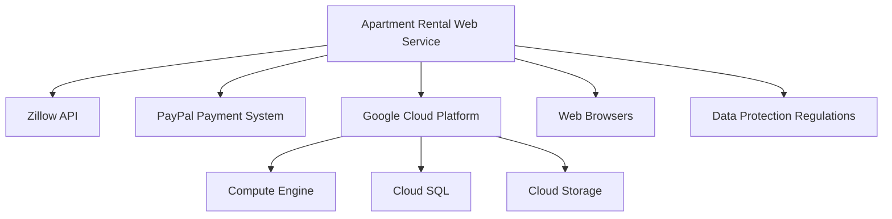
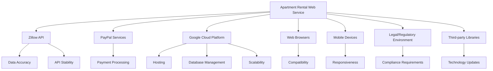
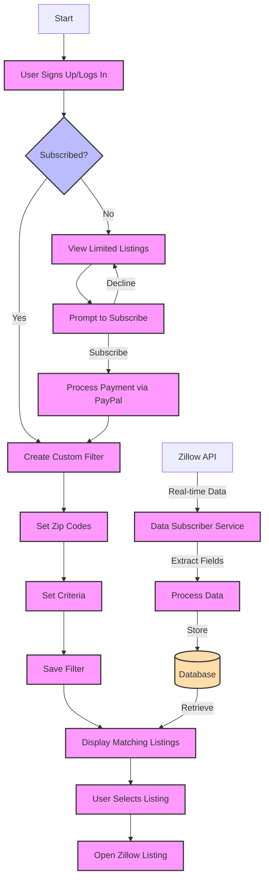
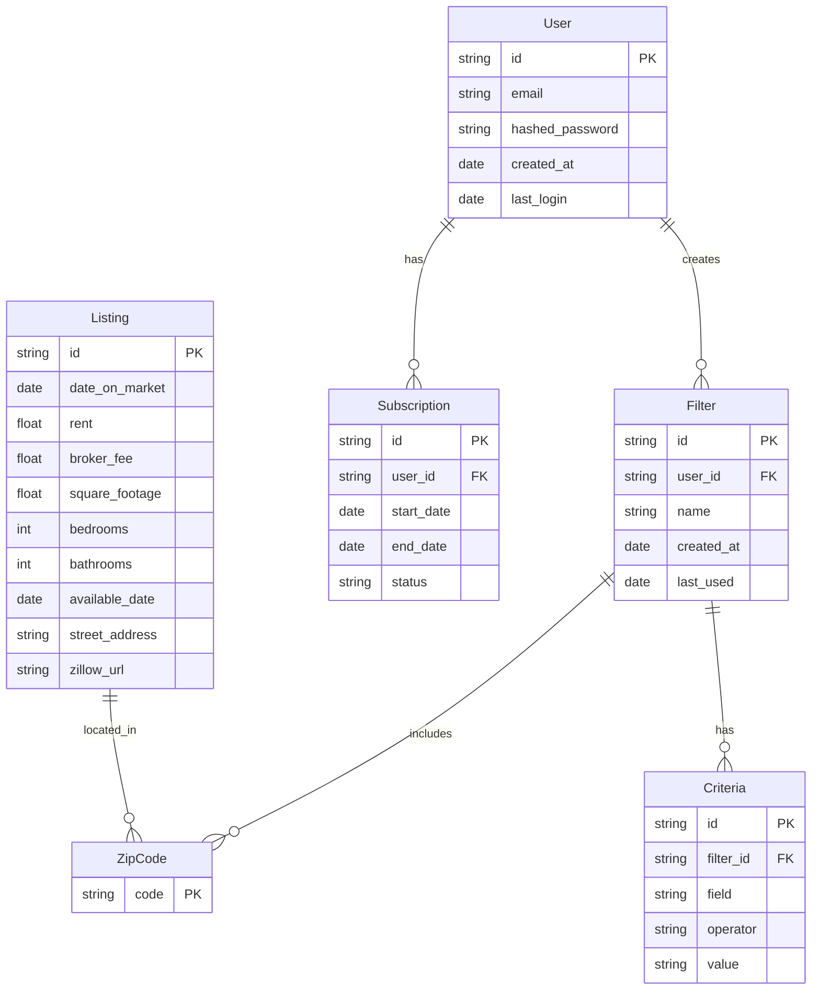
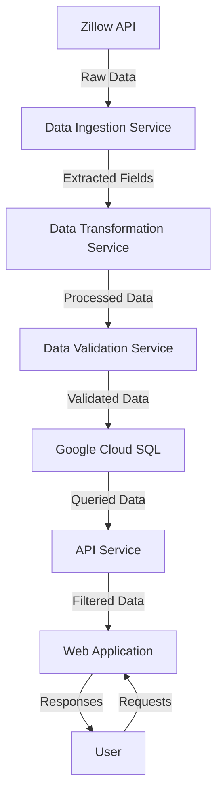

## INTRODUCTION

### PURPOSE

The purpose of this Software Requirements Specification (SRS) document is to provide a comprehensive and detailed description of the web service designed to help new college graduates find suitable apartments for rent. This document serves as a foundation for the development process, outlining the system's functionality, performance requirements, and design constraints.

This SRS is intended for the following audience:

1. Development Team: To guide the implementation of the system's features and functionalities.
2. Project Managers: To plan and track the project's progress against defined requirements.
3. Quality Assurance Team: To develop test plans and ensure the system meets specified requirements.
4. Stakeholders and Client Representatives: To review and approve the proposed system design and functionality.
5. Maintenance and Support Teams: To understand the system architecture for future updates and troubleshooting.

### SCOPE

The web service for apartment rentals targeting new college graduates encompasses two main subsystems: an Apartment Listing Data Subscriber and a Web Application for End-Users. The system aims to streamline the apartment hunting process by providing real-time, filtered listings from Zillow.com, tailored to the needs of recent graduates.

#### Goals:

1. Simplify the apartment search process for new college graduates.
2. Provide real-time, accurate apartment listing data from Zillow.com.
3. Offer a user-friendly interface for customized apartment searches.
4. Implement a sustainable business model through subscription-based services.

#### Benefits:

1. Time-saving: Users can quickly find relevant apartment listings without manual searching.
2. Customization: Ability to set specific criteria for apartment preferences.
3. Real-time Updates: Access to the latest apartment listings as soon as they become available.
4. Seamless Integration: Direct links to Zillow.com listings for detailed information.

#### Core Functionalities:

1. Apartment Listing Data Subscriber:
   - Real-time data collection from Zillow.com's API
   - Data extraction and processing of specified fields
   - Storage of processed data in a relational database

2. Web Application for End-Users:
   - User authentication system
   - Custom filter creation for apartment searches
   - Display of matching listings in a sortable table
   - Integration with Zillow.com listing pages
   - PayPal-based subscription system for premium features

#### Technology Stack:

- Frontend: React with TypeScript and Tailwind CSS for responsive and modern UI design
- Backend: Python for efficient data processing and API integration
- Cloud Infrastructure: Google Cloud ecosystem for scalable and reliable hosting
- Database: Google Cloud SQL for managed relational database services
- API Integration: RESTful APIs for communication between frontend and backend

This web service will provide a robust, scalable, and user-friendly platform that addresses the unique challenges faced by new college graduates in their apartment search, while leveraging modern technologies to ensure performance, reliability, and ease of maintenance.

## PRODUCT DESCRIPTION

### PRODUCT PERSPECTIVE

The apartment rental web service for new college graduates is a standalone system that integrates with external services to provide a comprehensive solution. It operates within the following context:

1. Data Source Integration:
   - Interfaces with Zillow's API to fetch real-time apartment listing data.
   - Relies on the availability and accuracy of Zillow's data feed.

2. Payment Processing:
   - Integrates with PayPal's payment system for subscription management.
   - Depends on PayPal's services for secure transaction processing.

3. Cloud Infrastructure:
   - Utilizes Google Cloud Platform (GCP) for hosting and scalability.
   - Leverages GCP services such as Compute Engine, Cloud SQL, and Cloud Storage.

4. User Access:
   - Accessible via web browsers on various devices (desktop, mobile, tablet).
   - Requires internet connectivity for users to access the service.

5. Security and Compliance:
   - Operates within the framework of data protection regulations (e.g., GDPR, CCPA).
   - Implements industry-standard security measures for user data protection.



### PRODUCT FUNCTIONS

The apartment rental web service provides the following key functions:

1. Real-time Data Collection:
   - Subscribe to Zillow's API for continuous apartment listing updates.
   - Process and store relevant listing data in a structured format.

2. User Management:
   - Allow user registration and authentication.
   - Manage user profiles and preferences.

3. Custom Search Filters:
   - Enable users to create and save personalized apartment search filters.
   - Support filtering by location (zip codes) and specific criteria (e.g., rent, amenities).

4. Listing Display and Interaction:
   - Present matching apartment listings in a sortable, user-friendly table format.
   - Provide direct links to original Zillow listings for detailed information.

5. Subscription Management:
   - Offer premium features through a subscription-based model.
   - Process payments and manage subscription status using PayPal integration.

6. Data Analytics and Reporting:
   - Generate insights on user behavior and popular search criteria.
   - Provide administrators with usage statistics and system performance metrics.

7. Notification System:
   - Alert users about new listings matching their saved filters.
   - Send subscription-related notifications (e.g., renewal reminders, payment confirmations).

### USER CHARACTERISTICS

The primary users of the apartment rental web service are new college graduates with the following characteristics:

1. Age Range: Typically 21-26 years old.
2. Education: Recent graduates with bachelor's or master's degrees.
3. Tech Savviness: Generally comfortable with digital technologies and web applications.
4. Financial Status: Often budget-conscious, with entry-level incomes or student loans.
5. Time Constraints: Busy with job searches or new careers, valuing efficiency in apartment hunting.

User Personas:

1. Sarah, 22, Marketing Graduate:
   - First-time renter looking for an affordable studio in a trendy neighborhood.
   - Wants to quickly filter options based on proximity to public transportation.

2. Alex, 25, Software Engineer:
   - Relocating for a new job and needs a pet-friendly apartment.
   - Prefers to set up alerts for new listings matching specific criteria.

3. Maria, 24, Graduate Student:
   - Seeking a shared apartment near her university campus.
   - Interested in comparing multiple options side-by-side based on amenities and rent.

### CONSTRAINTS

1. Technical Constraints:
   - Must integrate with Zillow's API within their usage limits and terms of service.
   - Required to maintain compatibility with major web browsers and mobile devices.
   - Needs to adhere to Google Cloud Platform's service limitations and best practices.

2. Regulatory Constraints:
   - Compliance with data protection regulations (GDPR, CCPA) for user data handling.
   - Adherence to financial regulations regarding subscription payments and refunds.

3. Business Constraints:
   - Initial focus on the greater Boston area market, limiting immediate scalability.
   - Reliance on Zillow as the sole data source for apartment listings.

4. User Interface Constraints:
   - Must provide a responsive design that works across various screen sizes and devices.
   - Required to meet WCAG 2.1 Level AA accessibility standards.

5. Performance Constraints:
   - System should handle up to 100,000 concurrent users without significant degradation.
   - API response times should not exceed 200ms for 95% of requests under normal load.

6. Security Constraints:
   - Implementation of multi-factor authentication for user accounts.
   - Encryption of sensitive data both in transit and at rest.

7. Budgetary Constraints:
   - Development and initial operation costs must remain within the allocated $287,100 budget.

### ASSUMPTIONS AND DEPENDENCIES

Assumptions:

1. Zillow's API will remain stable and provide accurate, up-to-date apartment listing data.
2. The target user base (new college graduates) has reliable internet access and basic digital literacy.
3. Users are willing to pay for premium features that simplify their apartment search process.
4. The greater Boston area rental market will remain active and relevant for the initial project scope.
5. Google Cloud Platform will continue to offer the required services at similar pricing and performance levels.

Dependencies:

1. Zillow API:
   - Continuous access to Zillow's data feed is critical for the service's core functionality.
   - Any changes to Zillow's API structure or terms of service may require system updates.

2. PayPal Integration:
   - Relies on PayPal's services for processing subscription payments.
   - Changes in PayPal's API or fee structure could impact the payment system.

3. Google Cloud Platform:
   - Depends on GCP for hosting, database management, and scalability.
   - Service disruptions or changes in GCP could affect system availability and performance.

4. Web Browsers:
   - Requires ongoing compatibility with major web browsers (Chrome, Firefox, Safari, Edge).
   - Browser updates may necessitate adjustments to the web application.

5. Mobile Device Compatibility:
   - Depends on the responsiveness of the web application across various mobile devices and operating systems.

6. Legal and Regulatory Environment:
   - Changes in data protection laws or rental market regulations may require system or policy updates.

7. Third-party Libraries and Frameworks:
   - Relies on the maintenance and compatibility of key libraries such as React, TypeScript, and Tailwind CSS.
   - Updates or deprecations of these technologies may require code refactoring.



This diagram illustrates the key dependencies of the apartment rental web service, highlighting the interconnected nature of the system and the external factors that could impact its functionality and success.

Here's the PROCESS FLOWCHART section for the Software Requirements Specification (SRS) using Mermaid JS:

## PROCESS FLOWCHART

The following flowchart illustrates the main processes of the apartment rental web service for new college graduates:



This flowchart represents the main processes of the apartment rental web service, including:

1. User Authentication:
   - Users sign up or log in to access the service.

2. Subscription Check:
   - The system checks if the user has an active subscription.
   - Non-subscribed users can view limited listings and are prompted to subscribe.

3. Custom Filter Creation:
   - Subscribed users can create custom filters by setting zip codes and specific criteria.

4. Listing Display:
   - The system displays matching listings based on the user's filter.

5. Zillow Integration:
   - Users can select a listing to view the original Zillow page.

6. Subscription Process:
   - Users can subscribe using PayPal integration to access premium features.

7. Data Subscriber Service:
   - A separate process continuously fetches real-time data from Zillow's API.
   - The service extracts relevant fields, processes the data, and stores it in the database.

The flowchart demonstrates the interaction between the frontend (React with TypeScript and Tailwind CSS) and the backend (Python), as well as the integration with external services like Zillow's API and PayPal for payments. This visual representation helps stakeholders understand the system's workflow and the relationships between different components.

Here's a breakdown of the product features with the requested sub-sections:

1. User Authentication System

ID: F001
DESCRIPTION: A secure system for user registration, login, and account management.
PRIORITY: High

| ID | Functional Requirement | Description |
|----|------------------------|-------------|
| F001-1 | User Registration | Allow users to create an account using email and password |
| F001-2 | User Login | Authenticate users with their credentials |
| F001-3 | Password Reset | Provide a mechanism for users to reset forgotten passwords |
| F001-4 | Account Management | Allow users to update their profile information |
| F001-5 | Multi-factor Authentication | Implement optional two-factor authentication for enhanced security |

2. Apartment Listing Data Subscriber

ID: F002
DESCRIPTION: A service that subscribes to Zillow's API and processes real-time apartment listing data.
PRIORITY: High

| ID | Functional Requirement | Description |
|----|------------------------|-------------|
| F002-1 | Zillow API Integration | Connect to Zillow's API and retrieve real-time apartment listing data |
| F002-2 | Data Extraction | Extract specified fields from each listing (e.g., rent, square footage, bedrooms) |
| F002-3 | Data Processing | Clean and format the extracted data for storage |
| F002-4 | Database Storage | Store processed data in a Google Cloud SQL database |
| F002-5 | Data Indexing | Create appropriate indexes for efficient querying |

3. Custom Filter Creation

ID: F003
DESCRIPTION: A feature allowing users to create and save custom filters for apartment searches.
PRIORITY: High

| ID | Functional Requirement | Description |
|----|------------------------|-------------|
| F003-1 | Zip Code Selection | Allow users to select up to five zip codes for their search |
| F003-2 | Criteria Definition | Enable users to set one simple criteria (e.g., rent < $2000) |
| F003-3 | Filter Saving | Save user-created filters for future use |
| F003-4 | Filter Editing | Allow users to modify existing filters |
| F003-5 | Filter Deletion | Provide option to delete saved filters |

4. Listing Display

ID: F004
DESCRIPTION: A feature to display matching apartment listings based on user filters.
PRIORITY: High

| ID | Functional Requirement | Description |
|----|------------------------|-------------|
| F004-1 | Filtered Results | Display listings that match the user's saved filter |
| F004-2 | Sortable Table | Present results in a table that can be sorted by different fields |
| F004-3 | Zillow Integration | Provide clickable links to open the original Zillow listing in a new tab |
| F004-4 | Pagination | Implement pagination for large result sets |
| F004-5 | Responsive Design | Ensure the listing display is mobile-responsive using Tailwind CSS |

5. Subscription Management

ID: F005
DESCRIPTION: A system to manage user subscriptions and payments via PayPal.
PRIORITY: High

| ID | Functional Requirement | Description |
|----|------------------------|-------------|
| F005-1 | PayPal Integration | Integrate PayPal's payment system for processing subscriptions |
| F005-2 | Subscription Purchase | Allow users to purchase subscriptions through the web application |
| F005-3 | Subscription Status | Track and display the current status of user subscriptions |
| F005-4 | Renewal Process | Implement automatic renewal of subscriptions |
| F005-5 | Cancellation Handling | Process subscription cancellations and update user access accordingly |

6. Admin Dashboard

ID: F006
DESCRIPTION: An administrative interface for managing users, listings, and system settings.
PRIORITY: Medium

| ID | Functional Requirement | Description |
|----|------------------------|-------------|
| F006-1 | User Management | Allow admins to view, edit, and manage user accounts |
| F006-2 | Listing Management | Provide tools for manually managing apartment listings if needed |
| F006-3 | System Metrics | Display key performance metrics and system health information |
| F006-4 | Configuration Settings | Allow admins to adjust system settings and parameters |
| F006-5 | Access Control | Implement role-based access control for admin functions |

7. Notification System

ID: F007
DESCRIPTION: A system to send notifications to users about new listings and account activities.
PRIORITY: Medium

| ID | Functional Requirement | Description |
|----|------------------------|-------------|
| F007-1 | Email Notifications | Send email notifications for new listings matching user filters |
| F007-2 | In-App Notifications | Display notifications within the web application |
| F007-3 | Notification Preferences | Allow users to set their notification preferences |
| F007-4 | Subscription Alerts | Send alerts for subscription-related events (e.g., upcoming renewals) |
| F007-5 | Notification History | Maintain a log of sent notifications for each user |

8. Analytics and Reporting

ID: F008
DESCRIPTION: A feature to generate insights and reports on system usage and apartment market trends.
PRIORITY: Low

| ID | Functional Requirement | Description |
|----|------------------------|-------------|
| F008-1 | User Activity Tracking | Track and analyze user interactions with the system |
| F008-2 | Market Trend Reports | Generate reports on apartment market trends based on listing data |
| F008-3 | Performance Analytics | Analyze system performance and generate reports |
| F008-4 | Custom Report Generation | Allow admins to create custom reports based on available data |
| F008-5 | Data Visualization | Implement charts and graphs for visual representation of analytics data |

These features will be implemented using TypeScript and React with Tailwind CSS for the frontend, Python for the backend services, and Google Cloud solutions for infrastructure and database management. The PayPal integration will be used for payment processing as specified in the previous sections of the document.

## NON-FUNCTIONAL REQUIREMENTS

### PERFORMANCE

1. Response Time
   - The web application shall load initial content within 2 seconds for 90% of requests.
   - API responses shall be delivered within 200ms for 95% of requests under normal load.
   - Search results shall be displayed within 1 second for 90% of queries.

2. Throughput
   - The system shall support at least 100 concurrent users without degradation in performance.
   - The Apartment Listing Data Subscriber shall process a minimum of 1000 new listings per hour.

3. Resource Usage
   - The web application shall consume no more than 100MB of client-side memory on desktop browsers.
   - Server-side processes shall utilize no more than 70% of allocated CPU and memory resources under normal load.

```typescript
// Example of performance monitoring in React component
import { useEffect, useState } from 'react';

const PerformanceMonitor: React.FC = () => {
  const [loadTime, setLoadTime] = useState<number>(0);

  useEffect(() => {
    const start = performance.now();
    window.addEventListener('load', () => {
      const end = performance.now();
      setLoadTime(end - start);
    });
  }, []);

  return (
    <div className="text-sm text-gray-600">
      Page load time: {loadTime.toFixed(2)}ms
    </div>
  );
};
```

### SAFETY

1. Data Backup
   - The system shall perform daily backups of all user and listing data.
   - Backups shall be stored in a geographically separate location from the primary data center.

2. Fault Tolerance
   - The system shall continue to function with degraded performance in case of partial failure, ensuring core functionalities remain accessible.

3. Error Handling
   - All errors shall be logged with appropriate details for debugging and analysis.
   - User-facing error messages shall be informative without exposing sensitive system information.

4. Data Integrity
   - The system shall implement transaction management to ensure data consistency in case of process failures.

```python
# Example of error handling in Python backend
import logging
from google.cloud import error_reporting

def handle_error(func):
    def wrapper(*args, **kwargs):
        try:
            return func(*args, **kwargs)
        except Exception as e:
            logging.error(f"Error in {func.__name__}: {str(e)}")
            error_reporting.Client().report_exception()
            raise
    return wrapper

@handle_error
def process_listing(listing_data):
    # Process listing logic here
    pass
```

### SECURITY

1. Authentication
   - The system shall use OAuth 2.0 for user authentication.
   - Multi-factor authentication shall be available as an optional security feature for users.

2. Authorization
   - Role-based access control (RBAC) shall be implemented to manage user permissions.
   - API access shall require valid authentication tokens.

3. Data Encryption
   - All data transmissions shall be encrypted using TLS 1.3 or higher.
   - Sensitive data at rest, including user credentials and payment information, shall be encrypted using AES-256.

4. Privacy
   - The system shall comply with GDPR and CCPA requirements for user data protection.
   - Users shall have the ability to export and delete their personal data.

```typescript
// Example of authentication check in React component
import { useAuth } from './auth-context';

const ProtectedComponent: React.FC = () => {
  const { isAuthenticated, user } = useAuth();

  if (!isAuthenticated) {
    return <Navigate to="/login" />;
  }

  return (
    <div className="p-4">
      <h1 className="text-xl font-bold">Welcome, {user.name}</h1>
      {/* Protected content */}
    </div>
  );
};
```

### QUALITY

1. Availability
   - The system shall maintain 99.9% uptime, allowing for no more than 8.76 hours of downtime per year.
   - Planned maintenance shall be scheduled during off-peak hours and communicated to users in advance.

2. Maintainability
   - The codebase shall adhere to PEP 8 style guide for Python and Airbnb style guide for JavaScript/TypeScript.
   - All components shall have unit test coverage of at least 80%.

3. Usability
   - The user interface shall be responsive and functional on devices with screen widths from 320px to 2560px.
   - The system shall support the latest two major versions of Chrome, Firefox, Safari, and Edge browsers.
   - The web application shall achieve a minimum score of 90 on Google Lighthouse accessibility audit.

4. Scalability
   - The system architecture shall support horizontal scaling to handle up to 1 million registered users.
   - Database queries shall be optimized to maintain performance as data volume grows to 10 million listings.

5. Reliability
   - The system shall have a Mean Time Between Failures (MTBF) of at least 720 hours (30 days).
   - Recovery from any unplanned outage shall be completed within 4 hours (Mean Time To Repair - MTTR).

```python
# Example of maintainability check using pylint in Python
import subprocess

def check_code_quality(file_path):
    result = subprocess.run(['pylint', file_path], capture_output=True, text=True)
    score = float(result.stdout.split('\n')[-3].split('/')[0])
    return score >= 8.0  # Minimum acceptable score
```

### COMPLIANCE

1. Legal
   - The system shall comply with the Fair Housing Act, ensuring no discriminatory practices in listing presentations.
   - Terms of Service and Privacy Policy shall be clearly presented and require user acceptance.

2. Regulatory
   - User data collection and processing shall comply with GDPR and CCPA regulations.
   - Financial transactions shall adhere to PCI DSS standards for handling payment information.

3. Standards
   - The web application shall conform to WCAG 2.1 Level AA accessibility standards.
   - API design shall follow RESTful principles and OpenAPI 3.0 specification.

4. Reporting
   - The system shall generate monthly compliance reports for internal auditing.
   - Data breach notification procedures shall be in place to comply with relevant regulations.

```typescript
// Example of GDPR compliance check in React component
import { useState } from 'react';

const GDPRConsentBanner: React.FC = () => {
  const [consentGiven, setConsentGiven] = useState(false);

  const handleConsent = () => {
    setConsentGiven(true);
    // Logic to store user consent
  };

  if (consentGiven) return null;

  return (
    <div className="fixed bottom-0 left-0 right-0 bg-gray-100 p-4">
      <p className="text-sm">
        We use cookies to improve your experience. By continuing to use our site, you agree to our use of cookies.
      </p>
      <button
        className="mt-2 bg-blue-500 text-white px-4 py-2 rounded"
        onClick={handleConsent}
      >
        I Agree
      </button>
    </div>
  );
};
```

These non-functional requirements ensure that the apartment rental web service for new college graduates is performant, safe, secure, high-quality, and compliant with relevant standards and regulations. The use of TypeScript, React, and Tailwind CSS for the frontend, Python for the backend, and Google Cloud solutions for infrastructure aligns with the specified technology stack and provides a robust foundation for meeting these requirements.

## DATA REQUIREMENTS

### DATA MODELS

The apartment rental web service will utilize the following data models:



This entity-relationship diagram represents the core data models for the apartment rental web service. The main entities are:

1. User: Represents registered users of the system.
2. Listing: Contains details of apartment listings from Zillow.
3. Filter: Custom filters created by users to search for apartments.
4. ZipCode: Represents zip codes associated with filters and listings.
5. Criteria: Specific criteria within a filter (e.g., rent < 2000).
6. Subscription: Tracks user subscriptions for premium features.

### DATA STORAGE

The apartment rental web service will use Google Cloud SQL for PostgreSQL as the primary relational database management system. This choice aligns with the Google Cloud ecosystem and provides a robust, scalable solution for data storage.

1. Data Retention:
   - Listing data will be retained for 1 year from the last update date.
   - User data will be retained for the lifetime of the account, plus 30 days after account deletion.
   - Subscription data will be retained for 7 years for financial auditing purposes.

2. Redundancy:
   - Google Cloud SQL provides built-in replication for high availability.
   - We will configure the database with regional replication to ensure data redundancy across multiple zones within a region.

3. Backup:
   - Automated daily backups will be configured using Google Cloud SQL's backup feature.
   - Backups will be retained for 30 days.
   - Monthly full backups will be stored in Google Cloud Storage for long-term retention (1 year).

4. Recovery:
   - Point-in-time recovery will be enabled, allowing data restoration to any point within the last 7 days.
   - A disaster recovery plan will be implemented, including regular testing of the restoration process.

5. Scalability:
   - Vertical scaling: Utilize Google Cloud SQL's ability to increase CPU and memory resources as needed.
   - Horizontal scaling: Implement read replicas to distribute read traffic and improve performance.
   - Implement database sharding for the Listing table if data volume exceeds single instance capacity.

### DATA PROCESSING

The data processing pipeline will handle the ingestion, transformation, and storage of apartment listing data from Zillow's API. The following diagram illustrates the data flow:



1. Data Ingestion:
   - A Python-based service will poll Zillow's API at regular intervals to fetch new and updated listings.
   - Raw data will be temporarily stored in Google Cloud Storage for backup and audit purposes.

2. Data Transformation:
   - Extract relevant fields as per the Listing data model.
   - Convert data types and formats to match the database schema.
   - Enrich data with additional information (e.g., geocoding for more precise location data).

3. Data Validation:
   - Implement data quality checks to ensure consistency and accuracy.
   - Flag or filter out potentially erroneous or spam listings.

4. Data Storage:
   - Store processed and validated data in Google Cloud SQL.
   - Implement database transactions to ensure data integrity during insertions and updates.

5. Data Retrieval:
   - Implement efficient indexing strategies for quick data retrieval.
   - Utilize caching mechanisms (e.g., Google Cloud Memorystore) for frequently accessed data.

6. Data Security:
   - Encrypt data at rest using Google Cloud SQL's built-in encryption.
   - Implement encryption in transit using TLS for all data transfers.
   - Use Identity and Access Management (IAM) to control access to data storage and processing services.
   - Implement field-level encryption for sensitive user data (e.g., payment information) before storing in the database.
   - Regular security audits and penetration testing to identify and address vulnerabilities.

7. Data Compliance:
   - Implement data anonymization techniques for analytics and reporting purposes.
   - Provide user data export and deletion functionality to comply with GDPR and CCPA regulations.
   - Maintain detailed logs of data access and modifications for audit purposes.

```typescript
// Example of a React component using TypeScript and Tailwind CSS for displaying listing data
import React from 'react';
import { Listing } from '../types';

interface ListingCardProps {
  listing: Listing;
}

const ListingCard: React.FC<ListingCardProps> = ({ listing }) => {
  return (
    <div className="bg-white shadow-md rounded-lg p-4 mb-4">
      <h2 className="text-xl font-bold mb-2">{listing.street_address}</h2>
      <p className="text-gray-600 mb-2">${listing.rent}/month</p>
      <p className="text-sm text-gray-500">
        {listing.bedrooms} bed • {listing.bathrooms} bath • {listing.square_footage} sqft
      </p>
      <a
        href={listing.zillow_url}
        target="_blank"
        rel="noopener noreferrer"
        className="mt-4 inline-block bg-blue-500 text-white px-4 py-2 rounded hover:bg-blue-600"
      >
        View on Zillow
      </a>
    </div>
  );
};

export default ListingCard;
```

This data requirements section outlines the data models, storage solutions, and processing pipeline for the apartment rental web service. It leverages Google Cloud services for scalability and security while maintaining compliance with data protection regulations. The use of TypeScript, React, and Tailwind CSS for the frontend ensures a modern and maintainable user interface.

## EXTERNAL INTERFACES

### USER INTERFACES

The apartment rental web service will provide a responsive and intuitive user interface designed using React with TypeScript and styled using Tailwind CSS. The interface will be accessible through web browsers on desktop and mobile devices.

Key user interface components include:

1. User Authentication
   - Login and registration forms
   - Password reset functionality

2. Dashboard
   - Overview of saved filters and recent listings
   - Quick access to create new filters

3. Filter Creation
   - Interactive form for selecting zip codes and setting criteria
   - Real-time feedback on filter matches

4. Listing Display
   - Sortable table view of matching listings
   - Card view option for more visual browsing

5. Subscription Management
   - Subscription status display
   - Payment interface integrated with PayPal

6. User Profile
   - Account settings and preferences
   - Subscription history

Placeholder for mockups:

```typescript
// Example of a React component for the listing display using TypeScript and Tailwind CSS
import React from 'react';
import { Listing } from '../types';

interface ListingTableProps {
  listings: Listing[];
}

const ListingTable: React.FC<ListingTableProps> = ({ listings }) => {
  return (
    <div className="overflow-x-auto">
      <table className="min-w-full bg-white">
        <thead className="bg-gray-100">
          <tr>
            <th className="px-4 py-2">Address</th>
            <th className="px-4 py-2">Rent</th>
            <th className="px-4 py-2">Bedrooms</th>
            <th className="px-4 py-2">Bathrooms</th>
            <th className="px-4 py-2">Square Footage</th>
          </tr>
        </thead>
        <tbody>
          {listings.map((listing, index) => (
            <tr key={index} className={index % 2 === 0 ? 'bg-gray-50' : ''}>
              <td className="px-4 py-2">{listing.address}</td>
              <td className="px-4 py-2">${listing.rent}</td>
              <td className="px-4 py-2">{listing.bedrooms}</td>
              <td className="px-4 py-2">{listing.bathrooms}</td>
              <td className="px-4 py-2">{listing.squareFootage} sq ft</td>
            </tr>
          ))}
        </tbody>
      </table>
    </div>
  );
};

export default ListingTable;
```

### SOFTWARE INTERFACES

The apartment rental web service will interact with several external software systems:

1. Zillow API
   - Purpose: Retrieve real-time apartment listing data
   - Interface Type: RESTful API
   - Data Format: JSON
   - Authentication: API key or OAuth 2.0 (as per Zillow's requirements)
   - Frequency: Continuous polling or webhook-based updates

2. PayPal API
   - Purpose: Process subscription payments
   - Interface Type: RESTful API
   - Data Format: JSON
   - Authentication: OAuth 2.0
   - Security: TLS 1.2 or higher for all transactions

3. Google Cloud SQL
   - Purpose: Store and retrieve application data
   - Interface Type: SQL
   - Connection: Secure SSL connection
   - Authentication: IAM database authentication

4. Google Cloud Storage
   - Purpose: Store large objects (e.g., user profile images, backup files)
   - Interface Type: RESTful API
   - Authentication: Service account credentials

Example of interfacing with Zillow API using Python:

```python
import requests
from google.cloud import secretmanager

def get_zillow_api_key():
    client = secretmanager.SecretManagerServiceClient()
    name = f"projects/your-project-id/secrets/zillow-api-key/versions/latest"
    response = client.access_secret_version(request={"name": name})
    return response.payload.data.decode("UTF-8")

def fetch_listings(zip_code):
    api_key = get_zillow_api_key()
    url = f"https://api.zillow.com/v2/search"
    params = {
        "zip": zip_code,
        "status": "for_rent",
        "api_key": api_key
    }
    response = requests.get(url, params=params)
    if response.status_code == 200:
        return response.json()
    else:
        raise Exception(f"Failed to fetch listings: {response.status_code}")
```

### COMMUNICATION INTERFACES

The apartment rental web service will utilize the following communication interfaces:

1. HTTPS
   - Purpose: Secure communication between client browsers and the web server
   - Protocol: TLS 1.3 or higher
   - Port: 443

2. WebSocket
   - Purpose: Real-time updates for new listings matching user filters
   - Protocol: WSS (WebSocket Secure)
   - Library: Socket.IO or similar for compatibility

3. SMTP
   - Purpose: Sending email notifications to users
   - Protocol: SMTP with TLS
   - Service: Google Workspace SMTP relay or similar

4. DNS
   - Purpose: Domain name resolution
   - Protocol: DNS over HTTPS (DoH) for enhanced privacy

Example of WebSocket setup using Socket.IO with Express and TypeScript:

```typescript
import express from 'express';
import http from 'http';
import { Server } from 'socket.io';

const app = express();
const server = http.createServer(app);
const io = new Server(server);

io.on('connection', (socket) => {
  console.log('A user connected');

  socket.on('subscribe', (filter) => {
    // Logic to subscribe user to specific listing updates
    socket.join(`filter:${filter.id}`);
  });

  socket.on('unsubscribe', (filter) => {
    socket.leave(`filter:${filter.id}`);
  });

  socket.on('disconnect', () => {
    console.log('User disconnected');
  });
});

// Example of sending updates to subscribed users
function notifyNewListing(filterId, listing) {
  io.to(`filter:${filterId}`).emit('newListing', listing);
}

server.listen(3000, () => {
  console.log('Server is running on port 3000');
});
```

These external interfaces provide a comprehensive overview of how the apartment rental web service will interact with users, external services, and various communication protocols. The use of TypeScript, React, Tailwind CSS, Python, and Google Cloud solutions ensures consistency with the previously defined technology stack and architectural decisions.

## APPENDICES

### GLOSSARY

| Term | Definition |
|------|------------|
| Apartment Listing Data Subscriber | A service that connects to Zillow's API to retrieve and process real-time apartment listing data |
| Custom Filter | A user-defined set of criteria for apartment searches, including zip codes and specific listing attributes |
| Listing | An individual apartment rental advertisement, containing details such as rent, location, and amenities |
| Subscription | A paid service that allows users to access premium features, such as creating and saving custom filters |
| Zillow | A popular online real estate marketplace that provides apartment listing data for this project |

### ACRONYMS

| Acronym | Expanded Form |
|---------|---------------|
| API | Application Programming Interface |
| CCPA | California Consumer Privacy Act |
| CI/CD | Continuous Integration/Continuous Deployment |
| DBMS | Database Management System |
| GDPR | General Data Protection Regulation |
| IAM | Identity and Access Management |
| NPS | Net Promoter Score |
| PCI DSS | Payment Card Industry Data Security Standard |
| REST | Representational State Transfer |
| SRS | Software Requirements Specification |
| SSL | Secure Sockets Layer |
| TLS | Transport Layer Security |
| UAT | User Acceptance Testing |
| UI/UX | User Interface/User Experience |
| WCAG | Web Content Accessibility Guidelines |

### ADDITIONAL REFERENCES

1. Zillow API Documentation
   - URL: https://www.zillow.com/howto/api/APIOverview.htm
   - Description: Official documentation for integrating with Zillow's API

2. PayPal Developer Documentation
   - URL: https://developer.paypal.com/docs/
   - Description: Comprehensive guide for integrating PayPal payment services

3. Google Cloud Documentation
   - URL: https://cloud.google.com/docs
   - Description: Official documentation for Google Cloud services used in the project

4. React Documentation
   - URL: https://reactjs.org/docs/getting-started.html
   - Description: Official documentation for React, used for frontend development

5. TypeScript Documentation
   - URL: https://www.typescriptlang.org/docs/
   - Description: Official documentation for TypeScript, used in frontend development

6. Tailwind CSS Documentation
   - URL: https://tailwindcss.com/docs
   - Description: Official documentation for Tailwind CSS, used for styling the web application

7. Python Documentation
   - URL: https://docs.python.org/3/
   - Description: Official documentation for Python, used in backend development

8. WCAG 2.1 Guidelines
   - URL: https://www.w3.org/TR/WCAG21/
   - Description: Web Content Accessibility Guidelines for ensuring web application accessibility

9. GDPR Official Text
   - URL: https://gdpr-info.eu/
   - Description: Full text of the General Data Protection Regulation for compliance reference

10. CCPA Official Text
    - URL: https://oag.ca.gov/privacy/ccpa
    - Description: Official information on the California Consumer Privacy Act for compliance reference

11. "Clean Code: A Handbook of Agile Software Craftsmanship" by Robert C. Martin
    - ISBN: 978-0132350884
    - Description: A guide to writing maintainable and efficient code, relevant for both frontend and backend development

12. "Designing Data-Intensive Applications" by Martin Kleppmann
    - ISBN: 978-1449373320
    - Description: A comprehensive guide to designing scalable and reliable systems, useful for the data processing aspects of the project

```typescript
// Example of a reusable React component using TypeScript and Tailwind CSS
import React from 'react';

interface ButtonProps {
  text: string;
  onClick: () => void;
  className?: string;
}

const Button: React.FC<ButtonProps> = ({ text, onClick, className = '' }) => {
  return (
    <button
      className={`px-4 py-2 bg-blue-500 text-white rounded hover:bg-blue-600 focus:outline-none focus:ring-2 focus:ring-blue-500 focus:ring-opacity-50 ${className}`}
      onClick={onClick}
    >
      {text}
    </button>
  );
};

export default Button;
```

```python
# Example of a Python function for processing Zillow API data
import requests
from google.cloud import storage

def fetch_and_store_listings(zip_code: str, bucket_name: str):
    """
    Fetches listings from Zillow API and stores them in Google Cloud Storage.
    """
    api_key = "YOUR_ZILLOW_API_KEY"
    url = f"https://api.zillow.com/webservice/GetSearchResults.htm?zws-id={api_key}&address={zip_code}"
    
    response = requests.get(url)
    if response.status_code == 200:
        # Process the XML response here
        listings_data = process_zillow_response(response.text)
        
        # Store in Google Cloud Storage
        storage_client = storage.Client()
        bucket = storage_client.bucket(bucket_name)
        blob = bucket.blob(f"listings_{zip_code}.json")
        blob.upload_from_string(listings_data)
        
        return True
    else:
        print(f"Error fetching data: {response.status_code}")
        return False

def process_zillow_response(response_text: str) -> str:
    # Implementation of XML parsing and data extraction
    # Returns a JSON string of processed listings
    pass
```

These appendices provide additional context and resources for the Software Requirements Specification (SRS) document. The glossary and acronyms sections help clarify terminology used throughout the document, while the additional references offer valuable resources for implementation and compliance. The code examples demonstrate the use of TypeScript with React and Tailwind CSS for the frontend, and Python with Google Cloud integration for the backend, consistent with the technology choices specified in the project requirements.