## INTRODUCTION

### SYSTEM OVERVIEW

The apartment rental web service for new college graduates is a comprehensive platform designed to simplify the process of finding suitable rental properties. The system consists of two main subsystems working in tandem to provide a seamless user experience:

1. Apartment Listing Data Subscriber
2. Web Application for End-Users

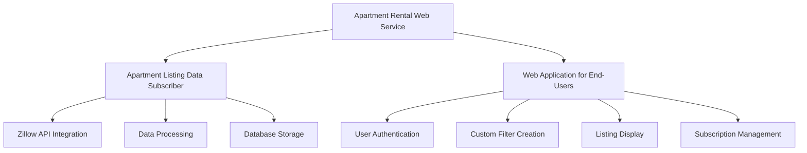

#### 1. Apartment Listing Data Subscriber

This subsystem is responsible for acquiring and processing real-time apartment listing data from Zillow's API. Key features include:

- Real-time data subscription to Zillow's API
- Extraction and processing of relevant listing information
- Storage of processed data in a Google Cloud SQL database

The data subscriber is implemented using Python, leveraging its robust libraries for API interactions and data processing. It runs as a background service, continuously updating the system's database with the latest apartment listings.

```python
# Example of Apartment Listing Data Subscriber
import requests
from google.cloud import sql

def fetch_zillow_data():
    # Fetch data from Zillow API
    response = requests.get('https://api.zillow.com/listings', params={'api_key': 'YOUR_API_KEY'})
    return response.json()

def process_listing(listing):
    # Extract relevant fields
    processed_listing = {
        'id': listing['id'],
        'rent': listing['price'],
        'bedrooms': listing['bedrooms'],
        'bathrooms': listing['bathrooms'],
        'square_footage': listing['sqft'],
        'address': listing['address'],
        'zillow_url': listing['url']
    }
    return processed_listing

def store_listing(listing):
    # Store processed listing in Google Cloud SQL
    connection = sql.connect('your-cloud-sql-instance')
    cursor = connection.cursor()
    cursor.execute("""
        INSERT INTO listings (id, rent, bedrooms, bathrooms, square_footage, address, zillow_url)
        VALUES (%(id)s, %(rent)s, %(bedrooms)s, %(bathrooms)s, %(square_footage)s, %(address)s, %(zillow_url)s)
    """, listing)
    connection.commit()
    connection.close()

def main():
    raw_data = fetch_zillow_data()
    for raw_listing in raw_data['listings']:
        processed_listing = process_listing(raw_listing)
        store_listing(processed_listing)

if __name__ == '__main__':
    main()
```

#### 2. Web Application for End-Users

This subsystem provides the user-facing interface, allowing college graduates to interact with the apartment listing data. It is built using React with TypeScript for the frontend and Python for the backend API. Key features include:

- User authentication and account management
- Custom filter creation for apartment searches
- Display of matching listings in a sortable table
- Subscription management integrated with PayPal

The web application uses Tailwind CSS for styling, ensuring a responsive and modern user interface across devices.

```typescript
// Example of a React component for listing display
import React from 'react';
import { Listing } from '../types';

interface ListingTableProps {
  listings: Listing[];
}

const ListingTable: React.FC<ListingTableProps> = ({ listings }) => {
  return (
    <div className="overflow-x-auto">
      <table className="min-w-full bg-white">
        <thead className="bg-gray-100">
          <tr>
            <th className="px-4 py-2">Address</th>
            <th className="px-4 py-2">Rent</th>
            <th className="px-4 py-2">Bedrooms</th>
            <th className="px-4 py-2">Bathrooms</th>
            <th className="px-4 py-2">Square Footage</th>
          </tr>
        </thead>
        <tbody>
          {listings.map((listing) => (
            <tr key={listing.id}>
              <td className="px-4 py-2">{listing.address}</td>
              <td className="px-4 py-2">${listing.rent}</td>
              <td className="px-4 py-2">{listing.bedrooms}</td>
              <td className="px-4 py-2">{listing.bathrooms}</td>
              <td className="px-4 py-2">{listing.squareFootage} sq ft</td>
            </tr>
          ))}
        </tbody>
      </table>
    </div>
  );
};

export default ListingTable;
```

The entire system is hosted on Google Cloud Platform, utilizing services such as Google Kubernetes Engine for containerized deployment, Cloud SQL for database management, and Cloud Storage for static asset hosting. This architecture ensures scalability, reliability, and ease of maintenance.

Key technologies used in the system:

| Component | Technology |
|-----------|------------|
| Frontend | React, TypeScript, Tailwind CSS |
| Backend API | Python (FastAPI or Flask) |
| Database | Google Cloud SQL (PostgreSQL) |
| Authentication | OAuth 2.0 |
| Payment Processing | PayPal API |
| Hosting | Google Kubernetes Engine |
| Static Assets | Google Cloud Storage |
| Continuous Integration/Deployment | Google Cloud Build |

This system overview provides a high-level description of the apartment rental web service, highlighting its main components, technologies, and architecture. The combination of real-time data subscription and a user-friendly web interface creates a powerful tool for college graduates to find their ideal rental apartments efficiently.

## SYSTEM ARCHITECTURE

### PROGRAMMING LANGUAGES

The apartment rental web service will utilize the following programming languages:

| Language | Purpose | Justification |
|----------|---------|---------------|
| TypeScript | Frontend development | Provides static typing for improved code quality and developer productivity. Enhances maintainability of React components. |
| React | Frontend framework | Offers a component-based architecture for building interactive and reusable UI elements. Widely adopted with excellent community support. |
| Python | Backend development, data processing | Versatile language with extensive libraries for web development (FastAPI) and data processing. Excellent for API integrations and scalable backend services. |
| SQL | Database queries | Standard language for interacting with Google Cloud SQL (PostgreSQL) database. |

### HIGH-LEVEL ARCHITECTURE DIAGRAM

The following diagram provides an overview of the system's components and their interactions:

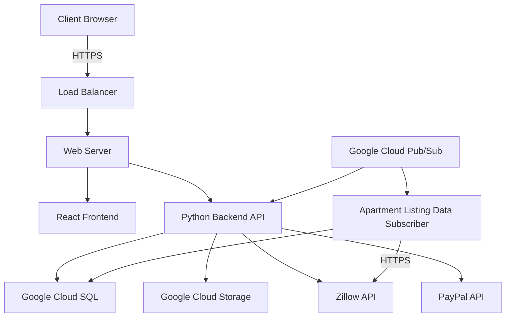

### COMPONENT DIAGRAMS

The system consists of the following main components:

1. Frontend Application

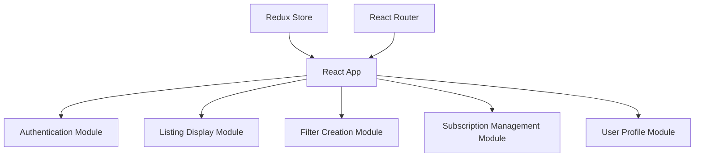

2. Backend API

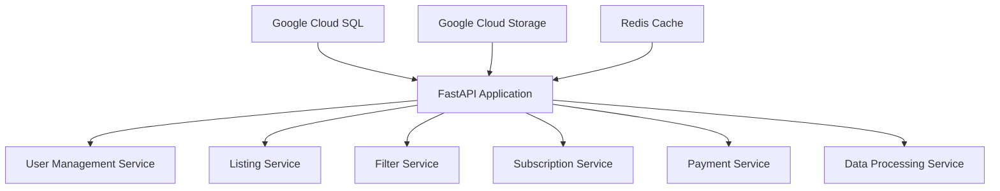

3. Apartment Listing Data Subscriber

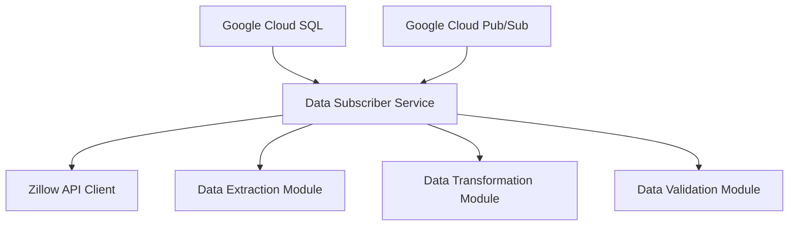

### SEQUENCE DIAGRAMS

1. User Authentication Flow

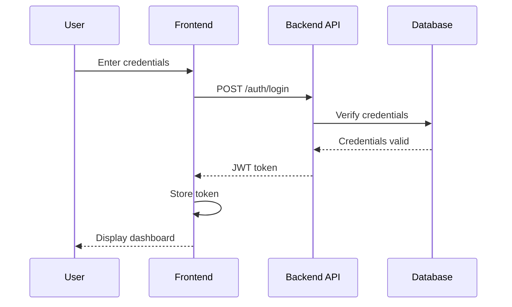

2. Apartment Listing Search Flow

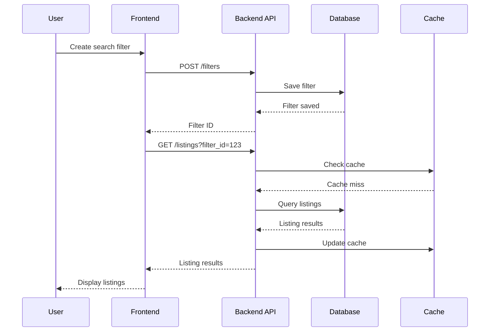

### DATA-FLOW DIAGRAM

The following diagram illustrates how information moves through the system:

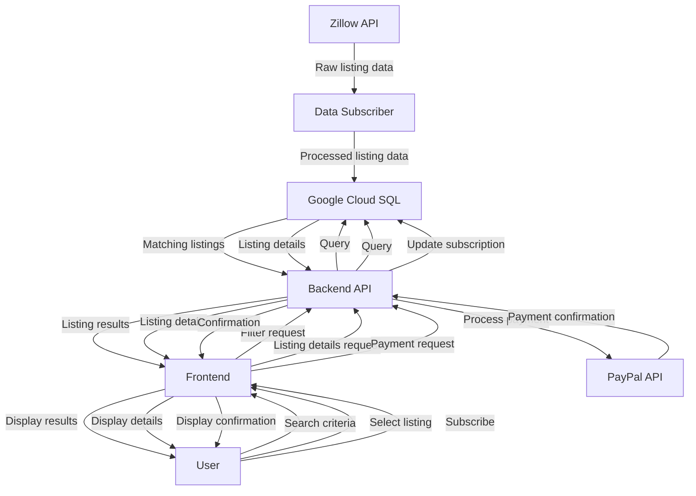

This data flow diagram demonstrates the movement of information from the Zillow API through the Data Subscriber, into the database, and then to the user through the Frontend and Backend API. It also shows the flow for user actions such as searching, viewing listing details, and subscribing to the service.

The system architecture leverages TypeScript and React for the frontend, Python (FastAPI) for the backend, and Google Cloud services (SQL, Storage, Pub/Sub) for data management and processing. This architecture ensures scalability, maintainability, and efficient data flow throughout the apartment rental web service.

## SYSTEM DESIGN

### PROGRAMMING LANGUAGES

The apartment rental web service will utilize the following programming languages:

| Language | Purpose | Justification |
|----------|---------|---------------|
| TypeScript | Frontend development | Provides static typing for improved code quality and developer productivity. Enhances maintainability of React components. |
| React | Frontend framework | Offers a component-based architecture for building interactive and reusable UI elements. Widely adopted with excellent community support. |
| Python | Backend development, data processing | Versatile language with extensive libraries for web development (FastAPI) and data processing. Excellent for API integrations and scalable backend services. |
| SQL | Database queries | Standard language for interacting with Google Cloud SQL (PostgreSQL) database. |

### DATABASE DESIGN

The system will use Google Cloud SQL with PostgreSQL as the relational database management system. The database schema is designed to efficiently store and retrieve apartment listings, user data, and filter information.

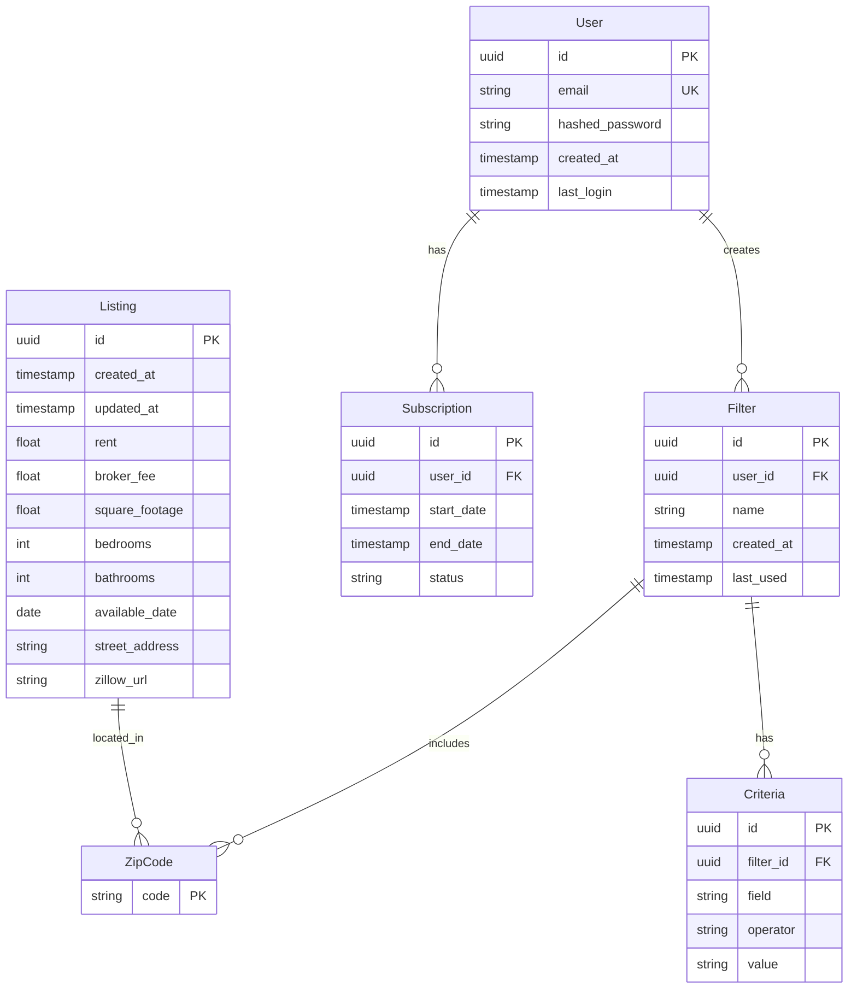

### API DESIGN

The system will use a RESTful API design for communication between the frontend and backend, as well as for integrating with external services like Zillow and PayPal.

1. Authentication API
   - POST /api/auth/register
   - POST /api/auth/login
   - POST /api/auth/logout
   - GET /api/auth/user

2. Listing API
   - GET /api/listings
   - GET /api/listings/{id}
   - POST /api/listings/search

3. Filter API
   - GET /api/filters
   - POST /api/filters
   - PUT /api/filters/{id}
   - DELETE /api/filters/{id}

4. Subscription API
   - GET /api/subscriptions
   - POST /api/subscriptions
   - PUT /api/subscriptions/{id}

Example of API endpoint implementation using FastAPI:

```python
from fastapi import FastAPI, Depends, HTTPException
from sqlalchemy.orm import Session
from . import crud, models, schemas
from .database import SessionLocal, engine

app = FastAPI()

# Dependency
def get_db():
    db = SessionLocal()
    try:
        yield db
    finally:
        db.close()

@app.post("/api/filters", response_model=schemas.Filter)
def create_filter(filter: schemas.FilterCreate, db: Session = Depends(get_db)):
    return crud.create_filter(db=db, filter=filter)

@app.get("/api/listings", response_model=List[schemas.Listing])
def read_listings(skip: int = 0, limit: int = 100, db: Session = Depends(get_db)):
    listings = crud.get_listings(db, skip=skip, limit=limit)
    return listings
```

### USER INTERFACE DESIGN

The user interface will be designed using React with TypeScript and styled using Tailwind CSS. The design will focus on responsiveness, accessibility, and user-friendliness.

Key components of the user interface include:

1. Navigation Bar
   - Logo
   - Search bar
   - User account menu

2. Landing Page
   - Featured listings
   - Quick search form

3. Search Results Page
   - Filterable list of apartments
   - Map view of listings

4. Listing Detail Page
   - Apartment details
   - Photo gallery
   - Contact form

5. User Dashboard
   - Saved filters
   - Subscription status
   - Recent searches

Example of a React component using TypeScript and Tailwind CSS:

```typescript
import React from 'react';
import { Listing } from '../types';

interface ListingCardProps {
  listing: Listing;
}

const ListingCard: React.FC<ListingCardProps> = ({ listing }) => {
  return (
    <div className="bg-white shadow-md rounded-lg overflow-hidden">
      
      <div className="p-4">
        <h2 className="text-xl font-semibold mb-2">{listing.address}</h2>
        <p className="text-gray-600">${listing.rent}/month</p>
        <div className="mt-2 flex justify-between text-sm text-gray-500">
          <span>{listing.bedrooms} beds</span>
          <span>{listing.bathrooms} baths</span>
          <span>{listing.squareFootage} sqft</span>
        </div>
        <a 
          href={listing.zillowUrl} 
          target="_blank" 
          rel="noopener noreferrer"
          className="mt-4 inline-block bg-blue-500 text-white px-4 py-2 rounded hover:bg-blue-600 transition duration-300"
        >
          View on Zillow
        </a>
      </div>
    </div>
  );
};

export default ListingCard;
```

This system design section outlines the key components of the apartment rental web service, including the choice of programming languages, database structure, API design, and user interface components. The design leverages TypeScript and React with Tailwind CSS for the frontend, Python (FastAPI) for the backend, and Google Cloud SQL for the database, aligning with the specified technology preferences and ensuring a scalable and maintainable architecture.

## TECHNOLOGY STACK

### PROGRAMMING LANGUAGES

The following programming languages will be used in the development of the apartment rental web service:

| Language | Purpose | Justification |
|----------|---------|---------------|
| TypeScript | Frontend development | Provides static typing for improved code quality and developer productivity. Enhances maintainability of React components. |
| Python | Backend development, data processing | Versatile language with extensive libraries for web development (FastAPI) and data processing. Excellent for API integrations and scalable backend services. |
| SQL | Database queries | Standard language for interacting with Google Cloud SQL (PostgreSQL) database. |

### FRAMEWORKS AND LIBRARIES

The project will utilize the following frameworks and libraries:

| Framework/Library | Purpose | Justification |
|-------------------|---------|---------------|
| React | Frontend UI framework | Component-based architecture for building interactive and reusable UI elements. Widely adopted with excellent community support. |
| Tailwind CSS | UI styling | Utility-first CSS framework for rapid UI development. Highly customizable and promotes consistent design. |
| FastAPI | Backend API framework | High-performance Python web framework for building APIs. Supports asynchronous programming and automatic API documentation. |
| SQLAlchemy | ORM (Object-Relational Mapping) | Provides a set of high-level API for database operations in Python. Simplifies database interactions and supports multiple database backends. |
| Redux | State management | Predictable state container for JavaScript apps. Helps manage complex application states in React. |
| React Router | Client-side routing | Declarative routing for React applications. Enables navigation without page reloads. |
| Axios | HTTP client | Promise-based HTTP client for browser and Node.js. Simplifies API requests and responses. |
| Pytest | Testing framework | Feature-rich testing framework for Python. Supports both unit and integration testing. |
| Jest | JavaScript testing | Delightful JavaScript testing framework with a focus on simplicity. Used for testing React components. |

### DATABASES

The apartment rental web service will use the following database system:

| Database | Purpose | Justification |
|----------|---------|---------------|
| Google Cloud SQL (PostgreSQL) | Primary relational database | Fully managed relational database service. Offers high availability, scalability, and integration with other Google Cloud services. PostgreSQL provides robust support for complex queries and data integrity. |

### THIRD-PARTY SERVICES

The following external services and APIs will be integrated into the system:

| Service | Purpose | Justification |
|---------|---------|---------------|
| Zillow API | Real-time apartment listing data | Provides comprehensive and up-to-date apartment rental information. Industry-standard source for real estate data. |
| PayPal API | Payment processing | Widely trusted payment gateway. Offers secure and reliable payment processing for subscriptions. |
| Google Cloud Storage | Object storage | Scalable and cost-effective storage for large files (e.g., listing images, data backups). Integrates seamlessly with other Google Cloud services. |
| Google Cloud Pub/Sub | Messaging service | Enables real-time data streaming between components. Useful for updating listings and notifying users of new matches. |
| Google Cloud Functions | Serverless compute | Allows running backend code in response to events. Useful for data processing tasks and integrations. |
| SendGrid | Email service | Reliable email delivery service for sending notifications and alerts to users. |
| Google Maps API | Mapping and geocoding | Provides mapping capabilities for displaying listing locations and geocoding addresses. |

### TECHNOLOGY STACK DIAGRAM

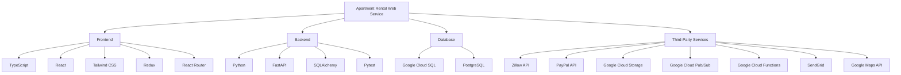

This technology stack leverages modern, scalable, and widely-supported technologies. The combination of TypeScript and React for the frontend, Python with FastAPI for the backend, and Google Cloud services for infrastructure provides a robust foundation for building a high-performance, maintainable, and scalable apartment rental web service. The chosen third-party services complement the core functionality by providing essential features such as real-time data, payment processing, and communication capabilities.

## SECURITY CONSIDERATIONS

### AUTHENTICATION AND AUTHORIZATION

The apartment rental web service will implement a robust authentication and authorization system to ensure secure access to user accounts and protected resources.

#### Authentication

1. User Registration:
   - Users will register using their email address and a strong password.
   - Passwords must meet the following criteria:
     - Minimum 12 characters
     - At least one uppercase letter, one lowercase letter, one number, and one special character
   - Email verification will be required to activate accounts.

2. Multi-Factor Authentication (MFA):
   - Optional but encouraged for all users.
   - Implemented using Time-based One-Time Passwords (TOTP) via Google Authenticator or similar apps.

3. Login Process:
   - Users will authenticate using their email and password.
   - Failed login attempts will be limited to 5 within a 15-minute window to prevent brute-force attacks.

4. Session Management:
   - JSON Web Tokens (JWT) will be used for maintaining user sessions.
   - Tokens will expire after 30 minutes of inactivity.
   - Refresh tokens will be implemented for seamless re-authentication.

#### Authorization

1. Role-Based Access Control (RBAC):
   - User roles: Guest, Registered User, Premium User, Admin
   - Each role will have specific permissions assigned to it.

2. Resource Access:
   - API endpoints will be protected based on user roles and permissions.
   - Frontend routes will be guarded to prevent unauthorized access.

```typescript
// Example of a protected route in React using TypeScript
import React from 'react';
import { Route, Redirect, RouteProps } from 'react-router-dom';
import { useAuth } from '../hooks/useAuth';

interface ProtectedRouteProps extends RouteProps {
  requiredRole: 'guest' | 'registered' | 'premium' | 'admin';
}

const ProtectedRoute: React.FC<ProtectedRouteProps> = ({ requiredRole, ...rest }) => {
  const { user } = useAuth();

  if (!user || user.role !== requiredRole) {
    return <Redirect to="/login" />;
  }

  return <Route {...rest} />;
};

export default ProtectedRoute;
```

### DATA SECURITY

To protect sensitive user information and maintain data integrity, the following measures will be implemented:

1. Encryption at Rest:
   - All data stored in Google Cloud SQL will be encrypted using AES-256 encryption.
   - Encryption keys will be managed through Google Cloud Key Management Service (KMS).

2. Encryption in Transit:
   - All communication between clients and servers will use TLS 1.3 or higher.
   - Internal communication between services will also be encrypted using TLS.

3. Data Masking:
   - Sensitive data (e.g., full credit card numbers) will be masked when displayed in the UI.
   - Only authorized personnel will have access to view full sensitive data.

4. Data Backup and Recovery:
   - Regular automated backups of the database will be performed.
   - Backups will be encrypted and stored in a separate Google Cloud Storage bucket.
   - A disaster recovery plan will be implemented and tested regularly.

5. Data Retention and Deletion:
   - User data will be retained only as long as necessary for the service.
   - Users will have the ability to request data deletion in compliance with GDPR and CCPA.

```python
# Example of data masking in Python
import re

def mask_credit_card(card_number: str) -> str:
    return re.sub(r'\d(?=\d{4})', '*', card_number)

# Usage
masked_number = mask_credit_card("1234567890123456")
print(masked_number)  # Output: ************3456
```

### SECURITY PROTOCOLS

The following security protocols will be implemented to maintain the overall security of the system:

1. Secure Development Lifecycle (SDL):
   - Regular security training for development team.
   - Code reviews with a focus on security vulnerabilities.
   - Static code analysis tools integrated into the CI/CD pipeline.

2. Vulnerability Management:
   - Regular vulnerability scans of the application and infrastructure.
   - Timely patching of identified vulnerabilities.
   - Bug bounty program to encourage responsible disclosure of security issues.

3. Incident Response Plan:
   - Documented procedures for handling security incidents.
   - Regular drills to test the effectiveness of the incident response plan.

4. Logging and Monitoring:
   - Centralized logging using Google Cloud Logging.
   - Real-time monitoring and alerting for suspicious activities.
   - Regular security audits of system logs.

5. API Security:
   - Rate limiting to prevent API abuse.
   - Input validation and sanitization to prevent injection attacks.
   - API versioning to manage changes securely.

6. Third-Party Security:
   - Regular security assessments of third-party integrations (e.g., Zillow API, PayPal).
   - Minimal access principle for third-party services.

7. Compliance:
   - Regular audits to ensure compliance with GDPR, CCPA, and other relevant regulations.
   - Implementation of privacy controls as required by applicable laws.

```mermaid
graph TD
    A[Security Protocols] --> B[Secure Development]
    A --> C[Vulnerability Management]
    A --> D[Incident Response]
    A --> E[Logging and Monitoring]
    A --> F[API Security]
    A --> G[Third-Party Security]
    A --> H[Compliance]
    
    B --> B1[Security Training]
    B --> B2[Code Reviews]
    B --> B3[Static Analysis]
    
    C --> C1[Regular Scans]
    C --> C2[Patching]
    C --> C3[Bug Bounty]
    
    D --> D1[Response Procedures]
    D --> D2[Regular Drills]
    
    E --> E1[Centralized Logging]
    E --> E2[Real-time Monitoring]
    E --> E3[Security Audits]
    
    F --> F1[Rate Limiting]
    F --> F2[Input Validation]
    F --> F3[API Versioning]
    
    G --> G1[Assessments]
    G --> G2[Minimal Access]
    
    H --> H1[Regular Audits]
    H --> H2[Privacy Controls]
```

This security considerations section outlines the key measures and protocols that will be implemented to ensure the safety and integrity of the apartment rental web service. By following these guidelines and continuously updating security practices, the system will maintain a strong security posture and protect user data effectively.